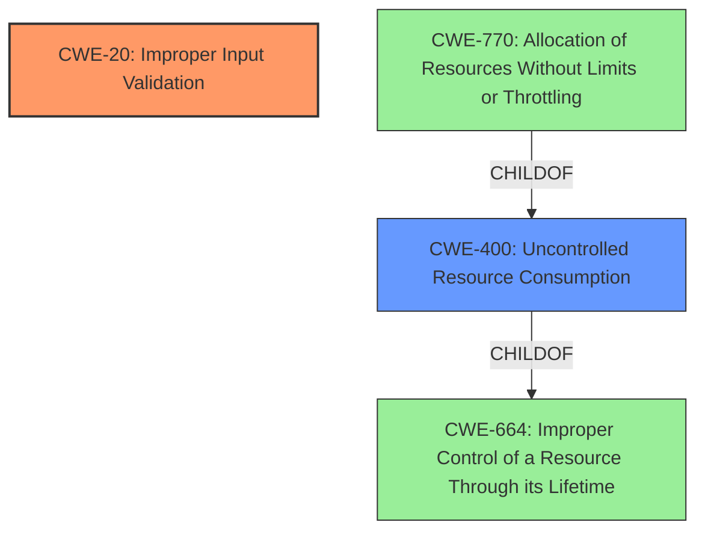

# Analysis Report for CVE-2021-0051

# Vulnerability Analysis Report: CVE-2021-0051

## Description


## Analysis (with Relationship Data)

# Summary
| CWE ID | CWE Name | Confidence | CWE Abstraction Level | CWE Vulnerability Mapping Label | CWE-Vulnerability Mapping Notes |
|---|---|---|---|---|---|
| CWE-20 | Improper Input Validation | 0.8 | Class | Primary | Discouraged |
| CWE-400 | Uncontrolled Resource Consumption | 0.6 | Class | Secondary | Allowed-with-Review |

## Evidence and Confidence

*   **Confidence Score:** 0.8
*   **Evidence Strength:** HIGH

## Relationship Analysis
The primary CWE selected is CWE-20 **Improper Input Validation**, which is a Class-level CWE. While it is generally discouraged, it directly matches the vulnerability description's root cause. There are several more specific child CWEs of CWE-20, however, the provided vulnerability description lacks the necessary details to specify the exact type of **improper input validation**.

CWE-400 **Uncontrolled Resource Consumption** is included as a secondary CWE because the impact of the **improper input validation** is denial of service, which often results from uncontrolled resource consumption. CWE-400 is a child of CWE-664, **Improper Control of a Resource Through Its Lifetime**, indicating that the resource management is a broader issue. It's also related to CWE-770, **Allocation of Resources Without Limits or Throttling**, which further specifies the resource allocation aspect.



## Vulnerability Chain
The vulnerability chain starts with **improper input validation** (CWE-20), which then leads to uncontrolled resource consumption (CWE-400), resulting in a denial-of-service condition. The root cause is the **improper input validation**, and the impact is the denial of service.

## Summary of Analysis
The primary CWE is CWE-20 **Improper Input Validation** because the vulnerability description explicitly states that the root cause is **improper input validation**.

The "Vulnerability Description Key Phrases" section confirms the **rootcause** as **Improper Input Validation**. Additionally, the "CVE Reference Links Content Summary" section states: "The vulnerability stems from **improper input validation** within the Intel Server Platform Services (SPS) firmware" and lists "**Improper input validation**" under "Weaknesses/Vulnerabilities."

Although CWE-20 is discouraged, it is the most accurate representation of the provided information. The report lacks the specifics required to select a more specific child CWE.

CWE-400 **Uncontrolled Resource Consumption** is added as a secondary CWE because the "Vulnerability Description" indicates that exploiting the **improper input validation** may "allow a privileged user to potentially enable denial of service via local access." Denial of Service often occurs due to uncontrolled resource consumption, making CWE-400 a relevant secondary weakness.

The confidence score is 0.8 because there is strong evidence for CWE-20 as the primary weakness. The selection of CWE-400 is less certain but justified based on the denial-of-service impact.

Relevant CWE Information:
# Enhanced Context (25 CWEs)
The following CWEs were identified as potentially relevant to this vulnerability:

## CWE-653: Improper Isolation or Compartmentalization
**Abstraction Level**: Class
**Similarity Score**: 0.77
**Source**: dense

**Description**:
The product does not properly compartmentalize or isolate functionality, processes, or resources that require different privilege levels, rights, or permissions.

**Mapping Guidance**:
- Usage: Allowed
- Rationale: This CWE entry is at the Base level of abstraction, which is a preferred level of abstraction for mapping to the root causes of vulnerabilities.

## CWE-404: Improper Resource Shutdown or Release
**Abstraction Level**: Class
**Similarity Score**: 0.76
**Source**: dense

**Description**:
The product does not release or incorrectly releases a resource before it is made available for re-use.

**Mapping Guidance**:
- Usage: Allowed-with-Review
- Rationale: This CWE entry is a Class and might have Base-level children that would be more appropriate

## CWE-703: Improper Check or Handling of Exceptional Conditions
**Abstraction Level**: Pillar
**Similarity Score**: 0.75
**Source**: dense

**Description**:
The product does not properly anticipate or handle exceptional conditions that rarely occur during normal operation of the product.

**Mapping Guidance**:
- Usage: Discouraged
- Rationale: This CWE entry is extremely high-level, a Pillar.

## CWE-20: Improper Input Validation
**Abstraction Level**: Class
**Status:** Stable

### Description
The product receives input or data, but it does
        not validate or incorrectly validates that the input has the
        properties that are required to process the data safely and
        correctly.

### Extended Description
Input validation is a frequently-used technique for checking potentially dangerous inputs in order to ensure that the inputs are safe for processing within the code, or when communicating with other components. When software does not validate input properly, an attacker is able to craft the input in a form that is not expected by the rest of the application. This will lead to parts of the system receiving unintended input, which may result in altered control flow, arbitrary control of a resource, or arbitrary code execution.

### Mapping Guidance
**Usage:** Discouraged
**Rationale:** CWE-20 is commonly misused in low-information vulnerability reports when lower-level CWEs could be used instead, or when more details about the vulnerability are available [REF-1287]. It is not useful for trend analysis. It is also a level-1 Class (i.e., a child of a Pillar).
**Comments:** Consider lower-level children such as Improper Use of Validation Framework (CWE-1173) or improper validation involving specific types or properties of input such as Specified Quantity (CWE-1284); Specified Index, Position, or Offset (CWE-1285); Syntactic Correctness (CWE-1286); Specified Type (CWE-1287); Consistency within Input (CWE-1288); or Unsafe Equivalence (CWE-1289).
**Reasons:**
- Frequent Misuse
**Suggested Alternatives:**
- CWE-1284: Specified Quantity
- CWE-1285: Specified Index, Position, or Offset
- CWE-1286: Syntactic Correctness
- CWE-1287: Specified Type
- CWE-1288: Consistency within Input
- CWE-1289: Unsafe Equivalence
- CWE-116: Improper Encoding or Escaping of Output

## CWE-287: Improper Authentication
**Abstraction Level**: Class
**Similarity Score**: 6713.07
**Source**: sparse

**Description**:
When an actor claims to have a given identity, the product does not prove or insufficiently proves that the claim is correct.

### Mapping Guidance
**Usage:** Discouraged
**Rationale:** This CWE entry might be misused when lower-level CWE entries are likely to be applicable. It is a level-1 Class (i.e., a child of a Pillar).

## CWE-400: Uncontrolled Resource Consumption
**Abstraction Level**: Class
**Description**: The software does not properly control the allocation, usage, or releasing of resources, which can lead to consumption of an unexpectedly large amount of resources.
**Alternate Terms**: Resource Exhaustion
**Mapping Guidance**: Allowed-with-Review

### Not Used

*   CWE-653 **Improper Isolation or Compartmentalization**: This CWE was considered because it relates to privilege levels and access control, however, the description focuses more on the separation of privileges, which isn't the primary issue.

*   CWE-404 **Improper Resource Shutdown or Release**: This CWE was considered, but it focuses on resources not being released properly, while the description suggests the resource consumption isn't controlled in the first place.

*   CWE-703 **Improper Check or Handling of Exceptional Conditions**: This CWE is a high-level Pillar and doesn't provide specific details about the weakness. It's too general to be a suitable fit.

*   CWE-287 **Improper Authentication**: This CWE was not selected because the vulnerability description explicitly mentions **improper input validation** and does not specify issues related to authentication.


## CWE Relationship Analysis

Current CWEs represent these abstraction levels: .


### Vulnerability Chain Analysis

**Chain starting from CWE-400:**
- 400 (Uncontrolled Resource Consumption) - ROOT


**Chain starting from CWE-703:**
- 703 (Improper Check or Handling of Exceptional Conditions) - ROOT


### CWE Relationship Diagram

```mermaid
graph TD
    classDef primary fill:#f96,stroke:#333,stroke-width:2px
    classDef secondary fill:#69f,stroke:#333
    classDef tertiary fill:#9e9,stroke:#333
```


*Report generated on 2025-03-31 08:59:31*
