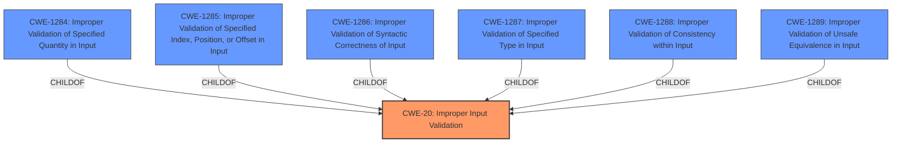

# Analysis Report for CVE-2021-0062

# Vulnerability Analysis Report: CVE-2021-0062

## Description


## Analysis (with Relationship Data)

# Summary
| CWE ID  | CWE Name   | Confidence | CWE Abstraction Level | CWE Vulnerability Mapping Label | CWE-Vulnerability Mapping Notes |
|-----------------|-----------------------------------------------------------------|------------|-------------------------|------------------------------------|----------------------------------------------------------------------------------------------------------------------------------------------------------------------------------------------------------------------------------------------------------------------|
| CWE-20 | Improper Input Validation | 0.75 | Class | Primary | Discouraged: Consider lower-level children or more specific properties of input. |

## Evidence and Confidence

*   **Confidence Score:** 0.75
*   **Evidence Strength:** HIGH

## Relationship Analysis
The primary CWE identified is CWE-20, "Improper Input Validation," which is a Class-level CWE. While it aligns with the vulnerability description, the guidance discourages its use due to its high-level nature. Several child CWEs offer more specific classifications. This relationship analysis guided the decision to acknowledge CWE-20's relevance but also consider more detailed options.



## Vulnerability Chain
The vulnerability chain starts with the **improper input validation** and leads to a potential escalation of privilege.

## Summary of Analysis
The initial analysis identified CWE-20, "Improper Input Validation," as the primary candidate. The vulnerability description explicitly mentions "**Improper input validation**" as the root cause. The CVE Reference Links Content Summary also highlights "**Improper input validation** in some Intel(R) Graphics Drivers" as the root cause.

However, the MITRE mapping guidance for CWE-20 discourages its use due to its high-level nature and suggests considering lower-level children. While more specific information about the exact type of input validation error is lacking, the evidence strongly points to input validation as the core issue. Therefore, CWE-20 is selected, but with a lower confidence and a clear recommendation to refine the classification if more details emerge.

The selection of CWE-20 is primarily based on the explicit mention of "**improper input validation**" in the vulnerability description and CVE summary. Without additional details, a more specific CWE cannot be confidently assigned.
Relevant CWE Information:

# Enhanced Context (25 CWEs)
The following CWEs were identified as potentially relevant to this vulnerability:

## CWE-1289: Improper Validation of Unsafe Equivalence in Input
**Abstraction Level**: Base
**Similarity Score**: 0.76
**Source**: dense

**Description**:
The product receives an input value that is used as a resource identifier or other type of reference, but it does not validate or incorrectly validates that the input is equivalent to a potentially-unsafe value.

**Mapping Guidance**:
- Usage: Allowed
- Rationale: This CWE entry is at the Base level of abstraction, which is a preferred level of abstraction for mapping to the root causes of vulnerabilities.

## CWE-1284: Improper Validation of Specified Quantity in Input
**Abstraction Level**: Base
**Similarity Score**: 5751.65
**Source**: sparse

**Description**:
The product receives input that is expected to specify a quantity (such as size or length), but it does not validate or incorrectly validates that the quantity has the required properties.

**Mapping Guidance**:
- Usage: Allowed
- Rationale: This CWE entry is at the Base level of abstraction, which is a preferred level of abstraction for mapping to the root causes of vulnerabilities.

## CWE-1285: Improper Validation of Specified Index, Position, or Offset in Input
**Abstraction Level**: Base
**Similarity Score**: 5751.65
**Source**: sparse

**Description**:
The product receives input that is expected to specify an index, position, or offset into an indexable resource such as a buffer or file, but it does not validate or incorrectly validates that the specified index/position/offset has the required properties.

**Mapping Guidance**:
- Usage: Allowed
- Rationale: This CWE entry is at the Base level of abstraction, which is a preferred level of abstraction for mapping to the root causes of vulnerabilities.

## CWE-1286: Improper Validation of Syntactic Correctness in Input
**Abstraction Level**: Base
**Similarity Score**: 5751.65
**Source**: sparse

**Description**:
The product receives input that is expected to conform to a defined syntax, but it does not validate or incorrectly validates that the input satisfies the syntax.

**Mapping Guidance**:
- Usage: Allowed
- Rationale: This CWE entry is at the Base level of abstraction, which is a preferred level of abstraction for mapping to the root causes of vulnerabilities.

## CWE-1287: Improper Validation of Specified Type in Input
**Abstraction Level**: Base
**Similarity Score**: 5751.65
**Source**: sparse

**Description**:
The product receives input that is expected to conform to a specified type (e.g., integer, filename, email address, etc.), but it does not validate or incorrectly validates that the input is of the correct type.

**Mapping Guidance**:
- Usage: Allowed
- Rationale: This CWE entry is at the Base level of abstraction, which is a preferred level of abstraction for mapping to the root causes of vulnerabilities.

## CWE-1288: Improper Validation of Consistency within Input
**Abstraction Level**: Base
**Similarity Score**: 5751.65
**Source**: sparse

**Description**:
The product receives a complex input with multiple elements or fields that must be consistent with each other, but it does not validate or incorrectly validates that the input is actually consistent.

**Mapping Guidance**:
- Usage: Allowed
- Rationale: This CWE entry is at the Base level of abstraction, which is a preferred level of abstraction for mapping to the root causes of vulnerabilities.

The other CWEs listed were considered but not used because they were either too high-level (Pillar), didn't precisely describe the **improper input validation** (e.g. insecure inherited permissions) or related to different types of weaknesses (e.g. resource shutdown).


## CWE Relationship Analysis

Current CWEs represent these abstraction levels: .


### Vulnerability Chain Analysis

**Chain starting from CWE-20:**
- 20 (Improper Input Validation) - ROOT


**Chain starting from CWE-1286:**
- 1286 (Improper Validation of Syntactic Correctness of Input) - ROOT


### CWE Relationship Diagram

```mermaid
graph TD
    classDef primary fill:#f96,stroke:#333,stroke-width:2px
    classDef secondary fill:#69f,stroke:#333
    classDef tertiary fill:#9e9,stroke:#333
```


*Report generated on 2025-03-31 03:48:04*
