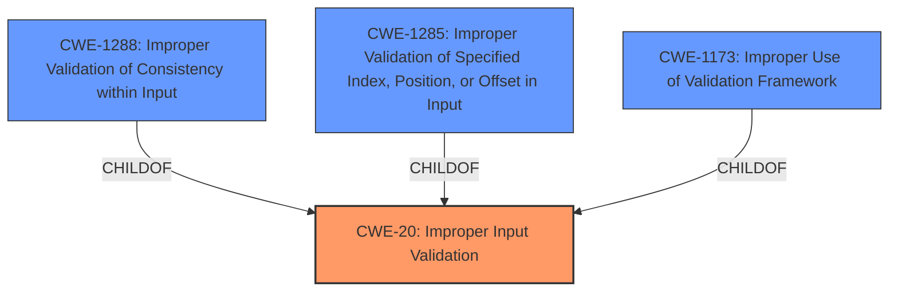

# Analysis for CVE-2021-0066

# Summary
| CWE ID | CWE Name | Confidence | CWE Abstraction Level | CWE Vulnerability Mapping Label | CWE-Vulnerability Mapping Notes |
|---|---|---|---|---|---|
| CWE-20 | Improper Input Validation | 0.9 | Class | Primary CWE | Discouraged |
| CWE-1288 | Improper Validation of Consistency within Input | 0.6 | Base | Secondary Candidate CWE | Allowed |
| CWE-1285 | Improper Validation of Specified Index, Position, or Offset in Input | 0.6 | Base | Secondary Candidate CWE | Allowed |
| CWE-1173 | Improper Use of Validation Framework | 0.5 | Base | Secondary Candidate CWE | Allowed |

## Evidence and Confidence

*   **Confidence Score:** 0.9
*   **Evidence Strength:** HIGH

## Relationship Analysis
The primary relationship is that CWE-20 is a class-level CWE, while CWE-1288, CWE-1285, and CWE-1173 are base-level CWEs and children of CWE-20. Since the vulnerability description specifically mentions **"Improper input validation"** as the root cause, it aligns well with the general definition of CWE-20. However, the retriever results and the specifications of the child CWEs suggest a possibility for more specific classifications. The analysis favors CWE-20 as the primary due to its direct match with the description. The other CWEs are considered as secondary candidates, as the evidence is not detailed enough to confirm their applicability with high confidence.

## Vulnerability Chain
The vulnerability chain starts with **"Improper input validation"** which leads to an "escalation of privilege."
  - Root Cause: **Improper input validation**
  - Impact: Escalation of privilege

## Summary of Analysis
The initial assessment strongly points towards CWE-20 due to the vulnerability description explicitly stating **"Improper input validation"**.
The evidence from the "CVE Reference Links Content Summary" section reinforces this, stating the "Root cause" and "Weaknesses" as "Improper input validation."
> *"Improper input validation in firmware"*

However, the retriever results offer more specific CWEs that could be considered if more details were available. Specifically:
- CWE-1288: Improper Validation of Consistency within Input
- CWE-1285: Improper Validation of Specified Index, Position, or Offset in Input
- CWE-1173: Improper Use of Validation Framework

The decision to keep CWE-20 as primary is based on the direct and explicit evidence, while acknowledging the potential for a more specific classification if further details were provided. Since CWE-20 is a class, it is discouraged, but the evidence doesn't point to a specific Base CWE with high enough confidence.

Relevant CWE Information:

# Enhanced Context (25 CWEs)

## CWE-691: Insufficient Control Flow Management
**Abstraction Level**: Pillar
**Similarity Score**: 0.78
**Source**: dense

**Description**:
The code does not sufficiently manage its control flow during execution, creating conditions in which the control flow can be modified in unexpected ways.

**Mapping Guidance**:
- Usage: Discouraged
- Rationale: This CWE entry is extremely high-level, a Pillar. However, classification research is limited for weaknesses of this type, so there can be gaps or organizational difficulties within CWE that force use of this weakness, even at such a high level of abstraction.
This CWE is too high-level and doesn't directly relate to input validation.

## CWE-1289: Improper Validation of Unsafe Equivalence in Input
**Abstraction Level**: Base
**Similarity Score**: 0.76
**Source**: dense

**Description**:
The product receives an input value that is used as a resource identifier or other type of reference, but it does not validate or incorrectly validates that the input is equivalent to a potentially-unsafe value.

**Mapping Guidance**:
- Usage: Allowed
- Rationale: This CWE entry is at the Base level of abstraction, which is a preferred level of abstraction for mapping to the root causes of vulnerabilities.
This CWE is not applicable because the description doesn't provide enough information on whether the input involves unsafe equivalence.

## CWE-653: Improper Isolation or Compartmentalization
**Abstraction Level**: Class
**Similarity Score**: 0.76
**Source**: dense

**Description**:
The product does not properly compartmentalize or isolate functionality, processes, or resources that require different privilege levels, rights, or permissions.

**Mapping Guidance**:
- Usage: Allowed
- Rationale: This CWE entry is at the Base level of abstraction, which is a preferred level of abstraction for mapping to the root causes of vulnerabilities.
This CWE is not applicable because the description doesn't describe problems with compartmentalization or isolation.

## CWE-667: Improper Locking
**Abstraction Level**: Class
**Similarity Score**: 0.76
**Source**: dense

**Description**:
The product does not properly acquire or release a lock on a resource, leading to unexpected resource state changes and behaviors.

**Mapping Guidance**:
- Usage: Allowed-with-Review
- Rationale: This CWE entry is a Class and might have Base-level children that would be more appropriate
This CWE is not applicable because the description doesn't mention locking issues.

## CWE-131: Incorrect Calculation of Buffer Size
**Abstraction Level**: Base
**Similarity Score**: 0.76
**Source**: dense

**Description**:
The product does not correctly calculate the size to be used when allocating a buffer, which could lead to a buffer overflow.

**Mapping Guidance**:
- Usage: Allowed
- Rationale: This CWE entry is at the Base level of abstraction, which is a preferred level of abstraction for mapping to the root causes of vulnerabilities.
This CWE is not applicable because the description doesn't mention buffer size calculations or buffer overflows.

## CWE-41: Improper Resolution of Path Equivalence
**Abstraction Level**: Base
**Similarity Score**: 0.76
**Source**: dense

**Description**:
The product is vulnerable to file system contents disclosure through path equivalence. Path equivalence involves the use of special characters in file and directory names. The associated manipulations are intended to generate multiple names for the same object.

**Mapping Guidance**:
- Usage: Allowed
- Rationale: This CWE entry is at the Base level of abstraction, which is a preferred level of abstraction for mapping to the root causes of vulnerabilities.
This CWE is not applicable because the description doesn't involve file path manipulation.

## CWE-703: Improper Check or Handling of Exceptional Conditions
**Abstraction Level**: Pillar
**Similarity Score**: 0.76
**Source**: dense

**Description**:
The product does not properly anticipate or handle exceptional conditions that rarely occur during normal operation of the product.

**Mapping Guidance**:
- Usage: Discouraged
- Rationale: This CWE entry is extremely high-level, a Pillar.
This CWE is too high-level and doesn't directly relate to input validation.

## CWE-119: Improper Restriction of Operations within the Bounds of a Memory Buffer
**Abstraction Level**: Class
**Similarity Score**: 0.76
**Source**: dense

**Description**:
The product performs operations on a memory buffer, but it reads from or writes to a memory location outside the buffer's intended boundary. This may result in read or write operations on unexpected memory locations that could be linked to other variables, data structures, or internal program data.

**Mapping Guidance**:
- Usage: Discouraged
- Rationale: CWE-119 is commonly misused in low-information vulnerability reports when lower-level CWEs could be used instead, or when more details about the vulnerability are available.
This CWE is not directly applicable because the description doesn't mention memory buffer operations.

## CWE-404: Improper Resource Shutdown or Release
**Abstraction Level**: Class
**Similarity Score**: 0.75
**Source**: dense

**Description**:
The product does not release or incorrectly releases a resource before it is made available for re-use.

**Mapping Guidance**:
- Usage: Allowed-with-Review
- Rationale: This CWE entry is a Class and might have Base-level children that would be more appropriate
This CWE is not applicable because the description doesn't describe resource management issues.

## CWE-73: External Control of File Name or Path
**Abstraction