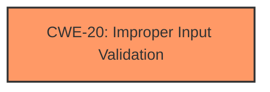

# Analysis for CVE-2021-0071

# Summary
| CWE ID | CWE Name | Confidence | CWE Abstraction Level | CWE Vulnerability Mapping Label | CWE-Vulnerability Mapping Notes |
|---|---|---|---|---|---|
| CWE-20 | Improper Input Validation | 0.8 | Class | Primary | Discouraged |

## Evidence and Confidence

*   **Confidence Score:** 0.8
*   **Evidence Strength:** HIGH

## Relationship Analysis
The primary CWE identified is CWE-20 [CWE-20: Improper Input Validation], which is a Class-level CWE. While it's discouraged to map directly to this CWE due to its high level of abstraction, the provided information strongly points to it as the root cause. Several child CWEs of CWE-20 were considered, but the information is not specific enough to choose a more specific variant.

## Vulnerability Chain
The vulnerability chain is straightforward: **Improper input validation** leads to escalation of privilege.

## Summary of Analysis
The analysis heavily relies on the vulnerability description and the CVE Reference Links Content Summary. The description explicitly states "**Improper input validation**" as the root cause. The summary confirms this by stating "Root cause: **Improper input validation**" and "Weaknesses: **Improper input validation**."

The primary CWE match identified from similar CVE descriptions is CWE-20 [CWE-20: Improper Input Validation].

CWE-20 [CWE-20: Improper Input Validation] is a Class-level CWE, and the mapping guidance discourages its use when more specific CWEs are available. However, based on the limited information provided, it's difficult to pinpoint a more specific weakness. The vulnerability description mentions only "**Improper input validation**" without specifying the type of input, the validation method, or the specific properties that are not being validated.

Several other CWEs were considered based on the Retriever Results, including CWE-1288 [CWE-1288: Improper Validation of Consistency within Input], CWE-1173 [CWE-1173: Improper Use of Validation Framework], and CWE-1285 [CWE-1285: Improper Validation of Specified Index, Position, or Offset in Input]. However, none of these CWEs could be selected because there is no information available on the type of **improper input validation** that occurred.

I am adhering to the general mapping guidance by starting with the primary CWE and top CWEs, then evaluating the other CWEs, and noting the relationship and abstraction levels.

Relevant CWE Information:

# Enhanced Context (25 CWEs)

## CWE-691: Insufficient Control Flow Management
**Abstraction Level**: Pillar
**Similarity Score**: 0.77
**Source**: dense

**Description**:
The code does not sufficiently manage its control flow during execution, creating conditions in which the control flow can be modified in unexpected ways.

**Mapping Guidance**:
- Usage: Discouraged
- Rationale: This CWE entry is extremely high-level, a Pillar. However, classification research is limited for weaknesses of this type, so there can be gaps or organizational difficulties within CWE that force use of this weakness, even at such a high level of abstraction.
*Not Selected*: This CWE is not selected because the vulnerability description specifically mentions **improper input validation**, not a general control flow issue.

## CWE-664: Improper Control of a Resource Through its Lifetime
**Abstraction Level**: Pillar
**Similarity Score**: 0.76
**Source**: dense

**Description**:
The product does not maintain or incorrectly maintains control over a resource throughout its lifetime of creation, use, and release.

**Mapping Guidance**:
- Usage: Discouraged
- Rationale: This CWE entry is high-level when lower-level children are available.
*Not Selected*: This CWE is not selected because it's a general resource management issue, while the vulnerability description points to **improper input validation**.

## CWE-693: Protection Mechanism Failure
**Abstraction Level**: Pillar
**Similarity Score**: 0.75
**Source**: dense

**Description**:
The product does not use or incorrectly uses a protection mechanism that provides sufficient defense against directed attacks against the product.

**Mapping Guidance**:
- Usage: Discouraged
- Rationale: This CWE entry is extremely high-level, a Pillar.
*Not Selected*: This CWE is not selected because it's a general protection mechanism failure, while the description highlights **improper input validation**.

## CWE-653: Improper Isolation or Compartmentalization
**Abstraction Level**: Class
**Similarity Score**: 0.74
**Source**: dense

**Description**:
The product does not properly compartmentalize or isolate functionality, processes, or resources that require different privilege levels, rights, or permissions.

**Mapping Guidance**:
- Usage: Allowed
- Rationale: This CWE entry is at the Base level of abstraction, which is a preferred level of abstraction for mapping to the root causes of vulnerabilities.
*Not Selected*: Not selected as the root cause is **improper input validation** and not a problem with isolation.

## CWE-807: Reliance on Untrusted Inputs in a Security Decision
**Abstraction Level**: Base
**Similarity Score**: 0.74
**Source**: dense

**Description**:
The product uses a protection mechanism that relies on the existence or values of an input, but the input can be modified by an untrusted actor in a way that bypasses the protection mechanism.

**Mapping Guidance**:
- Usage: Allowed
- Rationale: This CWE entry is at the Base level of abstraction, which is a preferred level of abstraction for mapping to the root causes of vulnerabilities.
*Not Selected*: While this CWE relates to untrusted inputs, the specific problem is the **improper input validation** and not necessarily the reliance on it in a security decision.

## CWE-1289: Improper Validation of Unsafe Equivalence in Input
**Abstraction Level**: Base
**Similarity Score**: 0.74
**Source**: dense

**Description**:
The product receives an input value that is used as a resource identifier or other type of reference, but it does not validate or incorrectly validates that the input is equivalent to a potentially-unsafe value.

**Mapping Guidance**:
- Usage: Allowed
- Rationale: This CWE entry is at the Base level of abstraction, which is a preferred level of abstraction for mapping to the root causes of vulnerabilities.
*Not Selected*: This is too specific, as there is no mention of equivalence.

## CWE-703: Improper Check or Handling of Exceptional Conditions
**Abstraction Level**: Pillar
**Similarity Score**: 0.74
**Source**: dense

**Description**:
The product does not properly anticipate or handle exceptional conditions that rarely occur during normal operation of the product.

**Mapping Guidance**:
- Usage: Discouraged
- Rationale: This CWE entry is extremely high-level, a Pillar.
*Not Selected*: The specific problem is **improper input validation**, not a general failure to handle exceptional conditions.

## CWE-274: Improper Handling of Insufficient Privileges
**Abstraction Level**: Base
**Similarity Score**: 0.73
**Source**: dense

**Description**:
The product does not handle or incorrectly handles when it has insufficient privileges to perform an operation, leading to resultant weaknesses.

**Mapping Guidance**:
- Usage: Discouraged
- Rationale: This CWE entry could be deprecated in a future version of CWE.
*Not Selected*: The problem is with validating input, not with the handling of insufficient privileges.

## CWE-41: Improper Resolution of Path Equivalence
**Abstraction Level**: Base
**Similarity Score**: 0.73
**Source**: dense

**Description**:
The product is vulnerable to file system contents disclosure through path equivalence. Path equivalence involves the use of special characters in file and directory names. The associated manipulations are intended to generate multiple names for the same object.

**Mapping Guidance**:
- Usage: Allowed
- Rationale: This CWE entry is at the Base level of abstraction, which is a preferred level of abstraction for mapping to the root causes of vulnerabilities.
*Not Selected*: This CWE is related to path equivalence, but there is no evidence to suggest a file path issue.

## CWE-1220: Insufficient Granularity of Access Control
**Abstraction Level**: Base
**Similarity Score**: 0.73
**Source**: dense

**Description**:
The product implements access controls via a policy or other feature with the intention to disable or restrict accesses (reads and/or writes) to assets in a system from untrusted agents. However, implemented access controls lack required granularity, which renders the control policy too broad because it allows accesses from unauthorized agents to the security-sensitive assets.

**Mapping Guidance**:
- Usage: Allowed
- Rationale: This CWE entry is at the Base level of abstraction, which is a preferred level of abstraction for mapping to the root causes of vulnerabilities.
*Not Selected*: The issue is **improper input validation** and not the access control granularity.

## CWE-22: Improper Limitation of a Pathname to a Restricted Directory ('Path Traversal')
**Abstraction Level**: Base
**Similarity Score**: 6745.68
**Source**: sparse