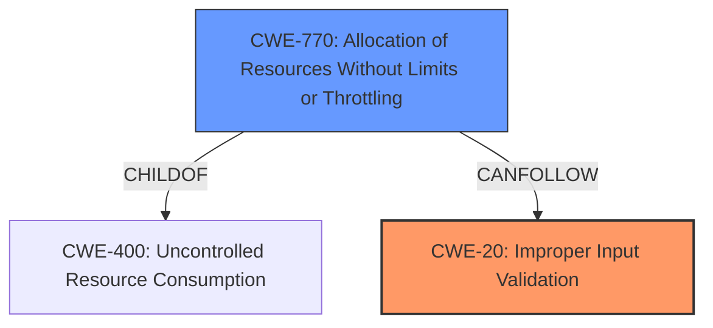

# Enhanced Analysis for CVE-2021-0083

# Summary
| CWE ID    | CWE Name                                                                | Confidence | CWE Abstraction Level | CWE Vulnerability Mapping Label | CWE-Vulnerability Mapping Notes |
| --------- | ----------------------------------------------------------------------- | ---------- | ----------------------- | ------------------------------- | ------------------------------- |
| CWE-20    | Improper Input Validation                                               | 0.9        | Class                   | Primary                         | Discouraged                    |
| CWE-770   | Allocation of Resources Without Limits or Throttling                   | 0.5        | Base                    | Secondary                       | Allowed                          |

## Evidence and Confidence

*   **Confidence Score:** 0.9
*   **Evidence Strength:** HIGH

## Relationship Analysis
The primary relationship influencing the decision is that CWE-20 (Improper Input Validation) is a class-level CWE, and many more specific Base-level CWEs are children of CWE-20. Since the vulnerability description explicitly mentions **improper input validation** as the **root cause**, CWE-20 is selected despite its discouraged usage, because it accurately captures the weakness without more specific details being available. CWE-770 (Allocation of Resources Without Limits or Throttling) is considered as a secondary candidate.



## Vulnerability Chain
The vulnerability chain starts with **improper input validation** (CWE-20), which allows a privileged user to potentially enable denial of service. The **improper input validation** is the root cause, and the denial of service is the impact.

## Summary of Analysis
The initial assessment strongly indicates that the vulnerability is due to **improper input validation**, as stated in the "Vulnerability Description Key Phrases" section, where it's listed as the **rootcause**. The "CVE Reference Links Content Summary" also confirms **improper input validation** as a key weakness.

CWE-20 (Improper Input Validation) is selected as the primary CWE. While CWE-20 is discouraged, the available information does not provide enough specificity to select a more detailed child CWE. The description highlights the **root cause** as **improper input validation**. The lack of specific details about the type of input, the validation failure, or the downstream consequences beyond denial of service constrains the selection to the broader CWE-20.

CWE-770 (Allocation of Resources Without Limits or Throttling) is considered a secondary candidate due to the "denial of service" impact. However, without further evidence linking the input validation directly to resource allocation issues, it remains a secondary consideration.

The selection of CWE-20 is based on the provided evidence, particularly the explicit mention of **improper input validation** as the **root cause**. While a more specific CWE would be preferable, the current evidence supports CWE-20 as the most accurate representation of the vulnerability's core weakness.

Relevant CWE Information:

# Enhanced Context (25 CWEs)

## CWE-1220: Insufficient Granularity of Access Control
**Abstraction Level**: Base
**Similarity Score**: 0.77
**Source**: dense

**Description**:
The product implements access controls via a policy or other feature with the intention to disable or restrict accesses (reads and/or writes) to assets in a system from untrusted agents. However, implemented access controls lack required granularity, which renders the control policy too broad because it allows accesses from unauthorized agents to the security-sensitive assets.

**Mapping Guidance**:
- Usage: Allowed
- Rationale: This CWE entry is at the Base level of abstraction, which is a preferred level of abstraction for mapping to the root causes of vulnerabilities.

This CWE is not applicable because the vulnerability description doesn't indicate any access control issues. Instead, it focuses on **improper input validation**.

## CWE-691: Insufficient Control Flow Management
**Abstraction Level**: Pillar
**Similarity Score**: 0.76
**Source**: dense

**Description**:
The code does not sufficiently manage its control flow during execution, creating conditions in which the control flow can be modified in unexpected ways.

**Mapping Guidance**:
- Usage: Discouraged
- Rationale: This CWE entry is extremely high-level, a Pillar. However, classification research is limited for weaknesses of this type, so there can be gaps or organizational difficulties within CWE that force use of this weakness, even at such a high level of abstraction.

This CWE is too abstract. The description focuses on **improper input validation**, not a general control flow issue.

## CWE-1289: Improper Validation of Unsafe Equivalence in Input
**Abstraction Level**: Base
**Similarity Score**: 0.76
**Source**: dense

**Description**:
The product receives an input value that is used as a resource identifier or other type of reference, but it does not validate or incorrectly validates that the input is equivalent to a potentially-unsafe value.

**Mapping Guidance**:
- Usage: Allowed
- Rationale: This CWE entry is at the Base level of abstraction, which is a preferred level of abstraction for mapping to the root causes of vulnerabilities.

This CWE is not applicable because the description does not indicate an issue with validation of equivalence of input. Instead, it focuses on **improper input validation**.

## CWE-653: Improper Isolation or Compartmentalization
**Abstraction Level**: Class
**Similarity Score**: 0.75
**Source**: dense

**Description**:
The product does not properly compartmentalize or isolate functionality, processes, or resources that require different privilege levels, rights, or permissions.

**Mapping Guidance**:
- Usage: Allowed
- Rationale: This CWE entry is at the Base level of abstraction, which is a preferred level of abstraction for mapping to the root causes of vulnerabilities.

This CWE is not applicable as there is no mention of isolation or compartmentalization issues in the vulnerability description.

## CWE-664: Improper Control of a Resource Through its Lifetime
**Abstraction Level**: Pillar
**Similarity Score**: 0.75
**Source**: dense

**Description**:
The product does not maintain or incorrectly maintains control over a resource throughout its lifetime of creation, use, and release.

**Mapping Guidance**:
- Usage: Discouraged
- Rationale: This CWE entry is high-level when lower-level children are available.

This CWE is too abstract and doesn't fit the specific vulnerability, which centers around **improper input validation**, not general resource control.

## CWE-807: Reliance on Untrusted Inputs in a Security Decision
**Abstraction Level**: Base
**Similarity Score**: 0.75
**Source**: dense

**Description**:
The product uses a protection mechanism that relies on the existence or values of an input, but the input can be modified by an untrusted actor in a way that bypasses the protection mechanism.

**Mapping Guidance**:
- Usage: Allowed
- Rationale: This CWE entry is at the Base level of abstraction, which is a preferred level of abstraction for mapping to the root causes of vulnerabilities.

This CWE is not applicable because the description does not indicate that a security decision is being made based on untrusted input.

## CWE-274: Improper Handling of Insufficient Privileges
**Abstraction Level**: Base
**Similarity Score**: 0.74
**Source**: dense

**Description**:
The product does not handle or incorrectly handles when it has insufficient privileges to perform an operation, leading to resultant weaknesses.

**Mapping Guidance**:
- Usage: Discouraged
- Rationale: This CWE entry could be deprecated in a future version of CWE.

This CWE doesn't align with the description, which focuses on **improper input validation**, not privilege handling.

## CWE-183: Permissive List of Allowed Inputs
**Abstraction Level**: Base
**Similarity Score**: 0.74
**Source**: dense

**Description**:
The product implements a protection mechanism that relies on a list of inputs (or properties of inputs) that are explicitly allowed by policy because the inputs are assumed to be safe, but the list is too permissive - that is, it allows an input that is unsafe, leading to resultant weaknesses.

**Mapping Guidance**:
- Usage: Allowed
- Rationale: This CWE entry is at the Base level of abstraction, which is a preferred level of abstraction for mapping to the root causes of vulnerabilities.

This CWE is too specific. While it relates to **improper input validation**, the description doesn't explicitly state the usage of a permissive list.

## CWE-280: Improper Handling of Insufficient Permissions or Privileges
**Abstraction Level**: Base
**Similarity Score**: 0.74
**Source**: dense

**Description**:
The product does not handle or incorrectly handles when it has insufficient privileges to access resources or functionality as specified by their permissions. This may cause it to follow unexpected code paths that may leave the product in an invalid state.

**Mapping Guidance**:
- Usage:


## CWE Relationship Analysis

Current CWEs represent these abstraction levels: .


### Vulnerability Chain Analysis

**Chain starting from CWE-400:**
- 400 (Uncontrolled Resource Consumption) - ROOT


**Chain starting from CWE-280:**
- 280 (Improper Handling of Insufficient Permissions or Privileges ) - ROOT


### CWE Relationship Diagram

```mermaid
graph TD
    classDef primary fill:#f96,stroke:#333,stroke-width:2px
    classDef secondary fill:#69f,stroke:#333
    classDef tertiary fill:#9e9,stroke:#333
```