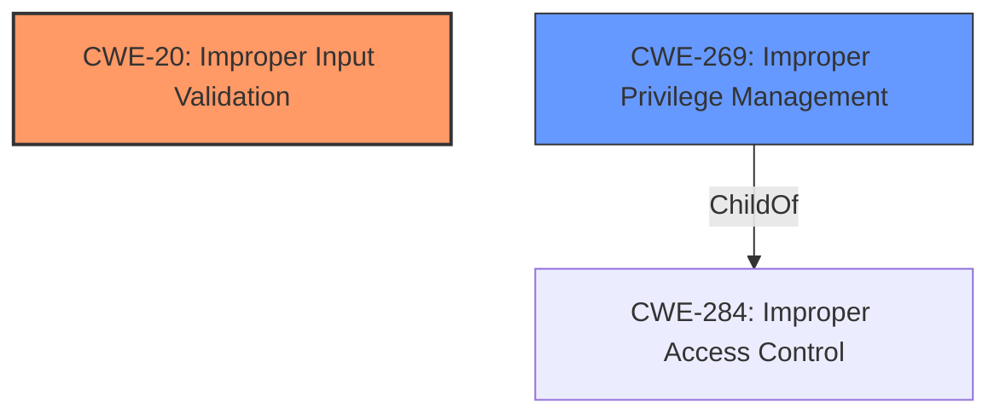

# Raw Analyzer Response for CVE-2021-0084

# Summary
| CWE ID | CWE Name | Confidence | CWE Abstraction Level | CWE Vulnerability Mapping Label | CWE-Vulnerability Mapping Notes |
|---|---|---|---|---|---|
| CWE-20 | Improper Input Validation | 0.8 | Class | Primary | Discouraged |
| CWE-269 | Improper Privilege Management | 0.5 | Class | Secondary | Discouraged |

## Evidence and Confidence

*   **Confidence Score:** 0.8
*   **Evidence Strength:** HIGH

## Relationship Analysis
The primary relationship that influenced the CWE selection is the parent-child relationship. CWE-20 **Improper Input Validation** is a class-level CWE. The vulnerability description explicitly mentions **improper input validation** as the root cause, so it becomes a candidate. However, it is a class level and the MITRE guidance discourages that selection. CWE-269 **Improper Privilege Management** is also a class level CWE, and the description has an impact of escalation of privilege, but the root cause is the input validation. Both are discouraged, and more specific CWEs would be preferrable.

## Vulnerability Chain
The vulnerability chain starts with **improper input validation** which leads to escalation of privilege.

## Summary of Analysis
The initial analysis identified **improper input validation** as the root cause, aligning with CWE-20. However, CWE-20 is a class-level CWE and is discouraged. The vulnerability description also indicated that the impact of the vulnerability is that it may allow an authenticated user to potentially enable escalation of privilege. This aligns with CWE-269. But the root cause is still **improper input validation**.

The final decision favors CWE-20 as the primary CWE because the vulnerability description explicitly mentions "**improper input validation**" as the root cause. The evidence for this is in the "**Vulnerability Description Key Phrases**" section. The fact that an authenticated user can escalate privileges is an impact of the **improper input validation**.

Relevant CWE Information:

# Enhanced Context (25 CWEs)

## CWE-1220: Insufficient Granularity of Access Control
**Abstraction Level**: Base
**Similarity Score**: 0.76
**Source**: dense

**Description**:
The product implements access controls via a policy or other feature with the intention to disable or restrict accesses (reads and/or writes) to assets in a system from untrusted agents. However, implemented access controls lack required granularity, which renders the control policy too broad because it allows accesses from unauthorized agents to the security-sensitive assets.

**Why not selected:** The root cause is **improper input validation**, not access control.

## CWE-653: Improper Isolation or Compartmentalization
**Abstraction Level**: Class
**Similarity Score**: 0.76
**Source**: dense

**Description**:
The product does not properly compartmentalize or isolate functionality, processes, or resources that require different privilege levels, rights, or permissions.

**Why not selected:** The root cause is **improper input validation**, not isolation.

## CWE-1289: Improper Validation of Unsafe Equivalence in Input
**Abstraction Level**: Base
**Similarity Score**: 0.76
**Source**: dense

**Description**:
The product receives an input value that is used as a resource identifier or other type of reference, but it does not validate or incorrectly validates that the input is equivalent to a potentially-unsafe value.

**Why not selected:** While this CWE is related to **improper validation**, the specific context of "unsafe equivalence" does not seem to precisely fit the vulnerability description provided. There is not enough information in the Vulnerability Description to determine if the equivalence of inputs is a factor.

## CWE-274: Improper Handling of Insufficient Privileges
**Abstraction Level**: Base
**Similarity Score**: 0.76
**Source**: dense

**Description**:
The product does not handle or incorrectly handles when it has insufficient privileges to perform an operation, leading to resultant weaknesses.

**Why not selected:** The vulnerability description states the impact is escalation of privilege due to **improper input validation**.

## CWE-691: Insufficient Control Flow Management
**Abstraction Level**: Pillar
**Similarity Score**: 0.76
**Source**: dense

**Description**:
The code does not sufficiently manage its control flow during execution, creating conditions in which the control flow can be modified in unexpected ways.

**Why not selected:** The root cause is **improper input validation**, not control flow management.

## CWE-807: Reliance on Untrusted Inputs in a Security Decision
**Abstraction Level**: Base
**Similarity Score**: 0.76
**Source**: dense

**Description**:
The product uses a protection mechanism that relies on the existence or values of an input, but the input can be modified by an untrusted actor in a way that bypasses the protection mechanism.

**Why not selected:** This CWE is plausible, however the description says the vulnerability occurs even with an "authenticated user".

## CWE-184: Incomplete List of Disallowed Inputs
**Abstraction Level**: Base
**Similarity Score**: 0.75
**Source**: dense

**Description**:
The product implements a protection mechanism that relies on a list of inputs (or properties of inputs) that are not allowed by policy or otherwise require other action to neutralize before additional processing takes place, but the list is incomplete.

**Why not selected:** There is insufficient evidence to determine if the **improper input validation** is related to an incomplete list of disallowed inputs.

## CWE-183: Permissive List of Allowed Inputs
**Abstraction Level**: Base
**Similarity Score**: 0.75
**Source**: dense

**Description**:
The product implements a protection mechanism that relies on a list of inputs (or properties of inputs) that are explicitly allowed by policy because the inputs are assumed to be safe, but the list is too permissive - that is, it allows an input that is unsafe, leading to resultant weaknesses.

**Why not selected:** There is insufficient evidence to determine if the **improper input validation** is related to an permissive list of allowed inputs.

## CWE-280: Improper Handling of Insufficient Permissions or Privileges
**Abstraction Level**: Base
**Similarity Score**: 0.75
**Source**: dense

**Description**:
The product does not handle or incorrectly handles when it has insufficient privileges to access resources or functionality as specified by their permissions. This may cause it to follow unexpected code paths that may leave the product in an invalid state.

**Why not selected:** The vulnerability description states the impact is escalation of privilege due to **improper input validation**.

## CWE-664: Improper Control of a Resource Through its Lifetime
**Abstraction Level**: Pillar
**Similarity Score**: 0.75
**Source**: dense

**Description**:
The product does not maintain or incorrectly maintains control over a resource throughout its lifetime of creation, use, and release.

**Why not selected:** The root cause is **improper input validation**, not resource control.

## CWE-119: Improper Restriction of Operations within the Bounds of a Memory Buffer
**Abstraction Level**: Class
**Similarity Score**: 6111.90
**Source**: sparse

**Description**:
The product performs operations on a memory buffer, but it reads from or writes to a memory location outside the buffer's intended boundary. This may result in read or write operations on unexpected memory locations that could be linked to other variables, data structures, or internal program data.

**Why not selected:** There is no mention of a buffer, so it is not possible to determine that this is related to operations within the bounds of a memory buffer.

## CWE-22: Improper Limitation of a Pathname to a Restricted Directory ('Path Traversal')
**Abstraction Level**: Base
**Similarity Score**: 5989.88
**Source**: sparse

**Description**:
The product uses external input to construct a pathname that is intended to identify a file or directory that is located underneath a restricted parent directory, but the product does not properly neutralize special elements within the pathname that can cause the pathname to resolve to a location that is outside of the restricted directory.

**Why not selected:** There is no mention of pathnames, files, or directories, so it is not possible to determine that this is related to path traversal.

## CWE-125: Out-of-bounds Read
**Abstraction Level**: Base
**Similarity Score**: 5988.41
**Source**: sparse

**Description**:
The product reads data past the end, or before the beginning, of the intended buffer.

**Why not selected:** There is no mention of a buffer, so it is not possible to determine that this is related to reading data out of bounds.

## CWE-1284: Improper Validation of Specified Quantity in Input
**Abstraction Level**: Base
**Similarity Score**: 5986