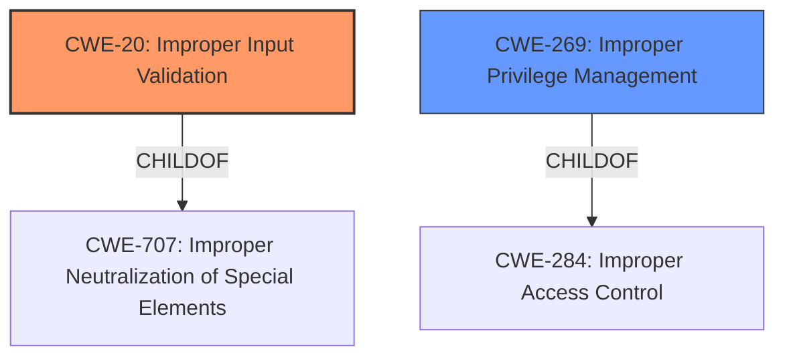

# Analysis for CVE-2021-0126

# Summary
| CWE ID | CWE Name | Confidence | CWE Abstraction Level | CWE Vulnerability Mapping Label | CWE-Vulnerability Mapping Notes |
|---|---|---|---|---|---|
| CWE-20 | Improper Input Validation | 0.75 | Class | Primary | Discouraged |
| CWE-269 | Improper Privilege Management | 0.5 | Class | Secondary | Discouraged |

## Evidence and Confidence

*   **Confidence Score:** 0.75
*   **Evidence Strength:** MEDIUM

## Relationship Analysis
The primary relationship considered here is the ChildOf relationship. CWE-20 [Improper Input Validation] is a child of CWE-707 [Improper Neutralization of Special Elements], while CWE-269 [Improper Privilege Management] is a child of CWE-284 [Improper Access Control]. Both CWE-20 and CWE-269 are Class level and should be avoided when a more specific Base or Variant level CWE is available.

## Vulnerability Chain
The vulnerability chain starts with **improper input validation** (CWE-20), leading to a potential escalation of privilege.

## Summary of Analysis
The initial analysis identified **improper input validation** as the root cause of the vulnerability, potentially leading to privilege escalation.

The vulnerability description states: "**Improper input validation** for the Intel(R) Manageability Commander before version 2.2 may allow an authenticated user to potentially enable escalation of privilege via adjacent access." This statement directly supports the selection of CWE-20 [Improper Input Validation] as a primary weakness and the selection of CWE-269 [Improper Privilege Management] as a secondary weakness since **improper input validation** is the rootcause weakness that allows for the **escalation of privilege**.

CWE-20 [Improper Input Validation] is a Class level CWE and should be avoided when a more specific Base or Variant level CWE is available. However, the provided information does not give more detail than **improper input validation**, therefore no specific Base or Variant level CWE can be selected.

CWE-269 [Improper Privilege Management] is also a Class level CWE and should be avoided when a more specific Base or Variant level CWE is available. However, the provided information does not give more detail than **escalation of privilege**, therefore no specific Base or Variant level CWE can be selected.

Relevant CWE Information:

# Enhanced Context (25 CWEs)
The following CWEs were identified as potentially relevant to this vulnerability:

## CWE-1289: Improper Validation of Unsafe Equivalence in Input
**Abstraction Level**: Base
**Similarity Score**: 0.77

This CWE is not selected because there is no evidence of "unsafe equivalence" in the provided vulnerability information.

## CWE-691: Insufficient Control Flow Management
**Abstraction Level**: Pillar
**Similarity Score**: 0.76

This CWE is not selected because there is no evidence of control flow management issues in the provided vulnerability information.

## CWE-274: Improper Handling of Insufficient Privileges
**Abstraction Level**: Base
**Similarity Score**: 0.76

This CWE is not selected because there is no evidence of handling insufficient privileges in the provided vulnerability information.

## CWE-807: Reliance on Untrusted Inputs in a Security Decision
**Abstraction Level**: Base
**Similarity Score**: 0.75

This CWE is not selected because there is no evidence of relying on untrusted inputs in a security decision in the provided vulnerability information.

## CWE-664: Improper Control of a Resource Through its Lifetime
**Abstraction Level**: Pillar
**Similarity Score**: 0.75

This CWE is not selected because there is no evidence of improper control of a resource through its lifetime in the provided vulnerability information.

## CWE-41: Improper Resolution of Path Equivalence
**Abstraction Level**: Base
**Similarity Score**: 0.75

This CWE is not selected because there is no evidence of path equivalence issues in the provided vulnerability information.

## CWE-653: Improper Isolation or Compartmentalization
**Abstraction Level**: Class
**Similarity Score**: 0.74

This CWE is not selected because there is no evidence of isolation or compartmentalization issues in the provided vulnerability information.

## CWE-703: Improper Check or Handling of Exceptional Conditions
**Abstraction Level**: Pillar
**Similarity Score**: 0.74

This CWE is not selected because there is no evidence of handling of exceptional conditions issues in the provided vulnerability information.

## CWE-280: Improper Handling of Insufficient Permissions or Privileges 
**Abstraction Level**: Base
**Similarity Score**: 0.74

This CWE is not selected because there is no evidence of handling insufficient permissions or privileges issues in the provided vulnerability information.

## CWE-693: Protection Mechanism Failure
**Abstraction Level**: Pillar
**Similarity Score**: 0.74

This CWE is not selected because there is no evidence of a protection mechanism failure in the provided vulnerability information.

## CWE-1284: Improper Validation of Specified Quantity in Input
**Abstraction Level**: Base
**Similarity Score**: 5657.16

This CWE is not selected because there is no evidence of a specified quantity in the provided vulnerability information.

## CWE-863: Incorrect Authorization
**Abstraction Level**: Class
**Similarity Score**: 5635.45

This CWE is not selected because there is no evidence of incorrect authorization in the provided vulnerability information.

## CWE-639: Authorization Bypass Through User-Controlled Key
**Abstraction Level**: Base
**Similarity Score**: 5546.96

This CWE is not selected because there is no evidence of authorization bypass through a user-controlled key in the provided vulnerability information.

## CWE-116: Improper Encoding or Escaping of Output
**Abstraction Level**: Class
**Similarity Score**: 5539.20

This CWE is not selected because there is no evidence of encoding or escaping of output in the provided vulnerability information.

## CWE-22: Improper Limitation of a Pathname to a Restricted Directory ('Path Traversal')
**Abstraction Level**: Base
**Similarity Score**: 5538.08

This CWE is not selected because there is no evidence of path traversal in the provided vulnerability information.

## CWE-190: Integer Overflow or Wraparound
**Abstraction Level**: base
**Similarity Score**: 4.33

This CWE is not selected because there is no evidence of integer overflow in the provided vulnerability information.

## CWE-193: Off-by-one Error
**Abstraction Level**: base
**Similarity Score**: 4.33

This CWE is not selected because there is no evidence of an off-by-one error in the provided vulnerability information.

## CWE-73: External Control of File Name or Path
**Abstraction Level**: base
**Similarity Score**: 4.33

This CWE is not selected because there is no evidence of external control of file name or path in the provided vulnerability information.

## CWE-770: Allocation of Resources Without Limits or Throttling
**Abstraction Level**: base
**Similarity Score**: 4.33

This CWE is not selected because there is no evidence of allocation of resources without limits or throttling in the provided vulnerability information.

## CWE-22: Improper Limitation of a Pathname to a Restricted Directory ('Path Traversal')
**Abstraction Level**: base
**Similarity Score**: 4.33

This CWE is not selected because there is no evidence of path traversal in the provided vulnerability information.

## CWE-822: Untrusted Pointer Dereference
**Abstraction Level**: base
**Similarity Score**: 4.33

This CWE is not selected because there is no evidence of untrusted pointer dereference in the provided vulnerability information.

## CWE-781: Improper Address Validation in IOCTL with METHOD_NEITHER I/O Control Code
**Abstraction Level**: variant
**Similarity Score**: 3.88

This CWE is not selected because there is no evidence of improper address validation in IOCTL in the provided vulnerability information.

## CWE-266: Incorrect Privilege Assignment
**Abstraction Level**: base
**Similarity Score**: 3.64

This CWE is not selected because there is no evidence of incorrect privilege assignment in the provided vulnerability information.

## CWE-322: Key Exchange without Entity Authentication
**Abstraction Level**: base
**Similarity Score**: 3.57

This CWE is not selected because there is no evidence of key exchange without entity authentication in the provided vulnerability information.

## CWE-