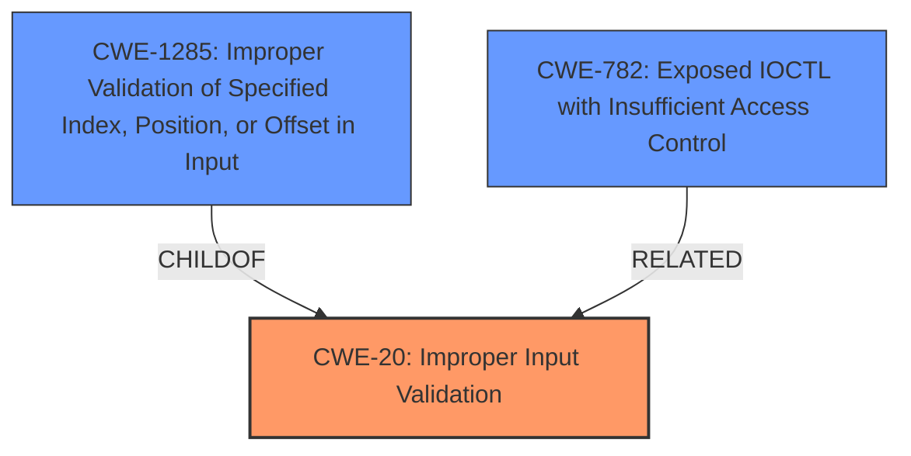

# Enhanced Analysis for CVE-2021-0135

# Summary
| CWE ID | CWE Name | Confidence | CWE Abstraction Level | CWE Vulnerability Mapping Label | CWE-Vulnerability Mapping Notes |
|---|---|---|---|---|---|
| CWE-20 (Primary) | Improper Input Validation | 0.8 | Class | Discouraged | This is the primary weakness due to the description explicitly stating "Improper input validation" as the root cause. While discouraged, it is a valid starting point. |
| CWE-1285 (Secondary) | Improper Validation of Specified Index, Position, or Offset in Input | 0.6 | Base | Allowed | This CWE is a potential candidate because the improper input validation might involve validating an index, position, or offset. However, there is no explicit evidence to confirm this. |
| CWE-782 (Secondary) | Exposed IOCTL with Insufficient Access Control | 0.5 | Variant | Allowed | This CWE is a potential candidate because the description mentions escalation of privilege via local access, which might involve IOCTLs. However, the connection is not explicitly stated. |

## Evidence and Confidence

*   **Confidence Score:** 0.7
*   **Evidence Strength:** MEDIUM

## Relationship Analysis
The primary CWE is CWE-20, which is a Class-level CWE. The retriever results suggest possible child CWEs that could be more specific, such as CWE-1285. The relationship analysis guided the consideration of more specific CWEs, though the provided evidence does not definitively support them.


## Vulnerability Chain
The vulnerability chain starts with **improper input validation** (CWE-20), which leads to a potential escalation of privilege. A more specific weakness related to input validation could be present (e.g., CWE-1285), or an IOCTL issue (CWE-782), but the description lacks the details to confirm.

## Summary of Analysis
The initial assessment identified CWE-20 as the primary weakness due to the explicit mention of "**Improper input validation**" in the vulnerability description. The retriever results suggested more specific CWEs, such as CWE-1285 and CWE-782, which are related to input validation and access control, respectively.

The assessment is primarily based on the provided evidence, specifically the "**rootcause: Improper input validation**" phrase. The graph relationships influenced the consideration of more specific CWEs.

CWE-20 is a Class-level CWE, and while the mapping guidance discourages its use when more specific CWEs are available, the lack of detailed information makes it difficult to pinpoint the exact type of input validation failure. Therefore, CWE-20 is the most appropriate choice based on the available evidence, even though it could benefit from further refinement. CWE-1285 and CWE-782 are plausible secondary candidates that might apply if further details become available.

Relevant CWE Information:

# Enhanced Context (25 CWEs)
The following CWEs were identified as potentially relevant to this vulnerability:

## CWE-691: Insufficient Control Flow Management
**Abstraction Level**: Pillar
**Similarity Score**: 0.75
**Source**: dense

**Description**:
The code does not sufficiently manage its control flow during execution, creating conditions in which the control flow can be modified in unexpected ways.

**Mapping Guidance**:
- Usage: Discouraged
- Rationale: This CWE entry is extremely high-level, a Pillar. However, classification research is limited for weaknesses of this type, so there can be gaps or organizational difficulties within CWE that force use of this weakness, even at such a high level of abstraction.

*Not selected:* This CWE is too high-level and doesn't directly relate to the described **improper input validation**.

## CWE-131: Incorrect Calculation of Buffer Size
**Abstraction Level**: Base
**Similarity Score**: 0.75
**Source**: dense

**Description**:
The product does not correctly calculate the size to be used when allocating a buffer, which could lead to a buffer overflow.

**Mapping Guidance**:
- Usage: Allowed
- Rationale: This CWE entry is at the Base level of abstraction, which is a preferred level of abstraction for mapping to the root causes of vulnerabilities.

*Not selected:* There is no evidence to suggest a buffer size calculation issue.

## CWE-653: Improper Isolation or Compartmentalization
**Abstraction Level**: Class
**Similarity Score**: 0.75
**Source**: dense

**Description**:
The product does not properly compartmentalize or isolate functionality, processes, or resources that require different privilege levels, rights, or permissions.

**Mapping Guidance**:
- Usage: Allowed
- Rationale: This CWE entry is at the Base level of abstraction, which is a preferred level of abstraction for mapping to the root causes of vulnerabilities.

*Not selected:* While the vulnerability leads to privilege escalation, there is no evidence to suggest an isolation or compartmentalization problem.

## CWE-191: Integer Underflow (Wrap or Wraparound)
**Abstraction Level**: Base
**Similarity Score**: 0.74
**Source**: dense

**Description**:
The product subtracts one value from another, such that the result is less than the minimum allowable integer value, which produces a value that is not equal to the correct result.

**Mapping Guidance**:
- Usage: Allowed
- Rationale: This CWE entry is at the Base level of abstraction, which is a preferred level of abstraction for mapping to the root causes of vulnerabilities.

*Not selected:* There is no evidence to suggest an integer underflow.

## CWE-1289: Improper Validation of Unsafe Equivalence in Input
**Abstraction Level**: Base
**Similarity Score**: 0.74
**Source**: dense

**Description**:
The product receives an input value that is used as a resource identifier or other type of reference, but it does not validate or incorrectly validates that the input is equivalent to a potentially-unsafe value.

**Mapping Guidance**:
- Usage: Allowed
- Rationale: This CWE entry is at the Base level of abstraction, which is a preferred level of abstraction for mapping to the root causes of vulnerabilities.

*Not selected:* There is no evidence to suggest an unsafe equivalence issue.

## CWE-667: Improper Locking
**Abstraction Level**: Class
**Similarity Score**: 0.74
**Source**: dense

**Description**:
The product does not properly acquire or release a lock on a resource, leading to unexpected resource state changes and behaviors.

**Mapping Guidance**:
- Usage: Allowed-with-Review
- Rationale: This CWE entry is a Class and might have Base-level children that would be more appropriate

*Not selected:* There is no evidence to suggest a locking issue.

## CWE-119: Improper Restriction of Operations within the Bounds of a Memory Buffer
**Abstraction Level**: Class
**Similarity Score**: 0.74
**Source**: dense

**Description**:
The product performs operations on a memory buffer, but it reads from or writes to a memory location outside the buffer's intended boundary. This may result in read or write operations on unexpected memory locations that could be linked to other variables, data structures, or internal program data.

**Mapping Guidance**:
- Usage: Discouraged
- Rationale: CWE-119 is commonly misused in low-information vulnerability reports when lower-level CWEs could be used instead, or when more details about the vulnerability are available.

*Not selected:* There is no evidence to suggest a buffer-related issue.

## CWE-404: Improper Resource Shutdown or Release
**Abstraction Level**: Class
**Similarity Score**: 0.74
**Source**: dense

**Description**:
The product does not release or incorrectly releases a resource before it is made available for re-use.

**Mapping Guidance**:
- Usage: Allowed-with-Review
- Rationale: This CWE entry is a Class and might have Base-level children that would be more appropriate

*Not selected:* There is no evidence to suggest a resource management issue.

## CWE-805: Buffer Access with Incorrect Length Value
**Abstraction Level**: Base
**Similarity Score**: 0.74
**Source**: dense

**Description**:
The product uses a sequential operation to read or write a buffer, but it uses an incorrect length value that causes it to access memory that is outside of the bounds of the buffer.

**Mapping Guidance**:
- Usage: Allowed
- Rationale: This CWE entry is at the Base level of abstraction, which is a preferred level of abstraction for mapping to the root causes of vulnerabilities.

*Not selected:* There is no evidence to suggest a buffer-related issue.

## CWE-125: Out-of-bounds Read
**Abstraction Level


## CWE Relationship Analysis

Current CWEs represent these abstraction levels: .


### Vulnerability Chain Analysis

**Chain starting from CWE-131:**
- 131 (Incorrect Calculation of Buffer Size) - ROOT


**Chain starting from CWE-805:**
- 805 (Buffer Access with Incorrect Length Value) - ROOT


### CWE Relationship Diagram

```mermaid
graph TD
    classDef primary fill:#f96,stroke:#333,stroke-width:2px
    classDef secondary fill:#69f,stroke:#333
    classDef tertiary fill:#9e9,stroke:#333
```