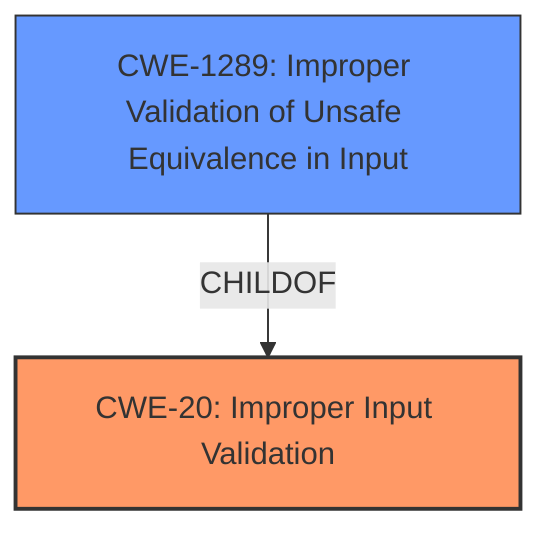

# Enhanced Analysis for CVE-2021-0159

# Summary
| CWE ID | CWE Name | Confidence | CWE Abstraction Level | CWE Vulnerability Mapping Label | CWE-Vulnerability Mapping Notes |
|---|---|---|---|---|---|
| **CWE-20** | **Improper Input Validation** | 0.75 | Class | Primary | Discouraged: CWE-20 is commonly misused in low-information vulnerability reports when lower-level CWEs could be used instead, or when more details about the vulnerability are available. |
| CWE-1289 | Improper Validation of Unsafe Equivalence in Input | 0.5 | Base | Secondary | Allowed |

## Evidence and Confidence

*   **Confidence Score:** 0.70
*   **Evidence Strength:** MEDIUM

## Relationship Analysis
The primary relationship influencing the choice of CWE-20 is its role as a general **Improper Input Validation** issue, which is directly indicated in the vulnerability description. While CWE-20 is a Class-level CWE, the evidence doesn't strongly support a more specific Base or Variant level CWE. It is also noted that **Improper Input Validation** can **precede** other CWEs like CWE-22 (Path Traversal), CWE-119 (Buffer Overflow), and CWE-770 (Allocation of Resources Without Limits or Throttling), suggesting it is a root cause.



## Vulnerability Chain
The vulnerability chain starts with **Improper Input Validation (CWE-20)**, which leads to an escalation of privilege. The description doesn't provide enough information to precisely determine how the **improper input validation** leads to the escalation, but it sets the stage for a potential exploit.
  - **Root Cause:** **CWE-20 (Improper Input Validation)**
  - **Impact:** Escalation of Privilege

## Summary of Analysis
Initial analysis strongly pointed towards **CWE-20 (Improper Input Validation)** as the primary weakness, supported by the "Vulnerability Description Key Phrases" highlighting "**Improper input validation**" as the **rootcause**. The CVE Reference Links Content Summary also emphasizes this point.

The retriever results suggest other CWEs like CWE-691, CWE-119, CWE-125, and CWE-770. However, these are either too high-level (CWE-691) or lack sufficient evidence in the description to justify their selection.

The final decision to assign **CWE-20** is based on the explicit statement of **improper input validation** in the vulnerability description. While the desire is to be as specific as possible, the available information doesn't warrant a lower-level CWE with high confidence.

**CWE-1289 (Improper Validation of Unsafe Equivalence in Input)** was considered as a secondary candidate because it is a more specific type of **Improper Input Validation**. The description states that the **improper input validation** in the BIOS authenticated code module allows a privileged user to potentially enable escalation of privilege via local access. It could be that the input is used as a resource identifier or other type of reference, but it does not validate or incorrectly validates that the input is equivalent to a potentially-unsafe value. However, there is insufficient evidence to confirm this, so it is assigned as a secondary candidate with lower confidence.

Relevant CWE Information:

# Enhanced Context (25 CWEs)
The following CWEs were identified as potentially relevant to this vulnerability:

## CWE-1289: Improper Validation of Unsafe Equivalence in Input
**Abstraction Level**: Base
**Similarity Score**: 0.77

**Description**:
The product receives an input value that is used as a resource identifier or other type of reference, but it does not validate or incorrectly validates that the input is equivalent to a potentially-unsafe value.

**Mapping Guidance**:
- Usage: Allowed
- Rationale: This CWE entry is at the Base level of abstraction, which is a preferred level of abstraction for mapping to the root causes of vulnerabilities.


## CWE Relationship Analysis

Current CWEs represent these abstraction levels: .


### Vulnerability Chain Analysis

**Chain starting from CWE-20:**
- 20 (Improper Input Validation) - ROOT


**Chain starting from CWE-1289:**
- 1289 (Improper Validation of Unsafe Equivalence in Input) - ROOT


### CWE Relationship Diagram

```mermaid
graph TD
    classDef primary fill:#f96,stroke:#333,stroke-width:2px
    classDef secondary fill:#69f,stroke:#333
    classDef tertiary fill:#9e9,stroke:#333
```