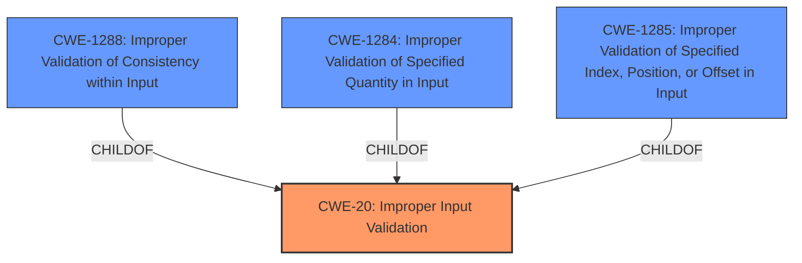

# Analysis Report for CVE-2021-0161

# Vulnerability Analysis Report: CVE-2021-0161

## Description


## Analysis (with Relationship Data)

# Summary
| CWE ID | CWE Name | Confidence | CWE Abstraction Level | CWE Vulnerability Mapping Label | CWE-Vulnerability Mapping Notes |
|---|---|---|---|---|---|
| CWE-20 | Improper Input Validation | 0.9 | Class | Primary | Discouraged due to being high-level, but most appropriate based on the provided information. |
| CWE-1288 | Improper Validation of Consistency within Input | 0.7 | Base | Secondary | Candidate because it's a child of CWE-20 and deals with consistency, but the description doesn't specify inconsistency. |
| CWE-1284 | Improper Validation of Specified Quantity in Input | 0.6 | Base | Secondary | Candidate as it deals with quantity, but the vulnerability description doesn't specify quantity issues. |
| CWE-1285 | Improper Validation of Specified Index, Position, or Offset in Input | 0.6 | Base | Secondary | Candidate as it deals with indexes, position, or offsets, but the vulnerability description doesn't specify index issues. |

## Evidence and Confidence

*   **Confidence Score:** 0.9
*   **Evidence Strength:** HIGH

## Relationship Analysis
The primary relationship influencing the decision is the parent-child relationship between CWE-20 and its children. While the vulnerability description points to **improper input validation**, the lack of specific details prevents assigning a more specific child CWE. The retriever results also highlight several children of CWE-20 such as CWE-1288, CWE-1284, and CWE-1285, but these are not definitively supported by the evidence.



## Vulnerability Chain
The chain starts with **improper input validation** in the firmware, which allows a privileged user to escalate their privileges.

Root Cause: **Improper Input Validation** (CWE-20)
Impact: Escalation of Privilege

## Summary of Analysis
The initial analysis focused on identifying the root cause from the vulnerability description: "**Improper input validation**". The CVE Reference Links Content Summary reinforces this by stating, "Root cause of vulnerability: Improper input validation in firmware". The provided information does not give enough information to go to a more specific CWE.

The primary CWE match from similar CVE descriptions is CWE-20, reinforcing the initial assessment. While CWE-20 is discouraged due to its high-level nature, the lack of specific details in the vulnerability description makes it the most appropriate choice.

The retriever results suggest several child CWEs of CWE-20, such as CWE-1288, CWE-1284 and CWE-1285. However, these require more specific evidence that is not provided in the vulnerability description.

Therefore, the assessment is based on the evidence provided which is directly related to **improper input validation**, but lacks the granularity to pinpoint the exact type of validation error.

Relevant CWE Information:

# Enhanced Context (25 CWEs)

## CWE-691: Insufficient Control Flow Management
**Abstraction Level**: Pillar
**Similarity Score**: 0.78
**Source**: dense

**Description**:
The code does not sufficiently manage its control flow during execution, creating conditions in which the control flow can be modified in unexpected ways.

**Mapping Guidance**:
- Usage: Discouraged
- Rationale: This CWE entry is extremely high-level, a Pillar. However, classification research is limited for weaknesses of this type, so there can be gaps or organizational difficulties within CWE that force use of this weakness, even at such a high level of abstraction.

*   Not selected because it is too high-level and doesn't directly relate to input validation.

## CWE-653: Improper Isolation or Compartmentalization
**Abstraction Level**: Class
**Similarity Score**: 0.76
**Source**: dense

**Description**:
The product does not properly compartmentalize or isolate functionality, processes, or resources that require different privilege levels, rights, or permissions.

**Mapping Guidance**:
- Usage: Allowed
- Rationale: This CWE entry is at the Base level of abstraction, which is a preferred level of abstraction for mapping to the root causes of vulnerabilities.

*   Not selected because the vulnerability description doesn't mention anything about isolation or compartmentalization.

## CWE-667: Improper Locking
**Abstraction Level**: Class
**Similarity Score**: 0.76
**Source**: dense

**Description**:
The product does not properly acquire or release a lock on a resource, leading to unexpected resource state changes and behaviors.

**Mapping Guidance**:
- Usage: Allowed-with-Review
- Rationale: This CWE entry is a Class and might have Base-level children that would be more appropriate

*   Not selected because the vulnerability description doesn't mention anything about locking.

## CWE-1289: Improper Validation of Unsafe Equivalence in Input
**Abstraction Level**: Base
**Similarity Score**: 0.76
**Source**: dense

**Description**:
The product receives an input value that is used as a resource identifier or other type of reference, but it does not validate or incorrectly validates that the input is equivalent to a potentially-unsafe value.

**Mapping Guidance**:
- Usage: Allowed
- Rationale: This CWE entry is at the Base level of abstraction, which is a preferred level of abstraction for mapping to the root causes of vulnerabilities.

*   Not selected because the vulnerability description doesn't mention anything about unsafe equivalence.

## CWE-131: Incorrect Calculation of Buffer Size
**Abstraction Level**: Base
**Similarity Score**: 0.76
**Source**: dense

**Description**:
The product does not correctly calculate the size to be used when allocating a buffer, which could lead to a buffer overflow.

**Mapping Guidance**:
- Usage: Allowed
- Rationale: This CWE entry is at the Base level of abstraction, which is a preferred level of abstraction for mapping to the root causes of vulnerabilities.

*   Not selected because the vulnerability description doesn't mention anything about buffer size calculation.

## CWE-41: Improper Resolution of Path Equivalence
**Abstraction Level**: Base
**Similarity Score**: 0.76
**Source**: dense

**Description**:
The product is vulnerable to file system contents disclosure through path equivalence. Path equivalence involves the use of special characters in file and directory names. The associated manipulations are intended to generate multiple names for the same object.

**Mapping Guidance**:
- Usage: Allowed
- Rationale: This CWE entry is at the Base level of abstraction, which is a preferred level of abstraction for mapping to the root causes of vulnerabilities.

*   Not selected because the vulnerability description doesn't mention anything about path equivalence.

## CWE-703: Improper Check or Handling of Exceptional Conditions
**Abstraction Level**: Pillar
**Similarity Score**: 0.76
**Source**: dense

**Description**:
The product does not properly anticipate or handle exceptional conditions that rarely occur during normal operation of the product.

**Mapping Guidance**:
- Usage: Discouraged
- Rationale: This CWE entry is extremely high-level, a Pillar.

*   Not selected because it is too high-level and not directly related to input validation.

## CWE-119: Improper Restriction of Operations within the Bounds of a Memory Buffer
**Abstraction Level**: Class
**Similarity Score**: 0.76
**Source**: dense

**Description**:
The product performs operations on a memory buffer, but it reads from or writes to a memory location outside the buffer's intended boundary. This may result in read or write operations on unexpected memory locations that could be linked to other variables, data structures, or internal program data.

**Mapping Guidance**:
- Usage: Discouraged
- Rationale: CWE-119 is commonly misused in low-information vulnerability reports when lower-level CWEs could be used instead, or when more details about the vulnerability are available.

*   Not selected because it is too general. While the impact could involve memory corruption, the root cause is input validation.

## CWE-404: Improper Resource Shutdown or Release
**Abstraction Level**: Class
**Similarity Score**: 0.75
**Source**: dense

**Description**:
The product does not release or incorrectly releases a resource before it is made available for re-use.

**Mapping Guidance**:
- Usage: Allowed-with-Review
- Rationale: This CWE entry is a Class and might have Base-level children that would be more appropriate

*   Not selected because the


## CWE Relationship Analysis

Current CWEs represent these abstraction levels: .


### Vulnerability Chain Analysis

**Chain starting from CWE-131:**
- 131 (Incorrect Calculation of Buffer Size) - ROOT


**Chain starting from CWE-41:**
- 41 (Improper Resolution of Path Equivalence) - ROOT


### CWE Relationship Diagram

```mermaid
graph TD
    classDef primary fill:#f96,stroke:#333,stroke-width:2px
    classDef secondary fill:#69f,stroke:#333
    classDef tertiary fill:#9e9,stroke:#333
```


*Report generated on 2025-03-30 21:51:26*
