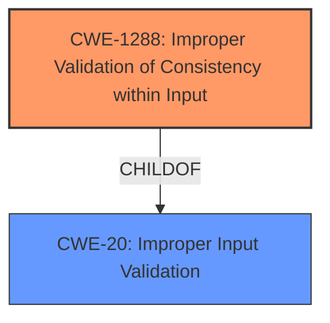

# Analysis Report for CVE-2021-0163

# Vulnerability Analysis Report: CVE-2021-0163

## Description


## Analysis (with Relationship Data)

# Summary
| CWE ID    | CWE Name                                  | Confidence | CWE Abstraction Level | CWE Vulnerability Mapping Label | CWE-Vulnerability Mapping Notes |
| --------- | ----------------------------------------- | ---------- | ----------------------- | ------------------------------- | ------------------------------- |
| CWE-1288 | Improper Validation of Consistency within Input | 0.9        | Base                    | Primary                         | Allowed                       |

## Evidence and Confidence

*   **Confidence Score:** 0.9
*   **Evidence Strength:** HIGH

## Relationship Analysis
The primary CWE identified is CWE-1288 (Improper Validation of Consistency within Input), a Base-level CWE. It is a child of CWE-20 (Improper Input Validation), which is a Class-level CWE. The hierarchical relationship supports selecting CWE-1288 because it's a more specific instance of a general input validation problem.



## Vulnerability Chain
The vulnerability chain starts with the **improper validation of consistency within input** (CWE-1288) which leads to a potential escalation of privilege.

## Summary of Analysis
The initial analysis strongly suggests CWE-1288 (Improper Validation of Consistency within Input) as the primary CWE. The vulnerability description clearly states "**Improper Validation of Consistency within input**" as the root cause. The CVE Reference Links Content Summary also emphasizes the **improper input validation** as the root cause.

The retriever results list CWE-1288 as the top combined result with a good score. CWE-20 (Improper Input Validation) is also listed, but the mapping guidance discourages its use when a more specific CWE is available. The relationship analysis confirms that CWE-1288 is a child of CWE-20, making it a more appropriate and specific choice.

The final selection of CWE-1288 is based on the direct evidence from the vulnerability description and the retriever results. The graph relationships support this choice as it's a more specific instance of the general input validation problem. This ensures the selected CWE is at the optimal level of specificity.

Relevant CWE Information:

# Enhanced Context (25 CWEs)

## CWE-1288: Improper Validation of Consistency within Input

**CWE-1288: Improper Validation of Consistency within Input**

*   **How the vulnerability's details match the CWE's characteristics:** The vulnerability stems from the **improper validation of consistency** within the input data. This aligns directly with the CWE-1288 description, which focuses on scenarios where input data has multiple elements or fields that must be consistent, but this consistency is not properly validated.

*   **The security implications and potential impact:** The security implication is escalation of privilege, which an attacker can potentially achieve due to the lack of proper consistency checks on the input.

*   **Any parent-child relationships or chain patterns that influenced your mapping:** CWE-1288 is a child of CWE-20, indicating that it is a specific type of input validation issue. This relationship influenced the mapping by guiding the selection toward a more precise CWE.

*   **Whether the weakness is primary or secondary in the vulnerability:** CWE-1288 is the primary weakness as it is the root cause of the vulnerability.

*   **How the official MITRE mapping guidance influenced your decision:** The MITRE mapping guidance for CWE-1288 indicates that it is at the Base level of abstraction, which is a preferred level for mapping root causes. The guidance suggests carefully reading the name and description to ensure it's an appropriate fit, which it is in this case.

## CWE-20: Improper Input Validation

*   CWE-20 was considered but not used because CWE-1288 provides a more specific description of the vulnerability, focusing on the consistency of the input rather than general input validation. The mapping guidance for CWE-20 discourages its use when lower-level CWEs are available.


## CWE Relationship Analysis

Current CWEs represent these abstraction levels: .


### Vulnerability Chain Analysis

**Chain starting from CWE-1288:**
- 1288 (Improper Validation of Consistency within Input) - ROOT


**Chain starting from CWE-20:**
- 20 (Improper Input Validation) - ROOT


### CWE Relationship Diagram

```mermaid
graph TD
    classDef primary fill:#f96,stroke:#333,stroke-width:2px
    classDef secondary fill:#69f,stroke:#333
    classDef tertiary fill:#9e9,stroke:#333
```


*Report generated on 2025-03-30 14:38:53*
