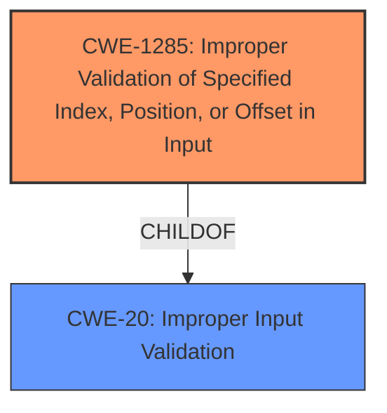

# Enhanced Analysis for CVE-2021-0183

# Summary
| CWE ID | CWE Name | Confidence | CWE Abstraction Level | CWE Vulnerability Mapping Label | CWE-Vulnerability Mapping Notes |
|---|---|---|---|---|---|
| CWE-1285 | Improper Validation of Specified Index, Position, or Offset in Input | 1.0 | Base | Allowed | Primary CWE |
| CWE-20 | Improper Input Validation | 0.7 | Class | Discouraged | Secondary Candidate |

## Evidence and Confidence

*   **Confidence Score:** 0.9
*   **Evidence Strength:** HIGH

## Relationship Analysis
The primary CWE, CWE-1285, is a child of CWE-20, reflecting a more specific type of input validation issue. While CWE-20 is a broader class, CWE-1285 directly addresses the **improper validation of index, position, or offset**, which aligns precisely with the vulnerability description.


## Vulnerability Chain
The chain starts with **improper validation** (CWE-1285) which leads to a potential denial-of-service (DoS) impact.

## Summary of Analysis
The initial assessment identified CWE-1285 as the primary candidate due to its direct relevance to the vulnerability description, which explicitly mentions **"Improper Validation of Specified Index, Position, or Offset in Input."** The CVE Reference Links Content Summary reinforces this by stating the **root cause** as **improper validation of specified index, position, or offset in input**.

The relationship graph shows that CWE-1285 is a child of the broader CWE-20 (Improper Input Validation). While CWE-20 is a potential candidate, CWE-1285 offers a more precise classification.

The decision to prioritize CWE-1285 is strongly supported by the evidence and the CWE specifications. The vulnerability description explicitly highlights the **improper validation of index, position, or offset**. This aligns directly with the description of CWE-1285.

Relevant CWE Information:

# Enhanced Context (25 CWEs)

## CWE-1285: Improper Validation of Specified Index, Position, or Offset in Input
**Abstraction:** Base
**Similarity Score**: 0.533
**Source**: sparse

**Description**:
The product receives input that is expected to specify an index, position, or offset into an indexable resource such as a buffer or file, but it does not validate or incorrectly validates that the specified index/position/offset has the required properties.

**Mapping Guidance**:
- Usage: Allowed
- Rationale: This CWE entry is at the Base level of abstraction, which is a preferred level of abstraction for mapping to the root causes of vulnerabilities.

### Final Conclusion
CWE-1285 is chosen due to the clear description of the vulnerability involving **improper validation of index, position, or offset**. The evidence directly supports the selection of this CWE, which is at the optimal level of specificity (Base). CWE-20, while related, is too general for this specific case.

**Supporting Evidence:**
- Vulnerability Description Key Phrases: "**rootcause:** **Improper Validation of Specified Index, Position, or Offset in Input**"
- CVE Reference Links Content Summary: "**Root cause of vulnerability**: Improper validation of specified index, position, or offset in input within software."


## CWE Relationship Analysis

Current CWEs represent these abstraction levels: .


### Vulnerability Chain Analysis

**Chain starting from CWE-20:**
- 20 (Improper Input Validation) - ROOT


**Chain starting from CWE-1285:**
- 1285 (Improper Validation of Specified Index, Position, or Offset in Input) - ROOT


### CWE Relationship Diagram

```mermaid
graph TD
    classDef primary fill:#f96,stroke:#333,stroke-width:2px
    classDef secondary fill:#69f,stroke:#333
    classDef tertiary fill:#9e9,stroke:#333
```