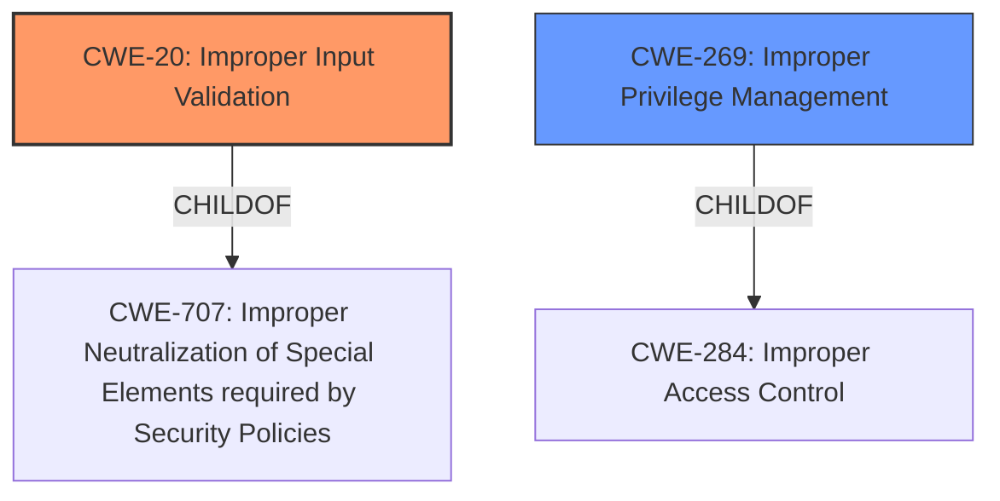

# Raw Analyzer Response for CVE-2021-0185

# Summary
| CWE ID | CWE Name | Confidence | CWE Abstraction Level | CWE Vulnerability Mapping Label | CWE-Vulnerability Mapping Notes |
|---|---|---|---|---|---|
| CWE-20 | Improper Input Validation | 0.9 | Class | Primary | Discouraged |
| CWE-269 | Improper Privilege Management | 0.7 | Class | Secondary | Discouraged |

## Evidence and Confidence

*   **Confidence Score:** 0.8
*   **Evidence Strength:** HIGH

## Relationship Analysis
The primary relationship is that CWE-20 [Improper Input Validation] is a child of CWE-707 [Improper Neutralization of Special Elements required by Security Policies]. CWE-269 [Improper Privilege Management] is a child of CWE-284 [Improper Access Control]. There is a potential chain where improper input validation (CWE-20) could lead to improper privilege management (CWE-269), although the description doesn't explicitly state this. The selection of CWE-20 is based on the explicit mention of "**Improper input validation**" in the vulnerability description and CVE details. Both CWE-20 and CWE-269 are Class level, but there were no other lower level matches so they are the best match in this case.

## Vulnerability Chain
The vulnerability chain starts with "**Improper input validation**" (CWE-20). If a privileged user provides malicious input that isn't validated properly, it could lead to an "escalation of privilege". This escalation can be viewed as a consequence of **improper privilege management** (CWE-269).

## Summary of Analysis
The initial assessment identified "**Improper input validation**" as the primary weakness, aligning with the provided vulnerability description and CVE details. The vulnerability description clearly states: "**Improper input validation** in the firmware... may allow a privileged user to potentially enable an escalation of privilege via local access."

The CVE Reference Links Content Summary also states:
*   **Root cause of vulnerability:** **Improper input validation** in the firmware.
*   **Weaknesses/vulnerabilities present:**  **Improper input validation**.
*   **Impact of exploitation:**  Escalation of privilege.

CWE-20 is selected due to this direct evidence. While CWE-20 is generally discouraged, there aren't better alternatives in the Retriever Results, and it directly reflects the stated root cause. The "escalation of privilege" impact suggests a secondary weakness related to privilege management, which is captured by CWE-269. However, since the root cause is clearly **improper input validation**, CWE-20 is the primary CWE. Both of these CWEs are Class level, and while more specific variants would be preferred, the evidence only supports these higher level classifications.

Relevant CWE Information:

# Enhanced Context (25 CWEs)

## CWE-691: Insufficient Control Flow Management
**Abstraction Level**: Pillar
**Similarity Score**: 0.76
**Source**: dense

**Description**:
The code does not sufficiently manage its control flow during execution, creating conditions in which the control flow can be modified in unexpected ways.

**Mapping Guidance**:
- Usage: Discouraged
- Rationale: This CWE entry is extremely high-level, a Pillar. However, classification research is limited for weaknesses of this type, so there can be gaps or organizational difficulties within CWE that force use of this weakness, even at such a high level of abstraction.

*Rejected Reason:* Too abstract. The provided vulnerability description is more specific than this pillar-level CWE.

## CWE-693: Protection Mechanism Failure
**Abstraction Level**: Pillar
**Similarity Score**: 0.76
**Source**: dense

**Description**:
The product does not use or incorrectly uses a protection mechanism that provides sufficient defense against directed attacks against the product.

**Mapping Guidance**:
- Usage: Discouraged
- Rationale: This CWE entry is extremely high-level, a Pillar.

*Rejected Reason:* Too abstract. Similar to CWE-691, the vulnerability description is more specific.

## CWE-664: Improper Control of a Resource Through its Lifetime
**Abstraction Level**: Pillar
**Similarity Score**: 0.74
**Source**: dense

**Description**:
The product does not maintain or incorrectly maintains control over a resource throughout its lifetime of creation, use, and release.

**Mapping Guidance**:
- Usage: Discouraged
- Rationale: This CWE entry is high-level when lower-level children are available.

*Rejected Reason:* Too abstract. Doesn't directly relate to input validation.

## CWE-653: Improper Isolation or Compartmentalization
**Abstraction Level**: Class
**Similarity Score**: 0.74
**Source**: dense

**Description**:
The product does not properly compartmentalize or isolate functionality, processes, or resources that require different privilege levels, rights, or permissions.

**Mapping Guidance**:
- Usage: Allowed
- Rationale: This CWE entry is at the Base level of abstraction, which is a preferred level of abstraction for mapping to the root causes of vulnerabilities.

*Rejected Reason:* This CWE is not directly related to input validation.

## CWE-807: Reliance on Untrusted Inputs in a Security Decision
**Abstraction Level**: Base
**Similarity Score**: 0.73
**Source**: dense

**Description**:
The product uses a protection mechanism that relies on the existence or values of an input, but the input can be modified by an untrusted actor in a way that bypasses the protection mechanism.

**Mapping Guidance**:
- Usage: Allowed
- Rationale: This CWE entry is at the Base level of abstraction, which is a preferred level of abstraction for mapping to the root causes of vulnerabilities.

*Rejected Reason:* While this CWE could be related, the description focuses on "**Improper input validation**" generally, not specifically the use of untrusted inputs in security decisions.

## CWE-274: Improper Handling of Insufficient Privileges
**Abstraction Level**: Base
**Similarity Score**: 0.73
**Source**: dense

**Description**:
The product does not handle or incorrectly handles when it has insufficient privileges to perform an operation, leading to resultant weaknesses.

**Mapping Guidance**:
- Usage: Discouraged
- Rationale: This CWE entry could be deprecated in a future version of CWE.

*Rejected Reason:* The issue is about improper validation, not handling of insufficient privileges.

## CWE-703: Improper Check or Handling of Exceptional Conditions
**Abstraction Level**: Pillar
**Similarity Score**: 0.73
**Source**: dense

**Description**:
The product does not properly anticipate or handle exceptional conditions that rarely occur during normal operation of the product.

**Mapping Guidance**:
- Usage: Discouraged
- Rationale: This CWE entry is extremely high-level, a Pillar.

*Rejected Reason:* Too abstract and doesn't directly relate to the described vulnerability.

## CWE-657: Violation of Secure Design Principles
**Abstraction Level**: Class
**Similarity Score**: 0.73
**Source**: dense

**Description**:
The product violates well-established principles for secure design.

**Mapping Guidance**:
- Usage: Discouraged
- Rationale: This CWE entry is a level-1 Class (i.e., a child of a Pillar). It might have lower-level children that would be more appropriate

*Rejected Reason:* Too broad and doesn't give specific insight into what is happening

## CWE-1289: Improper Validation of Unsafe Equivalence in Input
**Abstraction Level**: Base
**Similarity Score**: 0.72
**Source**: dense

**Description**:
The product receives an input value that is used as a resource identifier or other type of reference, but it does not validate or incorrectly validates that the input is equivalent to a potentially-unsafe value.

**Mapping Guidance**:
- Usage: Allowed
- Rationale: This CWE entry is at the Base level of abstraction, which is a preferred level of abstraction for mapping to the root causes of vulnerabilities.

*Rejected Reason:* Not specific enough, this vulnerability is a general improper input validation, not related to unsafe equivalence.

## CWE-1220: Insufficient Granularity of Access Control
**Abstraction Level**: Base
**Similarity Score**: 0.72
**Source**: dense

**Description**:
The product implements access controls via a policy or other feature with the intention to disable or restrict accesses (reads and/or writes) to assets in a system from untrusted agents. However, implemented access controls lack required granularity, which renders the control policy too broad because it allows accesses from unauthorized agents to