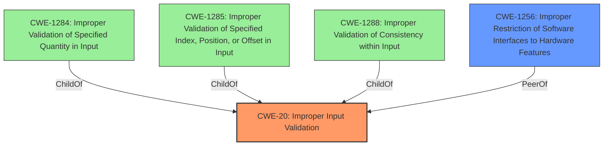

# Analysis for CVE-2021-0186

# Summary
| CWE ID  | CWE Name                                                        | Confidence | CWE Abstraction Level | CWE Vulnerability Mapping Label | CWE-Vulnerability Mapping Notes |
| :-------- | :-------------------------------------------------------------- | :--------- | :---------------------- | :------------------------------ | :------------------------------ |
| CWE-20  | Improper Input Validation                                       | 0.9        | Class                   | Primary                           | Discouraged                    |
| CWE-1256 | Improper Restriction of Software Interfaces to Hardware Features | 0.6        | Base                    | Secondary                        | Allowed                        |

## Evidence and Confidence

*   **Confidence Score:** 0.8
*   **Evidence Strength:** HIGH

## Relationship Analysis
The primary relationship is that CWE-20 is a Class-level CWE, and several more specific Base-level CWEs could be considered. The retriever suggested CWE-1256. However, the description also mentions "SGX2 enabled processors," suggesting a potential connection to hardware features.

## Vulnerability Chain
The vulnerability chain starts with **improper input validation**, leading to a potential privilege escalation.

## Summary of Analysis
The vulnerability description states: "**Improper input validation** in the Intel(R) SGX SDK applications compiled for SGX2 enabled processors may allow a privileged user to potentially escalation of privilege via local access." The CVE Reference Links Content Summary reinforces this, stating, "**Root cause of vulnerability:** Improper input validation in the Intel SGX SDK applications compiled for SGX2-enabled processors."

Given this evidence, CWE-20, "Improper Input Validation," is the most appropriate primary CWE. However, the mapping guidance for CWE-20 discourages its use, recommending more specific children. The retriever results suggest several possibilities, including CWE-1285 (Improper Validation of Specified Index, Position, or Offset in Input), CWE-1288 (Improper Validation of Consistency within Input) and CWE-1284 (Improper Validation of Specified Quantity in Input), but these are too specific, given the generic nature of the description. The description mentions "SGX2 enabled processors," suggesting a possible relationship with hardware features. Therefore, CWE-1256, "Improper Restriction of Software Interfaces to Hardware Features," is a potential secondary CWE.

**CWE-20: Improper Input Validation**
*   The vulnerability stems directly from **improper input validation**, as stated in the description.
*   Security implication is privilege escalation.
*   CWE-20 is a Class-level CWE, and while more specific CWEs are preferred, the lack of detail in the description makes it difficult to select a more precise option.
*   The official MITRE mapping guidance discourages the use of CWE-20, but the alternatives are too specific.

**CWE-1256: Improper Restriction of Software Interfaces to Hardware Features**
*   The vulnerability affects Intel(R) SGX SDK applications compiled for SGX2 enabled processors. SGX2 introduces hardware-based security enhancements. The lack of input validation could potentially affect how software interfaces with these hardware features.
*   Security implication is privilege escalation.
*   CWE-1256 is a Base-level CWE, providing a more specific classification related to hardware interfaces.
*   The official MITRE mapping guidance allows the use of CWE-1256.

Other CWEs Considered and Not Used:

*   CWE-691 (Insufficient Control Flow Management), CWE-284 (Improper Access Control), and CWE-693 (Protection Mechanism Failure) are too abstract (Pillar level) and do not directly address the **improper input validation**.
*   CWE-73 (External Control of File Name or Path) and CWE-434 (Unrestricted Upload of File with Dangerous Type) are not relevant as the vulnerability doesn't involve file names, paths, or file uploads.
*   CWE-1284 (Improper Validation of Specified Quantity in Input), CWE-1285 (Improper Validation of Specified Index, Position, or Offset in Input), and CWE-1288 (Improper Validation of Consistency within Input) are more specific types of input validation issues, but the description is too general to determine if these apply.
*   CWE-453 (Insecure Default Variable Initialization) is not applicable because the issue is with input validation, not the initialization of variables.

Relevant CWE Information:
INSERT