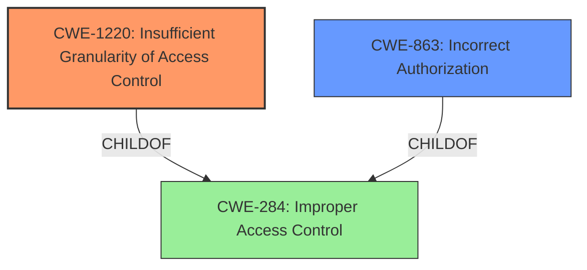

# Raw Analyzer Response for CVE-2021-0187

# Summary
| CWE ID  | CWE Name                                                       | Confidence | CWE Abstraction Level | CWE Vulnerability Mapping Label | CWE-Vulnerability Mapping Notes |
| :-------- | :------------------------------------------------------------- | :--------- | :-------------------- | :------------------------------ | :------------------------------ |
| CWE-1220  | Insufficient Granularity of Access Control                   | 0.8        | Base                  | Primary                        | Allowed                         |
| CWE-863   | Incorrect Authorization                                        | 0.6        | Class                 | Secondary                      | Allowed-with-Review           |
| CWE-284   | Improper Access Control                                        | 0.4        | Pillar                | Secondary                      | Discouraged                     |

## Evidence and Confidence

*   **Confidence Score:** 0.8
*   **Evidence Strength:** HIGH

## Relationship Analysis
The primary CWE is CWE-1220, which is a child of the more general CWE-284. CWE-863 is related to access control, but focuses on the correctness of the authorization check, while CWE-1220 addresses the granularity of the access control policy. The abstraction levels influenced the selection: choosing the Base level (CWE-1220) over the Pillar (CWE-284), and considering the Class level (CWE-863) for additional context.

## Vulnerability Chain
The vulnerability chain starts with **improper access control** in the BIOS firmware, leading to a potential escalation of privilege. The root cause is the **insufficient granularity of the access control**, which allows a privileged user to perform unauthorized actions.
  - Root Cause: **Improper Access Control**
  - Weakness: **Insufficient Granularity of Access Control**
  - Impact: Escalation of Privilege

## Summary of Analysis
The initial analysis focused on identifying the root cause of the vulnerability, which is stated as **"Improper access control in the BIOS firmware"**. Based on this, CWE-284 (Improper Access Control) was initially considered. However, the description highlights that a privileged user can escalate privileges, suggesting a more specific issue related to the granularity of access control.

The Retriever Results pointed to CWE-1220 (Insufficient Granularity of Access Control) as a strong candidate, supported by the vulnerability description and "The product implements access controls via a policy or other feature with the intention to disable or restrict accesses... However, implemented access controls lack required granularity...". CWE-1220 is a Base level CWE, providing a more precise description of the weakness than the more general CWE-284.

CWE-863 (Incorrect Authorization) was also considered because it relates to authorization checks. However, the vulnerability is more about the policy itself being too broad rather than the check being incorrect. Therefore, while CWE-863 might be a contributing factor, CWE-1220 is the more accurate primary classification.

The final decision to select CWE-1220 as the primary CWE is based on the following:

*   The vulnerability description explicitly mentions **improper access control** and escalation of privilege.
*   CWE-1220 directly addresses the **insufficient granularity** aspect of the access control, making it a more specific fit than CWE-284.
*   CWE-863 focuses on the correctness of authorization checks, which is not the primary issue in this vulnerability.

The chosen CWEs are at the optimal level of specificity, with CWE-1220 providing a detailed description of the root cause and CWE-863 offering additional context about authorization. CWE-284, while relevant, is too high-level to accurately represent the vulnerability.

Relevant CWE Information:
# Enhanced Context (25 CWEs)
The following CWEs were identified as potentially relevant to this vulnerability:

## CWE-1220: Insufficient Granularity of Access Control
**Abstraction Level**: Base
**Similarity Score**: 0.78
**Source**: dense

**Description**:
The product implements access controls via a policy or other feature with the intention to disable or restrict accesses (reads and/or writes) to assets in a system from untrusted agents. However, implemented access controls lack required granularity, which renders the control policy too broad because it allows accesses from unauthorized agents to the security-sensitive assets.

**Mapping Guidance**:
- Usage: Allowed
- Rationale: This CWE entry is at the Base level of abstraction, which is a preferred level of abstraction for mapping to the root causes of vulnerabilities.