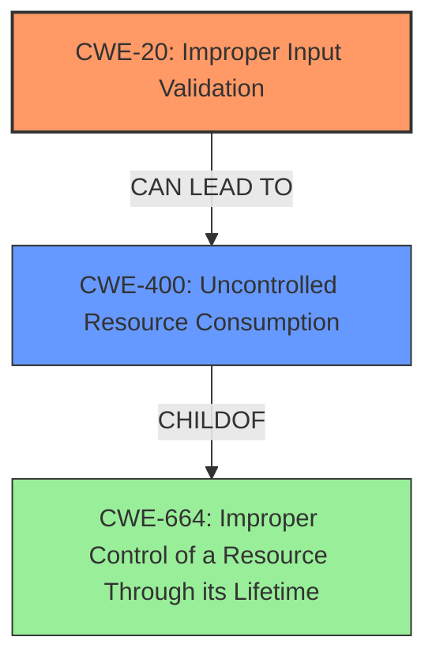

# Raw Analyzer Response for CVE-2021-0208

# Summary
| CWE ID | CWE Name | Confidence | CWE Abstraction Level | CWE Vulnerability Mapping Label | CWE-Vulnerability Mapping Notes |
|---|---|---|---|---|---|
| CWE-20 | Improper Input Validation | 1.0 | Class | Primary | Allowed-with-Review |
| CWE-400 | Uncontrolled Resource Consumption | 0.7 | Class | Secondary | Discouraged |

## Evidence and Confidence

*   **Confidence Score:** 0.9
*   **Evidence Strength:** HIGH

## Relationship Analysis
The primary CWE is CWE-20 (**Improper Input Validation**), which is a child of CWE-682 (**Incorrect Calculation**). The secondary CWE is CWE-400 (**Uncontrolled Resource Consumption**), a child of CWE-664 (**Improper Control of a Resource Through its Lifetime**). While CWE-400 is a potential consequence of the **improper input validation**, CWE-20 more accurately captures the root cause. CWE-1286 (**Improper Validation of Syntactic Correctness of Input**) is a potential child of CWE-20.

## Vulnerability Chain
The vulnerability chain starts with **improper input validation** (CWE-20), which leads to a malformed RSVP packet being processed by an egress router, ultimately causing a denial of service (DoS), which can be classified as uncontrolled resource consumption (CWE-400) due to the RPD crashing.

## Summary of Analysis
The vulnerability is primarily caused by **improper input validation** in the Routing Protocol Daemon (RPD) service. The receipt of a malformed RSVP packet triggers a crash in the RPD, leading to a Denial of Service (DoS) condition. The evidence provided in the Vulnerability Description Key Phrases clearly indicates the **rootcause** as "**improper input validation**". The impact is a denial of service.

CWE-20 (**Improper Input Validation**) is selected as the primary CWE because it directly addresses the root cause of the vulnerability. The description states an **improper input validation** vulnerability. This aligns perfectly with CWE-20, which is defined as, "The product receives input or data, but it does not validate or incorrectly validates that the input has the properties that are required to process the input safely and correctly."

CWE-400 (**Uncontrolled Resource Consumption**) is considered as a secondary CWE as the denial of service is the result of the **improper input validation**, where the malformed RSVP packet leads to the RPD crashing. While the impact of a DoS can be considered resource consumption, the root cause lies in the initial lack of validation. The mapping guidance for CWE-400 advises against its usage if a more specific CWE is available, stating, "CWE-400 is intended for incorrect behaviors in which the product is expected to track and restrict how many resources it consumes, but CWE-400 is often misused because it is conflated with the "technical impact" of vulnerabilities in which resource consumption occurs."

Other CWEs Considered and Rejected:

*   CWE-401 (**Missing Release of Memory after Effective Lifetime**): While memory leaks can contribute to resource exhaustion, the primary issue here is not a memory leak but rather the crash of the RPD due to a malformed packet.
*   CWE-606 (**Unchecked Input for Loop Condition**): This CWE is not relevant because the vulnerability is not directly related to unchecked input in a loop condition.
*   CWE-754 (**Improper Check for Unusual or Exceptional Conditions**) and CWE-755 (**Improper Handling of Exceptional Conditions**): These CWEs are too generic. The specific issue is the lack of validation of the input itself, not merely a failure to handle an unusual condition.
*   CWE-250 (**Execution with Unnecessary Privileges**): This CWE is not applicable because the vulnerability does not involve unnecessary privileges.
*   CWE-1286 (**Improper Validation of Syntactic Correctness of Input**) and CWE-1285 (**Improper Validation of Specified Index, Position, or Offset in Input**): These CWEs are more specific types of **improper input validation**, but the description doesn't give enough information to warrant using these over the base CWE-20 (**Improper Input Validation**).

The selection of CWE-20 is based on the explicit statement of **improper input validation** in the vulnerability description. This aligns with the CWE's definition and establishes it as the most accurate representation of the vulnerability's root cause.