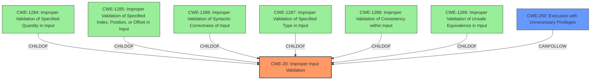

# Raw Analyzer Response for CVE-2021-0278

# Summary
| CWE ID  | CWE Name                                                        | Confidence | CWE Abstraction Level | CWE Vulnerability Mapping Label | CWE-Vulnerability Mapping Notes |
| :-------- | :-------------------------------------------------------------- | :--------- | :---------------------- | :------------------------------ | :------------------------------ |
| CWE-20    | Improper Input Validation                                         | 0.8        | Class                   | Primary                         | Discouraged                     |
| CWE-250   | Execution with Unnecessary Privileges                            | 0.6        | Base                    | Secondary                       | Allowed                         |

## Evidence and Confidence

*   **Confidence Score:** 0.7
*   **Evidence Strength:** MEDIUM

## Relationship Analysis
The primary relationship influencing the CWE selection is the hierarchical structure, where CWE-20 is a Class-level CWE and has more specific children. However, the provided information lacks the specifics needed to select a more granular child of CWE-20. Also, the impact of escalating privileges relates to CWE-250, but this is a consequence of the **improper input validation**.

## Vulnerability Chain
The vulnerability chain starts with **Improper Input Validation** (CWE-20), which allows a locally authenticated attacker to escalate their privileges to root.
  - Root Cause: **Improper Input Validation** (CWE-20)
  - Impact: Privilege escalation to root

## Summary of Analysis
The initial analysis identified **Improper Input Validation** as the root cause. The retriever results also point to CWE-20. The vulnerability description explicitly states "**Improper Input Validation** vulnerability in J-Web of Juniper Networks Junos OS allows a locally authenticated attacker to escalate their privileges to root over the target device."

CWE-20 is a Class-level CWE and the mapping guidance discourages its use when more specific children exist. The retriever results suggest potential children of CWE-20, such as CWE-1284, CWE-1285, CWE-1286, etc. However, the provided vulnerability description does not give enough information to determine which specific type of input validation is missing or incorrect. Without more detail, selecting a more specific CWE would be speculative.

The elevation of privileges (CWE-250) is a consequence of the **improper input validation**, as the attacker is able to gain root access due to the flawed input handling.

Therefore, CWE-20 is the most appropriate primary CWE, given the available information.

Relevant CWE Information:
*   CWE-20: Improper Input Validation
*   CWE-250: Execution with Unnecessary Privileges