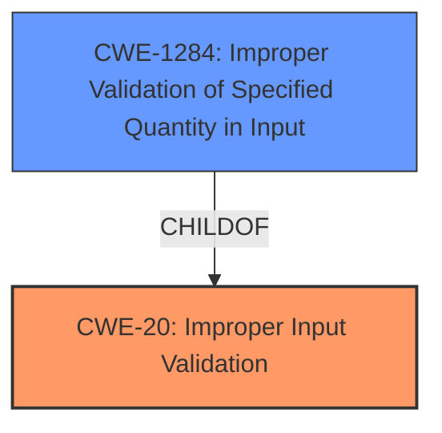

# Analysis for CVE-2021-0350

# Summary
| CWE ID | CWE Name | Confidence | CWE Abstraction Level | CWE Vulnerability Mapping Label | CWE-Vulnerability Mapping Notes |
|---|---|---|---|---|---|
| CWE-20 | Improper Input Validation | 0.75 | Class | Primary | Discouraged |
| CWE-1284 | Improper Validation of Specified Quantity in Input | 0.60 | Base | Secondary | Allowed |

## Evidence and Confidence

*   **Confidence Score:** 0.70
*   **Evidence Strength:** MEDIUM

## Relationship Analysis
The primary CWE identified is CWE-20 [Improper Input Validation], which is a high-level class. The retriever results suggested more specific base-level CWEs, and one of them, CWE-1284 [Improper Validation of Specified Quantity in Input], is considered as a possible secondary CWE. CWE-20 [Improper Input Validation] is a class-level CWE, while CWE-1284 [Improper Validation of Specified Quantity in Input] is a base-level CWE. The relationship is that CWE-1284 [Improper Validation of Specified Quantity in Input] is a child of CWE-20 [Improper Input Validation].

## Vulnerability Chain
The vulnerability chain starts with **improper input validation** (CWE-20 [Improper Input Validation] or CWE-1284 [Improper Validation of Specified Quantity in Input]), which leads to a system crash, resulting in a denial of service.

## Summary of Analysis
The vulnerability description clearly states that the root cause is an **improper input validation**.

The vulnerability description includes the following key phrase:
*   **rootcause:** **improper input validation**

This directly aligns with CWE-20 [Improper Input Validation]. However, CWE-20 [Improper Input Validation] is a Class-level CWE, and the mapping guidance discourages its use when more specific Base-level CWEs are available. Therefore, I considered the children of CWE-20 [Improper Input Validation] and other related CWEs suggested by the retriever.

CWE-1284 [Improper Validation of Specified Quantity in Input] is considered as a possible second CWE.

The final decision is to use CWE-20 [Improper Input Validation] as the primary CWE because the description only mentions "**improper input validation**" without specifying which type of input is not validated, so it's hard to determine whether CWE-1284 [Improper Validation of Specified Quantity in Input] is more appropriate.

Relevant CWE Information:

# Enhanced Context (25 CWEs)
The following CWEs were identified as potentially relevant to this vulnerability:

## CWE-404: Improper Resource Shutdown or Release
**Abstraction Level**: Class
**Similarity Score**: 0.78
**Source**: dense

**Description**:
The product does not release or incorrectly releases a resource before it is made available for re-use.
*This CWE is not relevant.*

## CWE-667: Improper Locking
**Abstraction Level**: Class
**Similarity Score**: 0.77
**Source**: dense

**Description**:
The product does not properly acquire or release a lock on a resource, leading to unexpected resource state changes and behaviors.
*This CWE is not relevant because there is no mention of locks in the description.*

## CWE-226: Sensitive Information in Resource Not Removed Before Reuse
**Abstraction Level**: Base
**Similarity Score**: 0.77
**Source**: dense

**Description**:
The product releases a resource such as memory or a file so that it can be made available for reuse, but it does not clear or "zeroize" the information contained in the resource before the product performs a critical state transition or makes the resource available for reuse by other entities.
*This CWE is not relevant because there is no mention of sensitive information in the description.*

## CWE-1289: Improper Validation of Unsafe Equivalence in Input
**Abstraction Level**: Base
**Similarity Score**: 0.76
**Source**: dense

**Description**:
The product receives an input value that is used as a resource identifier or other type of reference, but it does not validate or incorrectly validates that the input is equivalent to a potentially-unsafe value.
*This CWE is not relevant because there is no mention of resource identifiers.*

## CWE-664: Improper Control of a Resource Through its Lifetime
**Abstraction Level**: Pillar
**Similarity Score**: 0.76
**Source**: dense

**Description**:
The product does not maintain or incorrectly maintains control over a resource throughout its lifetime of creation, use, and release.
*This CWE is too abstract and is not relevant.*

## CWE-754: Improper Check for Unusual or Exceptional Conditions
**Abstraction Level**: Class
**Similarity Score**: 0.76
**Source**: dense

**Description**:
The product does not check or incorrectly checks for unusual or exceptional conditions that are not expected to occur frequently during day to day operation of the product.
*This CWE is not relevant because there is no mention of exceptional conditions.*

## CWE-909: Missing Initialization of Resource
**Abstraction Level**: Class
**Similarity Score**: 0.76
**Source**: dense

**Description**:
The product does not initialize a critical resource.
*This CWE is not relevant because there is no mention of uninitialized resources.*

## CWE-665: Improper Initialization
**Abstraction Level**: Class
**Similarity Score**: 0.76
**Source**: dense

**Description**:
The product does not initialize or incorrectly initializes a resource, which might leave the resource in an unexpected state when it is accessed or used.
*This CWE is not relevant because there is no mention of initialization.*

## CWE-662: Improper Synchronization
**Abstraction Level**: Class
**Similarity Score**: 0.75
**Source**: dense

**Description**:
The product utilizes multiple threads or processes to allow temporary access to a shared resource that can only be exclusive to one process at a time, but it does not properly synchronize these actions, which might cause simultaneous accesses of this resource by multiple threads or processes.
*This CWE is not relevant because there is no mention of synchronization.*

## CWE-703: Improper Check or Handling of Exceptional Conditions
**Abstraction Level**: Pillar
**Similarity Score**: 0.75
**Source**: dense

**Description**:
The product does not properly anticipate or handle exceptional conditions that rarely occur during normal operation of the product.
*This CWE is too abstract and is not relevant.*

## CWE-1284: Improper Validation of Specified Quantity in Input
**Abstraction Level**: Base
**Similarity Score**: 6291.95
**Source**: sparse

**Description**:
The product receives input that is expected to specify a quantity (such as size or length), but it does not validate or incorrectly validates that the quantity has the required properties.
*This is a possible secondary CWE.*

## CWE-667: Improper Locking
**Abstraction Level**: Class
**Similarity Score**: 6162.13
**Source**: sparse

**Description**:
The product does not properly acquire or release a lock on a resource, leading to unexpected resource state changes and behaviors.
*This CWE is not relevant because there is no mention of locks in the description.*

## CWE-770: Allocation of Resources Without Limits or Throttling
**Abstraction Level**: Base
**Similarity Score**: 6079.95
**Source**: sparse

**Description**:
The product allocates a reusable resource or group of resources on behalf of an actor without imposing any restrictions on the size or number of resources that can be allocated, in violation of the intended security policy for that actor.
*This CWE is not relevant because there is no mention of resource allocation.*

## CWE-367: Time-of-check Time-of-use (TOCTOU) Race Condition
**Abstraction Level**: Base
**Similarity Score**: 6079.14
**Source**: sparse

**Description**:
The product checks the state of a resource before using that resource, but the resource's state can change between the check and the use in a way that invalidates the results of the check. This can cause the product to perform invalid actions when the resource is in an unexpected state.
*This CWE is not relevant because there is no mention of race conditions.*

## CWE-362: Concurrent Execution using Shared Resource with Improper Synchronization ('Race Condition')
**Abstraction Level**: Class
**Similarity Score**: 6068.94
**Source**: sparse

**Description**:
The product contains a concurrent code sequence that requires temporary, exclusive access to a shared resource, but a timing window exists in which the shared resource can be modified by another code sequence operating concurrently.
*This CWE is not relevant because there is no mention of race conditions.*

## CWE