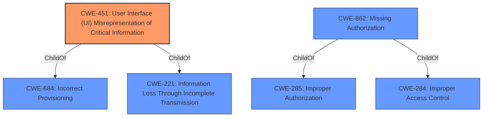

# Analysis for CVE-2021-0369

# Summary
| CWE ID | CWE Name | Confidence | CWE Abstraction Level | CWE Vulnerability Mapping Label | CWE-Vulnerability Mapping Notes |
|---|---|---|---|---|---|
| CWE-451 | User Interface (UI) Misrepresentation of Critical Information | 0.8 | Class | Allowed-with-Review | Primary CWE |
| CWE-862 | Missing Authorization | 0.6 | Class | Allowed-with-Review | Secondary Candidate |

## Evidence and Confidence

*   **Confidence Score:** 0.7
*   **Evidence Strength:** MEDIUM

## Relationship Analysis
The primary CWE, CWE-451 [CWE-451: User Interface (UI) Misrepresentation of Critical Information], is a Class-level CWE, and is related to CWE-684 [CWE-684: Incorrect Provisioning] and CWE-221 [CWE-221: Information Loss Through Incomplete Transmission]. The secondary CWE, CWE-862 [CWE-862: Missing Authorization], is also a Class-level CWE, related to CWE-285 [CWE-285: Improper Authorization] and CWE-284 [CWE-284: Improper Access Control]. While both are class level, based on the vulnerability description, CWE-451 [CWE-451: User Interface (UI) Misrepresentation of Critical Information] is the best fit.

## Vulnerability Chain
The vulnerability chain starts with a **logic error** in CrossProfileAppsServiceImpl.java, leading to the applications INTERACT_ACROSS_PROFILES grant state not displaying properly in the setting UI. This results in local escalation of privilege.
  - Root Cause: **logic error** in CrossProfileAppsServiceImpl.java
  - Weakness: applications INTERACT_ACROSS_PROFILES grant state not displaying properly in the setting UI
  - Impact: local escalation of privilege

## Summary of Analysis
Initially, the vulnerability was identified as a **logic error** leading to a misrepresentation of the INTERACT_ACROSS_PROFILES grant state in the UI, potentially leading to a local escalation of privilege. The "Retriever Results" pointed to CWE-451 [CWE-451: User Interface (UI) Misrepresentation of Critical Information] as the top candidate, which aligns well with the description of the grant state not displaying properly. Further analysis of the CVE Reference Links Content Summary reveals the **incorrect app-op handling** and **lack of proper resetting** of the INTERACT_ACROSS_PROFILES app-op, which caused the vulnerability.

The primary decision to select CWE-451 [CWE-451: User Interface (UI) Misrepresentation of Critical Information] is based on the fact that the vulnerability's impact is the misrepresentation of the application's grant state in the UI. From the vulnerability description, "applications INTERACT_ACROSS_PROFILES grant state not displaying properly in the setting UI due to a **logic error** in the code". This aligns with the CWE-451 [CWE-451: User Interface (UI) Misrepresentation of Critical Information] description "The user interface (UI) does not properly represent critical information to the user, allowing the information - or its source - to be obscured or spoofed".

CWE-862 [CWE-862: Missing Authorization] was considered because the root cause involves improper handling of app-ops and potentially granting unintended permissions. The "CVE Reference Links Content Summary" mentions the `INTERACT_ACROSS_PROFILES` app-op was not being reset correctly, potentially leading to unintended permissions being granted. However, the primary manifestation of the vulnerability is in the UI, which is why CWE-451 [CWE-451: User Interface (UI) Misrepresentation of Critical Information] is the better fit.

The selected CWE, CWE-451 [CWE-451: User Interface (UI) Misrepresentation of Critical Information], is at the Class level, but it is the most specific representation of the **weakness** given the available information. A more specific Base or Variant CWE would be ideal, but there isn't enough evidence to support a more granular classification.