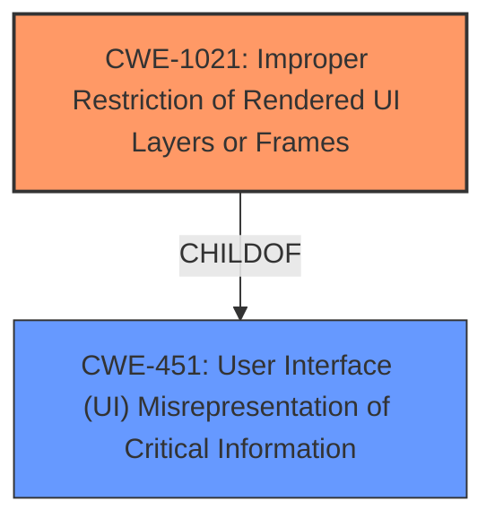

# Raw Analyzer Response for CVE-2021-0386

# Summary
| CWE ID | CWE Name | Confidence | CWE Abstraction Level | CWE Vulnerability Mapping Label | CWE-Vulnerability Mapping Notes |
|---|---|---|---|---|---|
| CWE-1021 | Improper Restriction of Rendered UI Layers or Frames | 0.8 | Base | Allowed | Primary CWE |
| CWE-451 | User Interface (UI) Misrepresentation of Critical Information | 0.6 | Class | Allowed-with-Review | Secondary Candidate |

## Evidence and Confidence

*   **Confidence Score:** 0.7
*   **Evidence Strength:** MEDIUM

## Relationship Analysis
The primary relationship impacting the decision is the ChildOf relationship where CWE-1021 is a child of CWE-451. CWE-1021 focuses on UI redress attacks, while CWE-451 is a more general class about UI misrepresentation. The vulnerability description and CVE summary lean toward UI redress via tapjacking, thus suggesting the more specific CWE-1021.

## Vulnerability Chain
The chain of events starts with an **insecure default value**, leading to a tapjacking vector, and ultimately results in local escalation of privilege. The root cause is the **insecure default value** that allows for the tapjacking, which then leads to the privilege escalation.

## Summary of Analysis
The analysis is based on the provided evidence, particularly the vulnerability description emphasizing a tapjacking vector due to an **insecure default value**.

The selection of CWE-1021 is primarily driven by its direct relevance to UI redress attacks such as tapjacking, which aligns with the vulnerability's description of a tapjacking vector. The CVE Reference Links Content Summary also alludes to the framework not properly restricting non-system dialogs, which can be related to improper rendering of UI elements.

CWE-451 was considered as a broader, more general category related to UI misrepresentation, but CWE-1021 was chosen for its specificity.

The selected CWE is at the Base level of abstraction, providing an appropriate level of detail for the vulnerability.

Relevant CWE Information:

# Enhanced Context (25 CWEs)
The following CWEs were identified as potentially relevant to this vulnerability:

## CWE-1021: Improper Restriction of Rendered UI Layers or Frames
**Abstraction Level**: Base
**Similarity Score**: 0.465
**Source**: sparse

**Description**:
The web application does not restrict or incorrectly restricts frame objects or UI layers that belong to another application or domain, which can lead to user confusion about which interface the user is interacting with.

## CWE-451: User Interface (UI) Misrepresentation of Critical Information
**Abstraction Level**: Class
**Similarity Score**: 0.75
**Source**: dense

**Description**:
The user interface (UI) does not properly represent critical information to the user, allowing the information - or its source - to be obscured or spoofed. This is often a component in phishing attacks.

---

**CWE-1021: Improper Restriction of Rendered UI Layers or Frames**

*   **Technical Explanation:** The vulnerability allows for tapjacking due to an **insecure default value**, meaning a malicious application can overlay UI elements and trick the user into unintended actions. This aligns with CWE-1021, which describes the lack of restriction on rendered UI layers.
*   **Security Implications:** An attacker can potentially trick a user into performing actions that escalate their privileges, leading to a compromise of the system.
*   **Relationship Analysis:** CWE-1021 is a child of CWE-451, making it more specific to UI redress attacks.
*   **Mapping Guidance:** The usage is ALLOWED, and the rationale states that it is at the Base level of abstraction, which is preferred.
*   **Evidence:** The vulnerability description states "tapjacking vector due to an **insecure default value**."
*   **Confidence:** 0.8

**CWE-451: User Interface (UI) Misrepresentation of Critical Information**

*   **Technical Explanation:** This CWE describes a scenario where the UI does not properly represent critical information. While tapjacking can be seen as a misrepresentation, it more specifically involves improperly restricted UI layers.
*   **Security Implications:** The implications are similar to CWE-1021, but less specific to the attack vector.
*   **Relationship Analysis:** This is a parent of CWE-1021, making it a broader category.
*   **Mapping Guidance:** The usage is ALLOWED-WITH-REVIEW, suggesting that a more specific CWE might be available.
*   **Evidence:** The **insecure default value** causing tapjacking can be seen as a form of misrepresentation.
*   **Confidence:** 0.6

**CWEs Considered But Not Used:**

*   CWE-862 (Missing Authorization): While privilege escalation is the impact, the root cause is not a missing authorization check but rather a UI vulnerability.
*   CWE-927 (Use of Implicit Intent for Sensitive Communication): Not applicable as the vulnerability doesn't involve implicit intents.
*   CWE-362 (Concurrent Execution using Shared Resource with Improper Synchronization ('Race Condition')): Not applicable as the vulnerability doesn't involve race conditions.