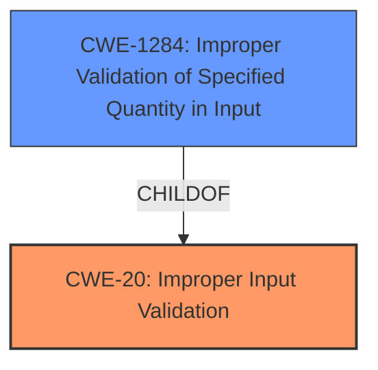

# Enhanced Analysis for CVE-2021-0511

# Summary
| CWE ID | CWE Name | Confidence | CWE Abstraction Level | CWE Vulnerability Mapping Label | CWE-Vulnerability Mapping Notes |
|---|---|---|---|---|---|
| CWE-20 | Improper Input Validation | 0.8 | Class | Primary | Discouraged |
| CWE-1284 | Improper Validation of Specified Quantity in Input | 0.6 | Base | Secondary | Allowed |

## Evidence and Confidence

*   **Confidence Score:** 0.8
*   **Evidence Strength:** MEDIUM

## Relationship Analysis
The primary CWE selected is CWE-20 which is a class level CWE. While it is discouraged, it accurately reflects the general nature of the vulnerability based on the available evidence, namely, the phrase "**improper input validation**". CWE-1284 is a child of CWE-20 and represents a more specific case of **improper input validation** related to quantities. It is included as a secondary CWE to capture the potential for quantity-related input issues.



## Vulnerability Chain
The vulnerability chain starts with **improper input validation** (CWE-20) in Dex2oat, which allows for the injection of bytecode into an application. This leads to local escalation of privilege, as the attacker can execute arbitrary code with elevated permissions.

## Summary of Analysis
The analysis is primarily based on the vulnerability description, which explicitly mentions "**improper input validation**" as the root cause. The retriever results also list CWE-20 as a candidate.

CWE-20 is chosen as the primary CWE because it directly addresses the **improper input validation** weakness. However, since CWE-20 is a Class-level CWE and discouraged by mapping guidance, I also considered more specific child CWEs. CWE-1284 is considered as a secondary CWE to capture the possibility of quantity-related input validation issues, although there is no specific evidence to support this.

The selection is based on the available evidence and the goal of providing the most accurate and specific classification possible. However, the lack of detailed information about the specific type of input being validated limits the confidence in selecting a more precise CWE.

Relevant CWE Information:

# Enhanced Context (25 CWEs)
The following CWEs were identified as potentially relevant to this vulnerability:

## CWE-404: Improper Resource Shutdown or Release
**Abstraction Level**: Class
**Similarity Score**: 0.77
**Source**: dense

**Description**:
The product does not release or incorrectly releases a resource before it is made available for re-use.
**NOT USED:** This doesn't fit the **improper input validation** root cause.

## CWE-667: Improper Locking
**Abstraction Level**: Class
**Similarity Score**: 0.77
**Source**: dense

**Description**:
The product does not properly acquire or release a lock on a resource, leading to unexpected resource state changes and behaviors.
**NOT USED:** This doesn't fit the **improper input validation** root cause.

## CWE-1289: Improper Validation of Unsafe Equivalence in Input
**Abstraction Level**: Base
**Similarity Score**: 0.77
**Source**: dense

**Description**:
The product receives an input value that is used as a resource identifier or other type of reference, but it does not validate or incorrectly validates that the input is equivalent to a potentially-unsafe value.
**NOT USED:** This is a more specific type of **improper input validation** but there is not enough evidence that the input is an "unsafe equivalence".

## CWE-754: Improper Check for Unusual or Exceptional Conditions
**Abstraction Level**: Class
**Similarity Score**: 0.76
**Source**: dense

**Description**:
The product does not check or incorrectly checks for unusual or exceptional conditions that are not expected to occur frequently during day to day operation of the product.
**NOT USED:** This doesn't fit the **improper input validation** root cause.

## CWE-226: Sensitive Information in Resource Not Removed Before Reuse
**Abstraction Level**: Base
**Similarity Score**: 0.76
**Source**: dense

**Description**:
The product releases a resource such as memory or a file so that it can be made available for reuse, but it does not clear or "zeroize" the information contained in the resource before the product performs a critical state transition or makes the resource available for reuse by other entities.
**NOT USED:** This doesn't fit the **improper input validation** root cause.

## CWE-362: Concurrent Execution using Shared Resource with Improper Synchronization ('Race Condition')
**Abstraction Level**: Class
**Similarity Score**: 0.75
**Source**: dense

**Description**:
The product contains a concurrent code sequence that requires temporary, exclusive access to a shared resource, but a timing window exists in which the shared resource can be modified by another code sequence operating concurrently.
**NOT USED:** This doesn't fit the **improper input validation** root cause.

## CWE-665: Improper Initialization
**Abstraction Level**: Class
**Similarity Score**: 0.75
**Source**: dense

**Description**:
The product does not initialize or incorrectly initializes a resource, which might leave the resource in an unexpected state when it is accessed or used.
**NOT USED:** This doesn't fit the **improper input validation** root cause.

## CWE-405: Asymmetric Resource Consumption (Amplification)
**Abstraction Level**: Class
**Similarity Score**: 0.75
**Source**: dense

**Description**:
The product does not properly control situations in which an adversary can cause the product to consume or produce excessive resources without requiring the adversary to invest equivalent work or otherwise prove authorization, i.e., the adversary's influence is "asymmetric."
**NOT USED:** This doesn't fit the **improper input validation** root cause.

## CWE-789: Memory Allocation with Excessive Size Value
**Abstraction Level**: Variant
**Similarity Score**: 0.75
**Source**: dense

**Description**:
The product allocates memory based on an untrusted, large size value, but it does not ensure that the size is within expected limits, allowing arbitrary amounts of memory to be allocated.
**NOT USED:** While memory allocation is a possibility of the bytecode injection, the root cause is not directly related to memory allocation.

## CWE-252: Unchecked Return Value
**Abstraction Level**: Base
**Similarity Score**: 0.75
**Source**: dense

**Description**:
The product does not check the return value from a method or function, which can prevent it from detecting unexpected states and conditions.
**NOT USED:** This doesn't fit the **improper input validation** root cause.

## CWE-1284: Improper Validation of Specified Quantity in Input
**Abstraction Level**: Base
**Similarity Score**: 6675.72
**Source**: sparse

**Description**:
The product receives input that is expected to specify a quantity (such as size or length), but it does not validate or incorrectly validates that the quantity has the required properties.
**USED AS SECONDARY:** This is a more specific type of **improper input validation** and there is some overlap.

## CWE-367: Time-of-check Time-of-use (TOCTOU) Race Condition
**Abstraction Level**: Base
**Similarity Score**: 6547.40
**Source**: sparse

**Description**:
The product checks the state of a resource before using that resource, but the resource's state can change between the check and the use in a way that invalidates the results of the check. This can cause the product to perform invalid actions when the resource is in an unexpected state.
**NOT USED:** This doesn't fit the **improper input validation** root cause.

## CWE-770: Allocation of Resources Without Limits or Throttling
**Abstraction Level**: Base
**Similarity Score**: 6490.70
**Source**: sparse

**Description**:
The product allocates a reusable resource or group of resources on behalf of an actor without imposing any restrictions on the size or number of resources that can be allocated, in violation of the intended security policy for that actor.
**NOT USED:** The root cause is not related to resource allocation limits.

## CWE-41: Improper Resolution of Path Equivalence
**Abstraction Level**: base
**Similarity Score**: 5.03
**Source**: graph

**Description**:
CWE-41: Improper Resolution of Path Equivalence
**NOT USED:** This doesn't fit the **improper input validation** root cause.

## CWE-73: External Control of File Name or Path
**Abstraction Level**: base
**Similarity Score**: 4.33
**Source**: graph

**Description**:
CWE-73: External Control of File Name or Path
**NOT USED:** This doesn'


## CWE Relationship Analysis

Current CWEs represent these abstraction levels: .


### Vulnerability Chain Analysis

**Chain starting from CWE-41:**
- 41 (Improper Resolution of Path Equivalence) - ROOT


**Chain starting from CWE-405:**
- 405 (Asymmetric Resource Consumption (Amplification)) - ROOT


### CWE Relationship Diagram

```mermaid
graph TD
    classDef primary fill:#f96,stroke:#333,stroke-width:2px
    classDef secondary fill:#69f,stroke:#333
    classDef tertiary fill:#9e9,stroke:#333
```