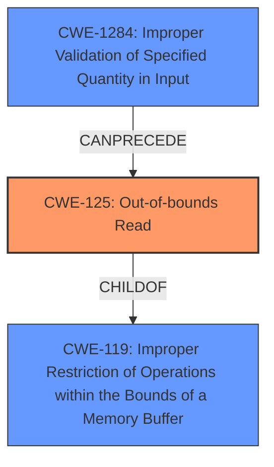

# Analysis Report for CVE-2021-0676

# Vulnerability Analysis Report: CVE-2021-0676

## Description


## Analysis (with Relationship Data)

# Summary
| CWE ID | CWE Name | Confidence | CWE Abstraction Level | CWE Vulnerability Mapping Label | CWE-Vulnerability Mapping Notes |
|---|---|---|---|---|---|
| CWE-125 | Out-of-bounds Read | 1.0 | Base | Allowed | Primary CWE |
| CWE-1284 | Improper Validation of Specified Quantity in Input | 0.7 | Base | Allowed | Secondary CWE |

## Evidence and Confidence

*   **Confidence Score:** 0.85
*   **Evidence Strength:** HIGH

## Relationship Analysis
The primary weakness is CWE-125, which is a child of CWE-119 (Improper Restriction of Operations within the Bounds of a Memory Buffer). The vulnerability description indicates an **incorrect bounds check** leading to an **out-of-bounds read**, indicating a failure to properly restrict memory buffer operations.



## Vulnerability Chain
The chain of events starts with an **incorrect bounds check** (potentially CWE-1284), leading to an **out-of-bounds read** (CWE-125), which results in local information disclosure.

## Summary of Analysis
The initial assessment focuses on the vulnerability description indicating an **out of bounds read** due to an **incorrect bounds check**. This strongly suggests CWE-125 as the primary weakness. The **incorrect bounds check** suggests a problem with validating the input used to access the buffer, which aligns with CWE-1284 (Improper Validation of Specified Quantity in Input).

The evidence for CWE-125 is strong: "there is a possible **out of bounds read** due to an **incorrect bounds check**." The CVE Reference Links Content Summary confirms this: "An incorrect bounds check in the geniezone driver leads to an out-of-bounds read."

CWE-125 is at the Base level of abstraction, which is preferred. The mapping guidance for CWE-125 states: "This CWE entry is at the Base level of abstraction, which is a preferred level of abstraction for mapping to the root causes of vulnerabilities."

CWE-1284 is considered as a secondary weakness because the "incorrect bounds check" implies a failure to properly validate the input quantity used to access the buffer.

The other CWEs were considered but not used:
*   CWE-908: Use of Uninitialized Resource - While possible, the description focuses on bounds checking, not uninitialized resources.
*   CWE-131: Incorrect Calculation of Buffer Size - The vulnerability description focuses on the bounds check, not the buffer size calculation.
*   CWE-191: Integer Underflow (Wrap or Wraparound) - The vulnerability description focuses on bounds checking, not integer underflow.
*   CWE-362: Concurrent Execution using Shared Resource with Improper Synchronization ('Race Condition') - The description does not indicate concurrency issues.
*   CWE-667: Improper Locking - The description does not indicate locking issues.
*   CWE-782: Exposed IOCTL with Insufficient Access Control - While the driver context could imply IOCTL, there's no specific information about exposed IOCTLs.
*   CWE-129: Improper Validation of Array Index - Similar to CWE-1284, but less specific to the quantity aspect.
*   CWE-20: Improper Input Validation - This is a broad class, and more specific CWEs are available.
*   CWE-190: Integer Overflow or Wraparound - The vulnerability description focuses on bounds checking, not integer overflow.

Based on the evidence, relationship analysis, and mapping guidance, CWE-125 is the most appropriate primary CWE, with CWE-1284 as a secondary candidate.

Relevant CWE Information:

# Enhanced Context (25 CWEs)

## CWE-191: Integer Underflow (Wrap or Wraparound)
**Abstraction Level**: Base
**Similarity Score**: 0.80
**Source**: dense

**Description**:
The product subtracts one value from another, such that the result is less than the minimum allowable integer value, which produces a value that is not equal to the correct result.

**Mapping Guidance**:
- Usage: Allowed
- Rationale: This CWE entry is at the Base level of abstraction, which is a preferred level of abstraction for mapping to the root causes of vulnerabilities.

## CWE-197: Numeric Truncation Error
**Abstraction Level**: Base
**Similarity Score**: 0.77
**Source**: dense

**Description**:
Truncation errors occur when a primitive is cast to a primitive of a smaller size and data is lost in the conversion.

**Mapping Guidance**:
- Usage: Allowed
- Rationale: This CWE entry is at the Base level of abstraction, which is a preferred level of abstraction for mapping to the root causes of vulnerabilities.

## CWE-680: Integer Overflow to Buffer Overflow
**Abstraction Level**: Compound
**Similarity Score**: 0.77
**Source**: dense

**Description**:
The product performs a calculation to determine how much memory to allocate, but an integer overflow can occur that causes less memory to be allocated than expected, leading to a buffer overflow.

**Mapping Guidance**:
- Usage: Discouraged
- Rationale: This CWE entry is a named chain, which combines multiple weaknesses.

## CWE-190: Integer Overflow or Wraparound
**Abstraction Level**: Base
**Similarity Score**: 0.76
**Source**: dense

**Description**:
The product performs a calculation that can
         produce an integer overflow or wraparound when the logic
         assumes that the resulting value will always be larger than
         the original value. This occurs when an integer value is
         incremented to a value that is too large to store in the
         associated representation. When this occurs, the value may
         become a very small or negative number.

**Mapping Guidance**:
- Usage: Allowed
- Rationale: This CWE entry is at the Base level of abstraction, which is a preferred level of abstraction for mapping to the root causes of vulnerabilities.

## CWE-681: Incorrect Conversion between Numeric Types
**Abstraction Level**: Base
**Similarity Score**: 0.76
**Source**: dense

**Description**:
When converting from one data type to another, such as long to integer, data can be omitted or translated in a way that produces unexpected values. If the resulting values are used in a sensitive context, then dangerous behaviors may occur.

**Mapping Guidance**:
- Usage: Allowed
- Rationale: This CWE entry is at the Base level of abstraction, which is a preferred level of abstraction for mapping to the root causes of vulnerabilities.

## CWE-131: Incorrect Calculation of Buffer Size
**Abstraction Level**: Base
**Similarity Score**: 0.76
**Source**: dense

**Description**:
The product does not correctly calculate the size to be used when allocating a buffer, which could lead to a buffer overflow.

**Mapping Guidance**:
- Usage: Allowed
- Rationale: This CWE entry is at the Base level of abstraction, which is a preferred level of abstraction for mapping to the root causes of vulnerabilities.

## CWE-125: Out-of-bounds Read
**Abstraction Level**: Base
**Similarity Score**: 0.74
**Source**: dense

**Description**:
The product reads data past the end, or before the beginning, of the intended buffer.

**Mapping Guidance**:
- Usage: Allowed
- Rationale: This CWE entry is at the Base level of abstraction, which is a preferred level of abstraction for mapping to the root causes of vulnerabilities.

## CWE-667: Improper Locking
**Abstraction Level**: Class
**Similarity Score**: 0.74
**Source**: dense

**Description**:
The product does not properly acquire or release a lock on a resource, leading to unexpected resource state changes and behaviors.

**Mapping Guidance**:
- Usage: Allowed-with-Review
- Rationale: This CWE entry is a Class and might have Base-level children that would be more appropriate

## CWE-823: Use of Out-of-range Pointer Offset
**Abstraction Level**: Base
**Similarity Score**: 0.74
**Source**: dense

**Description**:
The product performs pointer arithmetic on a valid pointer, but it uses an offset that can point outside of the intended range of valid memory locations for the resulting pointer.

**Mapping Guidance**:
- Usage: Allowed
- Rationale: This CWE entry is at the Base level of abstraction, which is a preferred level of abstraction for mapping to the root causes of vulnerabilities.

## CWE-805: Buffer Access with Incorrect


## CWE Relationship Analysis

Current CWEs represent these abstraction levels: .


### Vulnerability Chain Analysis

**Chain starting from CWE-131:**
- 131 (Incorrect Calculation of Buffer Size) - ROOT


**Chain starting from CWE-190:**
- 190 (Integer Overflow or Wraparound) - ROOT


### CWE Relationship Diagram

```mermaid
graph TD
    classDef primary fill:#f96,stroke:#333,stroke-width:2px
    classDef secondary fill:#69f,stroke:#333
    classDef tertiary fill:#9e9,stroke:#333
```


*Report generated on 2025-03-30 17:54:46*
