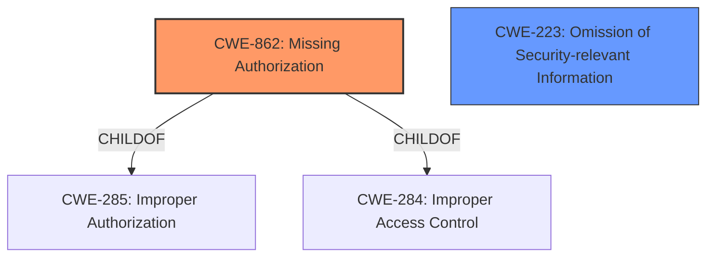

# Analysis for CVE-2021-0735

# Summary
| CWE ID | CWE Name | Confidence | CWE Abstraction Level | CWE Vulnerability Mapping Label | CWE-Vulnerability Mapping Notes |
|---|---|---|---|---|---|
| CWE-862 | Missing Authorization | 1.0 | Class | Allowed-with-Review | Primary CWE |
| CWE-223 | Omission of Security-relevant Information | 0.7 | Base | Allowed | Secondary Candidate |

## Evidence and Confidence

*   **Confidence Score:** 1.0
*   **Evidence Strength:** HIGH

## Relationship Analysis
The primary CWE selected is CWE-862, which is a Class-level CWE. While it would be preferable to identify a Base or Variant level CWE, the vulnerability description clearly states a "**missing permission check**", aligning directly with the definition of missing authorization. CWE-862 is a child of CWE-285 (Improper Authorization) and CWE-284 (Improper Access Control), but these are too general to be useful in this case. CWE-223 is also a possibility because the **missing permission check** means security relevant information is being ommitted but that is an impact of the **missing permission check** itself, and therefore secondary.

## Vulnerability Chain
The vulnerability chain starts with the **missing permission check** (CWE-862), which directly leads to local information disclosure.

## Summary of Analysis
The vulnerability description clearly indicates a **missing permission check** in the PackageManager, which allows unauthorized access to information about installed packages. This directly maps to CWE-862 (Missing Authorization).

The evidence supporting this decision is:

*   **Vulnerability Description Key Phrases:** "**missing permission check**"
*   **CVE Reference Links Content Summary:** "The vulnerability lies within the Framework component of Android...An attacker could potentially gain access to sensitive information."

While the ideal mapping would be to a Base or Variant level CWE, CWE-862 accurately captures the root cause of the vulnerability. The retriever results list CWE-862 as the top candidate with a score of 0.475.

CWE-223 (Omission of Security-relevant Information) was considered because the **missing permission check** results in security-relevant information not being properly protected. However, this is a consequence of the **missing authorization**, not the primary cause. Therefore, CWE-862 is the more accurate primary mapping.