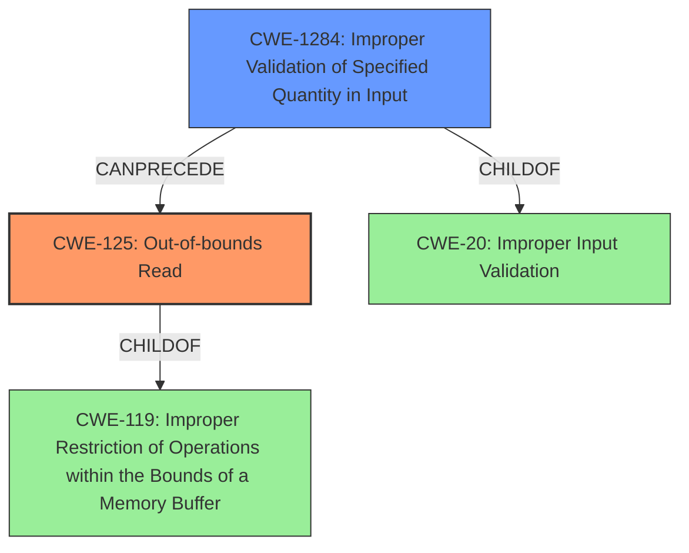

# Enhanced Analysis for CVE-2021-0902

# Summary
| CWE ID | CWE Name | Confidence | CWE Abstraction Level | CWE Vulnerability Mapping Label | CWE-Vulnerability Mapping Notes |
|---|---|---|---|---|---|
| CWE-125 | Out-of-bounds Read | 1 | Base | Primary | Allowed |
| CWE-1284 | Improper Validation of Specified Quantity in Input | 0.7 | Base | Secondary | Allowed |

## Evidence and Confidence

*   **Confidence Score:** 0.85
*   **Evidence Strength:** HIGH

## Relationship Analysis
The primary weakness is CWE-125, Out-of-bounds Read, which occurs due to an **incorrect bounds check**. This **incorrect bounds check** can be seen as **Improper Validation of Specified Quantity in Input**, represented by CWE-1284, since the bounds check is essentially validating a quantity (the size of the buffer). CWE-125 is a child of CWE-119 (Improper Restriction of Operations within the Bounds of a Memory Buffer). CWE-1284 is a child of CWE-20 (Improper Input Validation).



## Vulnerability Chain
The vulnerability chain starts with **Improper Validation of Specified Quantity in Input** (CWE-1284) due to the **incorrect bounds check**. This leads to an **Out-of-bounds Read** (CWE-125), resulting in local information disclosure.

## Summary of Analysis
The initial analysis correctly identified CWE-125 as the primary weakness, given the description focuses on an **out of bounds read**. The description also explicitly mentions an **incorrect bounds check**, which points to **Improper Validation of Specified Quantity in Input** (CWE-1284).

The evidence provided supports classifying this vulnerability as CWE-125 (Out-of-bounds Read) with high confidence. The description states, "In apusys, there is a possible **out of bounds read** due to an **incorrect bounds check**." The CVE Reference Links Content Summary also reinforces this by stating, "Specifically, an incorrect bounds check leads to an out-of-bounds read."

The relationship analysis highlights that CWE-125 is a direct consequence of the **incorrect bounds check**. The **incorrect bounds check** can be captured by CWE-1284 (Improper Validation of Specified Quantity in Input).

The selected CWEs are at the optimal level of specificity because CWE-125 directly describes the observed behavior and CWE-1284 captures the root cause of the out-of-bounds read.
# Enhanced Context (25 CWEs)
The following CWEs were identified as potentially relevant to this vulnerability:

## CWE-191: Integer Underflow (Wrap or Wraparound)
**Abstraction Level**: Base
**Similarity Score**: 0.80
**Source**: dense

**Description**:
The product subtracts one value from another, such that the result is less than the minimum allowable integer value, which produces a value that is not equal to the correct result.

**Why Not Used**: While integer underflow could potentially be related to an **incorrect bounds check**, the primary issue here is the resulting out-of-bounds read, not an arithmetic error.

## CWE-197: Numeric Truncation Error
**Abstraction Level**: Base
**Similarity Score**: 0.77
**Source**: dense

**Description**:
Truncation errors occur when a primitive is cast to a primitive of a smaller size and data is lost in the conversion.

**Why Not Used**: There is no evidence of numeric truncation in the provided description. The issue is an **incorrect bounds check** leading to an out-of-bounds read.

## CWE-681: Incorrect Conversion between Numeric Types
**Abstraction Level**: Base
**Similarity Score**: 0.77
**Source**: dense

**Description**:
When converting from one data type to another, such as long to integer, data can be omitted or translated in a way that produces unexpected values. If the resulting values are used in a sensitive context, then dangerous behaviors may occur.

**Why Not Used**: There is no evidence of incorrect conversion between numeric types in the provided description.

## CWE-680: Integer Overflow to Buffer Overflow
**Abstraction Level**: Compound
**Similarity Score**: 0.77
**Source**: dense

**Description**:
The product performs a calculation to determine how much memory to allocate, but an integer overflow can occur that causes less memory to be allocated than expected, leading to a buffer overflow.

**Why Not Used**: While integer overflow can lead to buffer overflows, the description specifies an **incorrect bounds check**, not specifically an integer overflow.

## CWE-190: Integer Overflow or Wraparound
**Abstraction Level**: Base
**Similarity Score**: 0.76
**Source**: dense

**Description**:
The product performs a calculation that can
         produce an integer overflow or wraparound when the logic
         assumes that the resulting value will always be larger than
         the original value. This occurs when an integer value is
         incremented to a value that is too large to store in the
         associated representation. When this occurs, the value may
         become a very small or negative number.

**Why Not Used**: The description indicates an **incorrect bounds check**, not an integer overflow specifically. While an integer overflow could be the cause of the **incorrect bounds check**, the provided information doesn't have that level of detail.

## CWE-131: Incorrect Calculation of Buffer Size
**Abstraction Level**: Base
**Similarity Score**: 0.76
**Source**: dense

**Description**:
The product does not correctly calculate the size to be used when allocating a buffer, which could lead to a buffer overflow.

**Why Not Used**: While the **incorrect bounds check** could be related to an incorrect buffer size calculation, the description is more focused on the check itself being flawed, rather than the initial calculation.

## CWE-823: Use of Out-of-range Pointer Offset
**Abstraction Level**: Base
**Similarity Score**: 0.75
**Source**: dense

**Description**:
The product performs pointer arithmetic on a valid pointer, but it uses an offset that can point outside of the intended range of valid memory locations for the resulting pointer.

**Why Not Used**: The primary issue is an **out of bounds read** due to an **incorrect bounds check**. While pointer arithmetic might be involved, it is not explicitly mentioned.

## CWE-667: Improper Locking
**Abstraction Level**: Class
**Similarity Score**: 0.75
**Source**: dense

**Description**:
The product does not properly acquire or release a lock on a resource, leading to unexpected resource state changes and behaviors.

**Why Not Used**: Locking issues are not relevant to this vulnerability.

## CWE-125: Out-of-bounds Read
**Abstraction Level**: Base
**Similarity Score**: 0.75
**Source**: dense

**Description**:
The product reads data past the end, or before the beginning, of the intended buffer.

**Why Used**: The vulnerability description explicitly states "**out of bounds read**".

## CWE-682: Incorrect Calculation
**Abstraction Level**: Pillar
**Similarity Score**: 0.74
**Source**: dense

**Description**:
The product performs a calculation that generates incorrect or unintended results that are later used in security-critical decisions or resource management.

**Why Not Used**: This is too high-level. The **incorrect bounds check** is more specific than a general incorrect calculation.

## CWE-1284: Improper Validation of Specified Quantity in Input
**Abstraction Level**: Base
**Similarity Score**: 7425.24
**Source**: sparse

**Description**:
The product receives input that is expected to specify a quantity (such as size or length), but it does not validate or incorrectly validates that the quantity has the required properties.

**Why Used**: The **incorrect bounds check** directly relates to the improper validation of a specified quantity, namely the size or bounds of the buffer.

## CWE-476: NULL Pointer Dereference
**Abstraction Level**: base
**Similarity Score**: 4.33
**Source**: graph

**Description**:
CWE-476: NULL Pointer Dereference

**Why Not Used**: A null pointer dereference is not part of the vulnerability description.


## CWE Relationship Analysis

Current CWEs represent these abstraction levels: .


### Vulnerability Chain Analysis

**Chain starting from CWE-190:**
- 190 (Integer Overflow or Wraparound) - ROOT


**Chain starting from CWE-131:**
- 131 (Incorrect Calculation of Buffer Size) - ROOT


### CWE Relationship Diagram

```mermaid
graph TD
    classDef primary fill:#f96,stroke:#333,stroke-width:2px
    classDef secondary fill:#69f,stroke:#333
    classDef tertiary fill:#9e9,stroke:#333
```