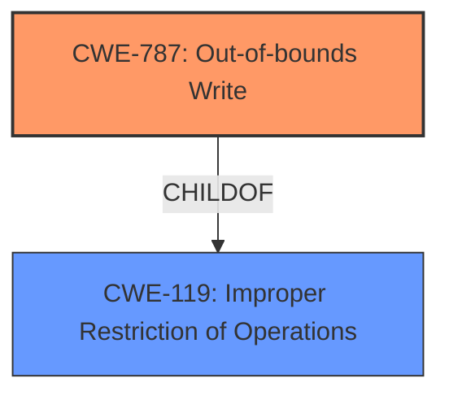

# Enhanced Analysis for CVE-2021-0903

# Summary
| CWE ID | CWE Name | Confidence | CWE Abstraction Level | CWE Vulnerability Mapping Label | CWE-Vulnerability Mapping Notes |
|---|---|---|---|---|---|
| CWE-787 | Out-of-bounds Write | 1.0 | Base | Allowed | Primary CWE |

## Evidence and Confidence

*   **Confidence Score:** 1.0
*   **Evidence Strength:** HIGH

## Relationship Analysis
The analysis focused on the primary weakness, CWE-787 (**Out-of-bounds Write**), which is directly implicated by the vulnerability description. The parent CWE, CWE-119 (**Improper Restriction of Operations within the Bounds of a Memory Buffer**), was considered but deemed less specific. The relationships between CWE-787 and other potential preceding or following CWEs (e.g., related to buffer size calculation or input validation) were examined, but the available information strongly points to a direct **out-of-bounds write** due to a **missing bounds check**, justifying the selection of CWE-787 as the primary and most specific weakness.



## Vulnerability Chain
The vulnerability chain begins with a **missing bounds check** leading directly to an **out-of-bounds write**, which in turn results in a local escalation of privilege.

Missing Bounds Check -> Out-of-Bounds Write -> Local Escalation of Privilege

## Summary of Analysis
The initial assessment identified CWE-787 (**Out-of-bounds Write**) as the primary candidate based on the **weakness** described in the vulnerability description and the "CWE for similar CVE Descriptions" section. The "CVE Reference Links Content Summary" confirms that the root cause is an improper restriction of operations due to a **missing bounds check**, leading to an **out-of-bounds write**.

The Retriever Results listed CWE-787 (**Out-of-bounds Write**) as a relevant CWE.

The evidence clearly supports the selection of CWE-787 (**Out-of-bounds Write**) as the primary CWE. The description explicitly mentions an **out-of-bounds write** due to a **missing bounds check**, making CWE-787 the most appropriate and specific classification. The MITRE mapping guidance also supports the use of Base level CWEs when sufficient evidence is available.

Relevant CWE Information:

# Enhanced Context (25 CWEs)

## CWE-191: Integer Underflow (Wrap or Wraparound)
**Abstraction Level**: Base
**Similarity Score**: 0.79
**Source**: dense
**Description**:
The product subtracts one value from another, such that the result is less than the minimum allowable integer value, which produces a value that is not equal to the correct result.
**Why it was not selected**: While integer underflow can lead to buffer overflows, there is no indication of this in the description. The vulnerability is due to a **missing bounds check**, not an integer underflow.

## CWE-131: Incorrect Calculation of Buffer Size
**Abstraction Level**: Base
**Similarity Score**: 0.78
**Source**: dense
**Description**:
The product does not correctly calculate the size to be used when allocating a buffer, which could lead to a buffer overflow.
**Why it was not selected**: The vulnerability is due to a **missing bounds check**, not an incorrect calculation of buffer size.

## CWE-805: Buffer Access with Incorrect Length Value
**Abstraction Level**: Base
**Similarity Score**: 0.77
**Source**: dense
**Description**:
The product uses a sequential operation to read or write a buffer, but it uses an incorrect length value that causes it to access memory that is outside of the bounds of the buffer.
**Why it was not selected**: While the result is similar to that of CWE-787, the root cause is a **missing bounds check**.

## CWE-667: Improper Locking
**Abstraction Level**: Class
**Similarity Score**: 0.77
**Source**: dense
**Description**:
The product does not properly acquire or release a lock on a resource, leading to unexpected resource state changes and behaviors.
**Why it was not selected**: There is no evidence of an improper locking issue in the description.

## CWE-125: Out-of-bounds Read
**Abstraction Level**: Base
**Similarity Score**: 0.77
**Source**: dense
**Description**:
The product reads data past the end, or before the beginning, of the intended buffer.
**Why it was not selected**: The vulnerability description specifically states that it is an **out of bounds write**, not a read.

## CWE-124: Buffer Underwrite ('Buffer Underflow')
**Abstraction Level**: Base
**Similarity Score**: 0.77
**Source**: dense
**Description**:
The product writes to a buffer using an index or pointer that references a memory location prior to the beginning of the buffer.
**Why it was not selected**: The description does not describe a write before the beginning of the buffer.

## CWE-197: Numeric Truncation Error
**Abstraction Level**: Base
**Similarity Score**: 0.76
**Source**: dense
**Description**:
Truncation errors occur when a primitive is cast to a primitive of a smaller size and data is lost in the conversion.
**Why it was not selected**: There is no indication of a numeric truncation error in the description.

## CWE-823: Use of Out-of-range Pointer Offset
**Abstraction Level**: Base
**Similarity Score**: 0.76
**Source**: dense
**Description**:
The product performs pointer arithmetic on a valid pointer, but it uses an offset that can point outside of the intended range of valid memory locations for the resulting pointer.
**Why it was not selected**: The root cause is a **missing bounds check**, not the use of an out-of-range pointer offset.

## CWE-404: Improper Resource Shutdown or Release
**Abstraction Level**: Class
**Similarity Score**: 0.76
**Source**: dense
**Description**:
The product does not release or incorrectly releases a resource before it is made available for re-use.
**Why it was not selected**: There is no indication of a resource shutdown or release issue in the description.

## CWE-1289: Improper Validation of Unsafe Equivalence in Input
**Abstraction Level**: Base
**Similarity Score**: 0.76
**Source**: dense
**Description**:
The product receives an input value that is used as a resource identifier or other type of reference, but it does not validate or incorrectly validates that the input is equivalent to a potentially-unsafe value.
**Why it was not selected**: The vulnerability is due to a **missing bounds check**, not an improper validation of input.

## CWE-190: Integer Overflow or Wraparound
**Abstraction Level**: Base
**Similarity Score**: 6355.91
**Source**: sparse
**Description**:
The product performs a calculation that can produce an integer overflow or wraparound when the logic assumes that the resulting value will always be larger than the original value.
**Why it was not selected**: While integer overflows can lead to buffer overflows, there is no indication of this in the description. The vulnerability is due to a **missing bounds check**, not an integer overflow.

## CWE-1284: Improper Validation of Specified Quantity in Input
**Abstraction Level**: Base
**Similarity Score**: 6299.72
**Source**: sparse
**Description**:
The product receives input that is expected to specify a quantity (such as size or length), but it does not validate or incorrectly validates that the quantity has the required properties.
**Why it was not selected**: The vulnerability is due to a **missing bounds check**, not an improper validation of input.

## CWE-362: Concurrent Execution using Shared Resource with Improper Synchronization ('Race Condition')
**Abstraction Level**: Class
**Similarity Score**: 6227.15
**Source**: sparse
**Description**:
The product contains a concurrent code sequence that requires temporary, exclusive access to a shared resource, but a timing window exists in which the shared resource can be modified by another code sequence operating concurrently.
**Why it was not selected**: There is no evidence of a race condition in the description.

## CWE-41: Improper Resolution of Path Equivalence
**Abstraction Level**: base
**Similarity Score**: 5.03
**Source**: graph
**Description**:
CWE-41: Improper Resolution of Path Equivalence
**Why it was not selected**: This is not related to path equivalence.

## CWE-1260: Improper Handling of Overlap Between Protected Memory Ranges
**Abstraction Level**: base
**Similarity Score**: 4.33
**Source**: graph
**Description**:
CWE-1260: Improper Handling of Overlap Between Protected Memory Ranges
**Why it was not selected**: This is not related to overlapping memory ranges.


## CWE Relationship Analysis

Current CWEs represent these abstraction levels: .


### Vulnerability Chain Analysis

**Chain starting from CWE-131:**
- 131 (Incorrect Calculation of Buffer Size) - ROOT


**Chain starting from CWE-190:**
- 190 (Integer Overflow or Wraparound) - ROOT


### CWE Relationship Diagram

```mermaid
graph TD
    classDef primary fill:#f96,stroke:#333,stroke-width:2px
    classDef secondary fill:#69f,stroke:#333
    classDef tertiary fill:#9e9,stroke:#333
```