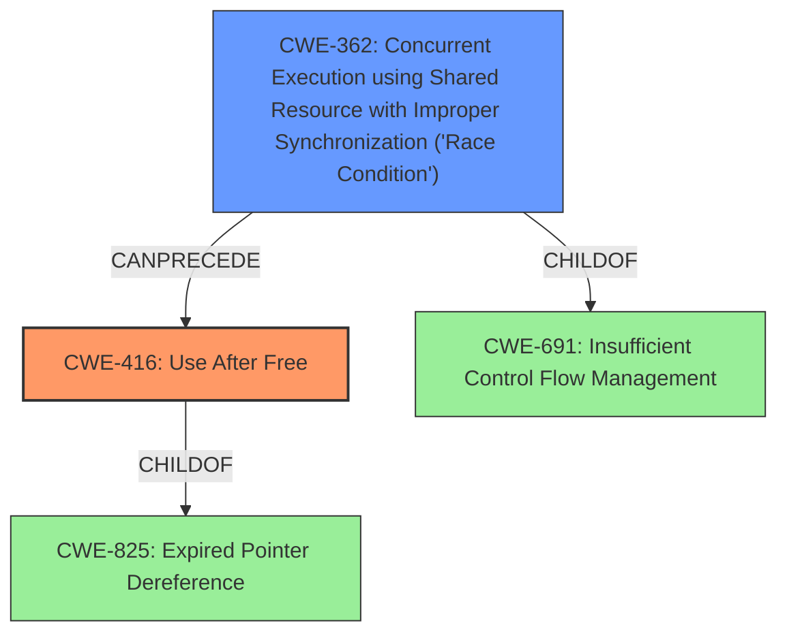

# Raw Analyzer Response for CVE-2021-0920

# Summary
| CWE ID | CWE Name | Confidence | CWE Abstraction Level | CWE Vulnerability Mapping Label | CWE-Vulnerability Mapping Notes |
|---|---|---|---|---|---|
| CWE-416 | Use After Free | 0.9 | Variant | Allowed | Primary CWE |
| CWE-362 | Concurrent Execution using Shared Resource with Improper Synchronization ('Race Condition') | 0.9 | Class | Allowed-with-Review | Secondary CWE |

## Evidence and Confidence

*   **Confidence Score:** 0.9
*   **Evidence Strength:** HIGH

## Relationship Analysis
The primary weakness is **CWE-416 (Use After Free)**, which is a Variant-level CWE. The root cause of this vulnerability is **CWE-362 (Concurrent Execution using Shared Resource with Improper Synchronization ('Race Condition'))**, which is a Class-level CWE. **CWE-362** can precede **CWE-416**, indicating that the race condition leads to the use-after-free vulnerability.

## Vulnerability Chain
The vulnerability chain starts with **CWE-362 (Concurrent Execution using Shared Resource with Improper Synchronization ('Race Condition'))**. Due to the **race condition**, a resource is freed while another thread still holds a reference to it. This leads to **CWE-416 (Use After Free)**, where the thread attempts to access the freed memory, potentially causing a crash, denial of service, or privilege escalation.

## Summary of Analysis
The primary weakness is **CWE-416 (Use After Free)**, as the vulnerability allows for the reuse or reference of memory after it has been freed. The root cause of this issue is a **CWE-362 (Concurrent Execution using Shared Resource with Improper Synchronization ('Race Condition'))**, which allows the memory to be freed while still in use.

The vulnerability description explicitly states: "In unix_scm_to_skb of af_unix.c, there is a possible **use after free** bug due to a **race condition**." This statement directly supports the mapping to **CWE-416** as the weakness and **CWE-362** as the root cause.

The "CVE Reference Links Content Summary" provides additional evidence, stating: "A **race condition** exists in the local sockets (AF_UNIX) subsystem of the Linux kernel... leading to a **use-after-free** vulnerability."

The relationships between the CWEs, specifically the "CanPrecede" relationship of **CWE-362** preceding **CWE-416**, further solidify the classification.

The selected CWEs are at the optimal level of specificity. **CWE-416** is a Variant, which is preferred when the vulnerability matches the specific conditions of the CWE. **CWE-362** is a Class, but it is the most accurate representation of the root cause given the available information.

Relevant CWE Information:

# Enhanced Context (25 CWEs)
The following CWEs were identified as potentially relevant to this vulnerability:

## CWE-366: Race Condition within a Thread
**Abstraction Level**: Base
**Similarity Score**: 0.81
**Source**: dense

**Description**:
If two threads of execution use a resource simultaneously, there exists the possibility that resources may be used while invalid, in turn making the state of execution undefined.

**Mapping Guidance**:
- Usage: Allowed
- Rationale: This CWE entry is at the Base level of abstraction, which is a preferred level of abstraction for mapping to the root causes of vulnerabilities.

*Rationale for not selecting:* While this is a race condition, the description doesn't specify that it is within a thread.

## CWE-362: Concurrent Execution using Shared Resource with Improper Synchronization ('Race Condition')
**Abstraction Level**: Class
**Similarity Score**: 0.78
**Source**: dense

**Description**:
The product contains a concurrent code sequence that requires temporary, exclusive access to a shared resource, but a timing window exists in which the shared resource can be modified by another code sequence operating concurrently.

**Mapping Guidance**:
- Usage: Allowed-with-Review
- Rationale: This CWE entry is a Class and might have Base-level children that would be more appropriate

*Rationale for selecting as a secondary CWE:* The vulnerability description and CVE summary both mention a race condition as the root cause.

## CWE-667: Improper Locking
**Abstraction Level**: Class
**Similarity Score**: 0.78
**Source**: dense

**Description**:
The product does not properly acquire or release a lock on a resource, leading to unexpected resource state changes and behaviors.

**Mapping Guidance**:
- Usage: Allowed-with-Review
- Rationale: This CWE entry is a Class and might have Base-level children that would be more appropriate

*Rationale for not selecting:* While improper locking can lead to a race condition, the description does not specifically mention locking issues.

## CWE-404: Improper Resource Shutdown or Release
**Abstraction Level**: Class
**Similarity Score**: 0.76
**Source**: dense

**Description**:
The product does not release or incorrectly releases a resource before it is made available for re-use.

**Mapping Guidance**:
- Usage: Allowed-with-Review
- Rationale: This CWE entry is a Class and might have Base-level children that would be more appropriate

*Rationale for not selecting:* This CWE is related to releasing resources, but it is a symptom of the race condition and the use after free.

## CWE-415: Double Free
**Abstraction Level**: Variant
**Similarity Score**: 0.75
**Source**: dense

**Description**:
The product calls free() twice on the same memory address, potentially leading to modification of unexpected memory locations.

**Mapping Guidance**:
- Usage: Allowed
- Rationale: This CWE entry is at the Variant level of abstraction, which is a preferred level of abstraction for mapping to the root causes of vulnerabilities.

*Rationale for not selecting:* The vulnerability description mentions a use-after-free, not a double free.

## CWE-662: Improper Synchronization
**Abstraction Level**: Class
**Similarity Score**: 0.75
**Source**: dense

**Description**:
The product utilizes multiple threads or processes to allow temporary access to a shared resource that can only be exclusive to one process at a time, but it does not properly synchronize these actions, which might cause simultaneous accesses of this resource by multiple threads or processes.

**Mapping Guidance**:
- Usage: Discouraged
- Rationale: This CWE entry is a level-1 Class (i.e., a child of a Pillar). It might have lower-level children that would be more appropriate

*Rationale for not selecting:* This is a more general case of the race condition.

## CWE-226: Sensitive Information in Resource Not Removed Before Reuse
**Abstraction Level**: Base
**Similarity Score**: 0.75
**Source**: dense

**Description**:
The product releases a resource such as memory or a file so that it can be made available for reuse, but it does not clear or "zeroize" the information contained in the resource before the product performs a critical state transition or makes the resource available for reuse by other entities.

**Mapping Guidance**:
- Usage: Allowed
- Rationale: This CWE entry is at the Base level of abstraction, which is a preferred level of abstraction for mapping to the root causes of vulnerabilities.

*Rationale for not selecting:* This CWE is not directly related to the vulnerability description.

## CWE-367: Time-of-check Time-of-use (TOCTOU) Race Condition
**Abstraction Level**: Base
**Similarity Score**: 0.74
**Source**: dense

**Description**:
The product checks the state of a resource before using that resource, but the resource's state can change between the check and the use in a way that invalidates the results of the check. This can cause the product to perform invalid actions when the resource is in an unexpected state.

**Mapping Guidance**:
- Usage: Allowed
- Rationale: This CWE entry is at the Base level of abstraction, which is a preferred level of abstraction for mapping to the root causes of vulnerabilities.

*Rationale for not selecting:* There is no check and use scenario in the vulnerability description.

## CWE-364: Signal Handler Race Condition
**Abstraction