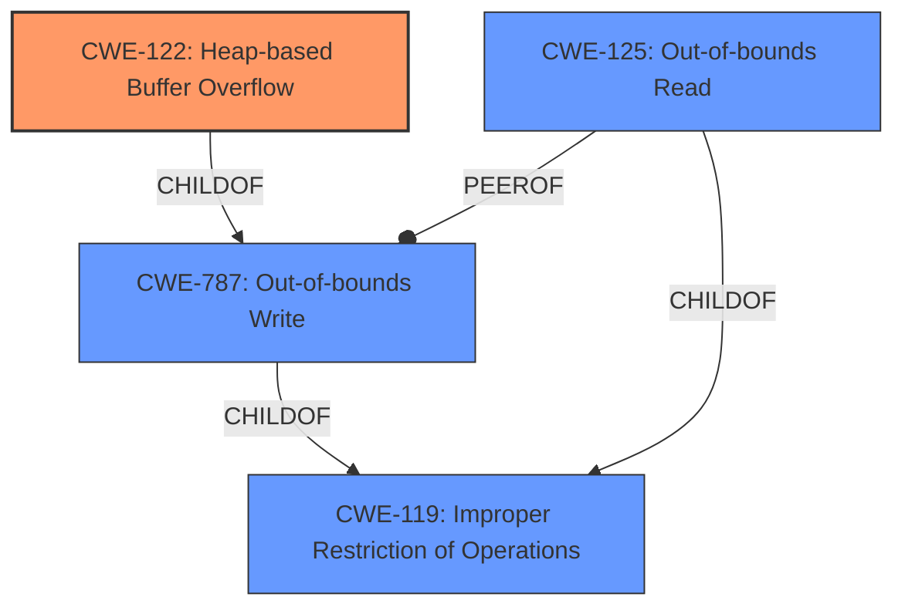

# Analysis Report for CVE-2021-1001

# Vulnerability Analysis Report: CVE-2021-1001

## Description


## Analysis (with Relationship Data)

# Summary
| CWE ID | CWE Name | Confidence | CWE Abstraction Level | CWE Vulnerability Mapping Label | CWE-Vulnerability Mapping Notes |
|---|---|---|---|---|---|
| CWE-122 | Heap-based Buffer Overflow | 0.9 | Variant | Allowed | Primary CWE |
| CWE-125 | Out-of-bounds Read | 0.8 | Base | Allowed | Secondary Candidate |

## Evidence and Confidence

*   **Confidence Score:** 0.85
*   **Evidence Strength:** HIGH

## Relationship Analysis
The primary CWE is CWE-122, which is a variant of CWE-787 (Out-of-bounds Write) and CWE-119 (Improper Restriction of Operations within the Bounds of a Memory Buffer). CWE-125 (Out-of-bounds Read) is a peer of CWE-787 and also a child of CWE-119. The vulnerability involves a **heap buffer overflow** leading to an **out-of-bounds read**, suggesting a write operation went beyond the allocated heap memory and a subsequent read operation accessed memory outside the intended buffer. The choice of CWE-122 as primary is due to the explicit mention of "heap buffer overflow" as the root cause.



## Vulnerability Chain
The vulnerability chain starts with a **heap buffer overflow**, which is the root cause (CWE-122). This leads to an **out-of-bounds read** (CWE-125), ultimately resulting in local information disclosure.

## Summary of Analysis
The initial analysis identified the root cause as a **heap buffer overflow** leading to an **out-of-bounds read**. The evidence directly supports this, with the "Vulnerability Description Key Phrases" section clearly stating "**rootcause:** **heap buffer overflow**" and "**weakness:** **out of bounds read**".

The graph relationships influenced the selection by showing how CWE-122, CWE-787, CWE-119, and CWE-125 are interconnected. Given that the description explicitly mentions "**heap buffer overflow**," CWE-122 was chosen as the primary CWE because it represents the most specific and accurate classification of the root cause.

The selected CWEs are at the optimal level of specificity. CWE-122 (Heap-based Buffer Overflow) is a variant that pinpoints the specific type of buffer overflow, while CWE-125 (Out-of-bounds Read) is a base CWE that accurately describes the resulting weakness.

Relevant CWE Information:

# Enhanced Context (25 CWEs)

## CWE-191: Integer Underflow (Wrap or Wraparound)
Not used. Integer underflow isn't directly mentioned in the description.

## CWE-131: Incorrect Calculation of Buffer Size
Not used. The description indicates a **heap buffer overflow**, but doesn't explicitly mention an incorrect calculation of buffer size.

## CWE-125: Out-of-bounds Read
**Explanation:** The product reads data past the end, or before the beginning, of the intended buffer. The vulnerability description states "**weakness:** **out of bounds read**". This matches the description of CWE-125.
**Justification:** This is a result of the root cause **heap buffer overflow**.
**Confidence:** 0.8

## CWE-805: Buffer Access with Incorrect Length Value
Not used. While related to buffer access, the root cause is identified as a **heap buffer overflow**, making CWE-122 a more direct match.

## CWE-681: Incorrect Conversion between Numeric Types
Not used. There's no evidence to suggest incorrect conversion between numeric types.

## CWE-404: Improper Resource Shutdown or Release
Not used. This CWE isn't relevant to the described vulnerability.

## CWE-909: Missing Initialization of Resource
Not used. This CWE isn't relevant to the described vulnerability.

## CWE-190: Integer Overflow or Wraparound
Not used. There's no evidence to suggest an integer overflow.

## CWE-126: Buffer Over-read
Not used. While similar to CWE-125, the description does not specify if the read is after the targeted buffer. Thus, CWE-125 is a better fit.

## CWE-197: Numeric Truncation Error
Not used. There's no evidence to suggest numeric truncation.

## CWE-128: Wrap-around Error
Not used. There's no evidence to suggest a wrap-around error.

## CWE-195: Signed to Unsigned Conversion Error
Not used. There's no evidence to suggest signed to unsigned conversion error.

## CWE-170: Improper Null Termination
Not used. There's no evidence to suggest improper null termination.

## CWE-1284: Improper Validation of Specified Quantity in Input
Not used. The CVE Reference summary mentions **Improper Input Validation** as the weakness, but the vulnerability description is very clear it is a **heap buffer overflow**.

## CWE-123: Write-what-where Condition
Not used. The description doesn't provide enough information to confirm this condition.

## CWE-1339: Insufficient Precision or Accuracy of a Real Number
Not used. This CWE isn't relevant to the described vulnerability.

## CWE-120: Buffer Copy without Checking Size of Input ('Classic Buffer Overflow')
Not used. The description doesn't specify a buffer copy operation.

## CWE-787: Out-of-bounds Write
Not used. While this could be a parent for CWE-122, the description clearly identifies a **heap buffer overflow**, making CWE-122 a more specific and appropriate choice.

## CWE-416: Use After Free
Not used. This CWE isn't relevant to the described vulnerability.

**CWE-122: Heap-based Buffer Overflow**
**Explanation:** A **heap overflow** condition is a buffer overflow, where the buffer that can be overwritten is allocated in the heap portion of memory, generally meaning that the buffer was allocated using a routine such as malloc(). The vulnerability description states "**rootcause:** **heap buffer overflow**".
**Justification:** The root cause of the vulnerability is explicitly identified as a **heap buffer overflow**.
**Confidence:** 0.9


## CWE Relationship Analysis

Current CWEs represent these abstraction levels: .


### Vulnerability Chain Analysis

**Chain starting from CWE-119:**
- 119 (Improper Restriction of Operations within the Bounds of a Memory Buffer) - ROOT


**Chain starting from CWE-123:**
- 123 (Write-what-where Condition) - ROOT


### CWE Relationship Diagram

```mermaid
graph TD
    classDef primary fill:#f96,stroke:#333,stroke-width:2px
    classDef secondary fill:#69f,stroke:#333
    classDef tertiary fill:#9e9,stroke:#333
```


*Report generated on 2025-03-31 06:01:12*
