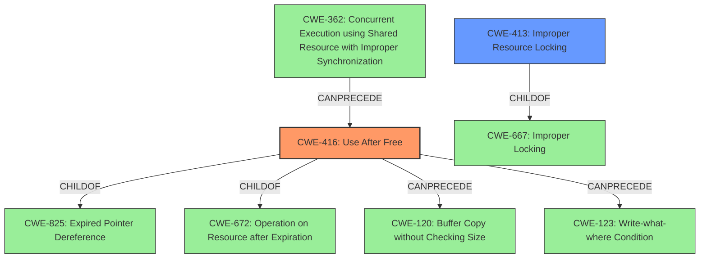

# Enhanced Analysis for CVE-2021-1048

# Summary
| CWE ID | CWE Name | Confidence | CWE Abstraction Level | CWE Vulnerability Mapping Label | CWE-Vulnerability Mapping Notes |
|---|---|---|---|---|---|
| CWE-416 | Use After Free | 1.0 | Variant | Allowed | Primary CWE |
| CWE-413 | Improper Resource Locking | 0.7 | Base | Allowed | Secondary Candidate |

## Evidence and Confidence

*   **Confidence Score:** 0.9
*   **Evidence Strength:** HIGH

## Relationship Analysis
The primary CWE, CWE-416, is a variant of CWE-825 (Expired Pointer Dereference) and CWE-672 (Operation on Resource after Expiration). It can be preceded by CWE-362 (Concurrent Execution using Shared Resource with Improper Synchronization) and can lead to CWE-120 (Buffer Copy without Checking Size) or CWE-123 (Write-What-Where). CWE-413 is a base CWE and a child of CWE-667 (Improper Locking).



## Vulnerability Chain
The vulnerability chain starts with the **improper management of file object references** within the kernel's epoll functionality. This leads to a **use-after-free** condition where the code attempts to access memory associated with a file object that has already been freed. Exploitation can lead to a **local escalation of privilege**.

## Summary of Analysis
The initial analysis correctly identified **use after free** as the root cause. The supporting evidence is strong, with the vulnerability description and CVE reference links both explicitly mentioning the **use-after-free** condition. The retriever results also highlight CWE-416 as a relevant candidate.

The final decision is primarily based on the evidence from the vulnerability description: "In ep_loop_check_proc of eventpoll.c, there is a possible way to corrupt memory due to a **use after free**." This statement directly corresponds to the definition of CWE-416. The CVE Reference Links Content Summary further reinforces this by stating: "The vulnerability is a **use-after-free** condition that exists within the Kernel component." The abstraction level of CWE-416 (Variant) is appropriate given the specificity of the vulnerability.

CWE-413 (Improper Resource Locking) was considered as a secondary CWE because the CVE reference summary mentioned improper management of file object references. This might suggest a locking issue, potentially leading to the **use-after-free**. This is further supported by the observed example for CVE-2022-20141 in the CWE-413 documentation: "Chain: an operating system kernel has insufficient resource locking (CWE-413) leading to a **use after free** (CWE-416)." Thus, CWE-413 is included as a secondary candidate.

Other CWEs considered but not used:
*   CWE-362 (Concurrent Execution using Shared Resource with Improper Synchronization): While concurrency might be involved, the primary issue is the memory corruption due to the **use after free**, not necessarily a race condition.
*   CWE-415 (Double Free): There is no evidence suggesting a double free condition.
*   CWE-908 (Use of Uninitialized Resource) and CWE-909 (Missing Initialization of Resource): The vulnerability is related to memory being freed prematurely, not a failure to initialize.


## CWE Relationship Analysis

Current CWEs represent these abstraction levels: .


### Vulnerability Chain Analysis

**Chain starting from CWE-413:**
- 413 (Improper Resource Locking) - ROOT


**Chain starting from CWE-825:**
- 825 (Expired Pointer Dereference) - ROOT


### CWE Relationship Diagram

```mermaid
graph TD
    classDef primary fill:#f96,stroke:#333,stroke-width:2px
    classDef secondary fill:#69f,stroke:#333
    classDef tertiary fill:#9e9,stroke:#333
```