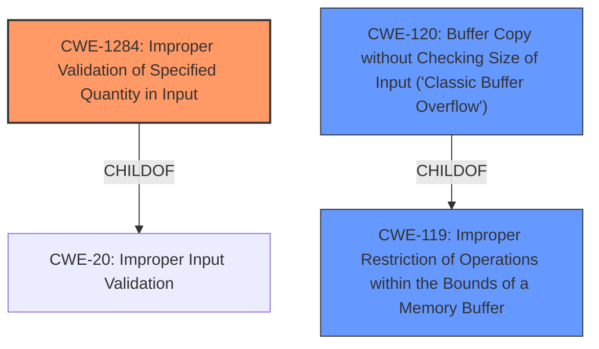

# Raw Analyzer Response for CVE-2021-1062

# Summary
| CWE ID  | CWE Name | Confidence | CWE Abstraction Level | CWE Vulnerability Mapping Label | CWE-Vulnerability Mapping Notes |
|-----------------|-----------------------------------------------------------------|------------------|--------------------------|------------------------------------|------------------------------------|
| **CWE-1284** | Improper Validation of Specified Quantity in Input | 0.8 | Base | Primary | Allowed |
| CWE-119 | Improper Restriction of Operations within the Bounds of a Memory Buffer | 0.6 | Class | Secondary | Discouraged |
| CWE-120 | Buffer Copy without Checking Size of Input ('Classic Buffer Overflow') | 0.5 | Base | Secondary | Allowed-with-Review |

## Evidence and Confidence

*   **Confidence Score:** 0.8
*   **Evidence Strength:** HIGH

## Relationship Analysis
The primary weakness is **CWE-1284** Improper Validation of Specified Quantity in Input. This is because the vulnerability description specifically mentions that the **input data length is not validated**. **CWE-1284** is a child of **CWE-20** Improper Input Validation, which is a more general class of weakness. **CWE-119** Improper Restriction of Operations within the Bounds of a Memory Buffer is a class-level CWE related to memory buffer operations. **CWE-120** Buffer Copy without Checking Size of Input ('Classic Buffer Overflow') is a base-level CWE that is a child of **CWE-119** and describes a specific type of buffer overflow where the size of the input is not checked before copying.

## Vulnerability Chain
The vulnerability chain starts with the **lack of input validation** (**CWE-1284**), which can lead to a **buffer overflow** (**CWE-120**), resulting in **data tampering** or **denial of service**.

## Summary of Analysis
The initial analysis identified **CWE-1284** as the primary weakness due to the explicit mention of **input data length not being validated** in the vulnerability description. While **CWE-20** is listed as the primary CWE match based on similar CVE descriptions, **CWE-1284** is a more specific and appropriate choice given the available information. The retriever results also support **CWE-1284** as a relevant CWE. The graph relationships show that **CWE-1284** is a child of **CWE-20**, indicating a more specific type of input validation issue. The decision to select **CWE-1284** is based on the specific evidence from the vulnerability description and the guidance to choose the most specific CWE when possible.

Relevant CWE Information:

# Enhanced Context (25 CWEs)

## CWE-1284: Improper Validation of Specified Quantity in Input
**Abstraction Level**: Base
**Similarity Score**: 7966.78
**Source**: sparse

**Description**:
The product receives input that is expected to specify a quantity (such as size or length), but it does not validate or incorrectly validates that the quantity has the required properties.

**Mapping Guidance**:
- Usage: Allowed
- Rationale: This CWE entry is at the Base level of abstraction, which is a preferred level of abstraction for mapping to the root causes of vulnerabilities.

**Relationships**:
- PARENTOF -> CWE-606
- CANPRECEDE -> CWE-789
- CHILDOF -> CWE-20
- CHILDOF -> CWE-20
- CANFOLLOW -> CWE-1284

### Rationale for Choosing CWEs:

*   **CWE-1284: Improper Validation of Specified Quantity in Input**
    *   **How the vulnerability matches:** The vulnerability description explicitly states that the **input data length is not validated**. **CWE-1284** directly addresses the scenario where a product receives input that specifies a quantity (in this case, data length) but fails to validate it properly.
    *   **Security implications and potential impact:** The lack of input validation can lead to buffer overflows, as highlighted in the vulnerability description, resulting in data tampering or denial of service.
    *   **Parent-child relationships:** **CWE-1284** is a child of **CWE-20**, which represents a broader class of improper input validation.
    *   **MITRE mapping guidance:** The usage is "Allowed," and the rationale supports using this base-level CWE.
    *   **Confidence:** 0.8
*   **CWE-119: Improper Restriction of Operations within the Bounds of a Memory Buffer**
    *   **How the vulnerability matches:** Since the **lack of input validation** can lead to a buffer overflow, **CWE-119** is relevant.
    *   **Security implications and potential impact:** Writing outside the intended buffer can corrupt data or cause denial of service.
    *   **Parent-child relationships:** This is a class-level CWE.
    *   **MITRE mapping guidance:** The usage is "Discouraged," with a suggestion to consider lower-level CWEs like **CWE-787** or **CWE-125**. However, since the description does not specify read vs write, this is a good secondary candidate.
    *   **Confidence:** 0.6
*   **CWE-120: Buffer Copy without Checking Size of Input ('Classic Buffer Overflow')**
    *   **How the vulnerability matches:** A common consequence of **not validating the input length** is a buffer overflow during a copy operation.
    *   **Security implications and potential impact:** Buffer overflows can lead to arbitrary code execution or denial of service.
    *   **Parent-child relationships:** This is a base-level CWE, a child of **CWE-119**.
    *   **MITRE mapping guidance:** The usage is "Allowed-with-Review," with a comment that it might be misused if selected simply because it mentions "buffer overflow." It is applicable here because the vulnerability involves copying data without checking the input size.
    *   **Confidence:** 0.5

### Rationale for Not Choosing Other CWEs:

*   **CWE-190: Integer Overflow or Wraparound:** While integer overflows can sometimes lead to buffer overflows, there is no direct evidence of an integer overflow in the provided vulnerability description.
*   **CWE-415: Double Free, CWE-226: Sensitive Information in Resource Not Removed Before Reuse, CWE-404: Improper Resource Shutdown or Release, CWE-667: Improper Locking, CWE-125: Out-of-bounds Read, CWE-252: Unchecked Return Value, CWE-1325: Improperly Controlled Sequential Memory Allocation, CWE-1289: Improper Validation of Unsafe Equivalence in Input, CWE-131: Incorrect Calculation of Buffer Size, CWE-191: Integer Underflow (Wrap or Wraparound), CWE-41: Improper Resolution of Path Equivalence, CWE-1339: Insufficient Precision or Accuracy of a Real Number, CWE-416: Use After Free, CWE-22: Improper Limitation of a Pathname to a Restricted Directory ('Path Traversal'), CWE-770: Allocation of Resources Without Limits or Throttling, CWE-73: External Control of File Name or Path, CWE-193: Off-by-one Error, CWE-179: Incorrect Behavior Order: Early Validation, CWE-121: Stack-based Buffer Overflow, CWE-20: Improper Input Validation:** These CWEs do not directly align with the **root cause** of the vulnerability, which is the **lack of input validation** on the data length. They describe different types of weaknesses or consequences that are not explicitly mentioned in the vulnerability description.