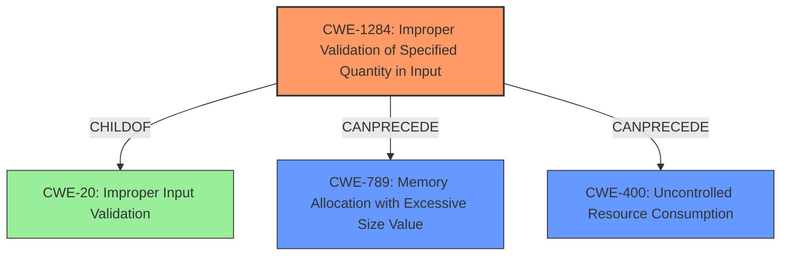

# Analysis for CVE-2021-1081

# Summary
| CWE ID  | CWE Name                                                      | Confidence | CWE Abstraction Level | CWE Vulnerability Mapping Label | CWE-Vulnerability Mapping Notes |
| :-------- | :------------------------------------------------------------ | :--------- | :---------------------- | :------------------------------ | :------------------------------ |
| CWE-1284 | Improper Validation of Specified Quantity in Input | 0.9        | Base                    | Allowed                         | Primary CWE                     |
| CWE-789 | Memory Allocation with Excessive Size Value                 | 0.7        | Variant                 | Allowed                         | Secondary Candidate             |
| CWE-400 | Uncontrolled Resource Consumption                           | 0.6        | Class                   | Discouraged                     | Secondary Candidate             |

## Evidence and Confidence

*   **Confidence Score:** 0.8
*   **Evidence Strength:** HIGH

## Relationship Analysis
The primary CWE, CWE-1284, is a base-level weakness that falls under the broader category of improper input validation (CWE-20). The vulnerability description clearly points to a failure in validating the input length, which directly aligns with the characteristics of CWE-1284. CWE-789 and CWE-400 are related as potential consequences of the primary weakness. If the input length is not validated, it could lead to allocating excessive memory (CWE-789) or, more generally, uncontrolled resource consumption (CWE-400), potentially causing a denial-of-service.

## Vulnerability Chain
The chain of events in this vulnerability starts with the **lack of input length validation** (CWE-1284). This can then lead to an excessive amount of memory being allocated (CWE-789), or more broadly, an uncontrolled consumption of resources (CWE-400). The end result of this chain is information disclosure, data tampering, or denial of service, as outlined in the vulnerability description.

## Summary of Analysis
The initial analysis correctly identified that the root cause of the vulnerability is the **lack of input length validation**. The vulnerability description explicitly states this: "NVIDIA vGPU software contains a vulnerability ... in which an **input length is not validated**, which may lead to information disclosure, tampering of data, or denial of service." This statement aligns perfectly with the description of CWE-1284, which focuses on the improper validation of specified quantities in input.

The retriever results also listed CWE-1284 as the top combined result, further reinforcing this choice.

CWE-20, while relevant as a parent class, is too broad. CWE-1284 provides a more specific and accurate representation of the vulnerability's root cause. CWE-789 and CWE-400 are considered secondary because they describe potential consequences of the **missing input validation** rather than the root cause itself. CWE-789 describes the specific case of excessive memory allocation, while CWE-400 describes the general case of uncontrolled resource consumption.

The final selection of CWE-1284 as the primary CWE is based on the explicit evidence in the vulnerability description, the retriever results, and the need for specificity in CWE mapping.

Relevant CWE Information:

# Enhanced Context (25 CWEs)

## CWE-404: Improper Resource Shutdown or Release
**Abstraction Level**: Class
**Similarity Score**: 0.79
**Source**: dense

**Description**:
The product does not release or incorrectly releases a resource before it is made available for re-use.

**Mapping Guidance**:
- Usage: Allowed-with-Review
- Rationale: This CWE entry is a Class and might have Base-level children that would be more appropriate
*This CWE was not selected. The issue isn't about releasing a resource, but about the initial validation of input length.*

## CWE-789: Memory Allocation with Excessive Size Value
**Abstraction Level**: Variant
**Similarity Score**: 0.78
**Source**: dense

**Description**:
The product allocates memory based on an untrusted, large size value, but it does not ensure that the size is within expected limits, allowing arbitrary amounts of memory to be allocated.

**Mapping Guidance**:
- Usage: Allowed
- Rationale: This CWE entry is at the Variant level of abstraction, which is a preferred level of abstraction for mapping to the root causes of vulnerabilities.
*This CWE was selected as a secondary CWE. The lack of validation could lead to memory allocation with excessive size value.*

## CWE-226: Sensitive Information in Resource Not Removed Before Reuse
**Abstraction Level**: Base
**Similarity Score**: 0.78
**Source**: dense

**Description**:
The product releases a resource such as memory or a file so that it can be made available for reuse, but it does not clear or "zeroize" the information contained in the resource before the product performs a critical state transition or makes the resource available for reuse by other entities.

**Mapping Guidance**:
- Usage: Allowed
- Rationale: This CWE entry is at the Base level of abstraction, which is a preferred level of abstraction for mapping to the root causes of vulnerabilities.
*This CWE was not selected. The issue isn't about releasing resources and not removing sensitive information.*

## CWE-405: Asymmetric Resource Consumption (Amplification)
**Abstraction Level**: Class
**Similarity Score**: 0.77
**Source**: dense

**Description**:
The product does not properly control situations in which an adversary can cause the product to consume or produce excessive resources without requiring the adversary to invest equivalent work or otherwise prove authorization, i.e., the adversary's influence is "asymmetric."

**Mapping Guidance**:
- Usage: Allowed-with-Review
- Rationale: This CWE entry is a Class and might have Base-level children that would be more appropriate
*This CWE was not selected. It's a broader category and not a direct fit for the missing input validation.*

## CWE-1325: Improperly Controlled Sequential Memory Allocation
**Abstraction Level**: Base
**Similarity Score**: 0.77
**Source**: dense

**Description**:
The product manages a group of objects or resources and performs a separate memory allocation for each object, but it does not properly limit the total amount of memory that is consumed by all of the combined objects.

**Mapping Guidance**:
- Usage: Allowed
- Rationale: This CWE entry is at the Base level of abstraction, which is a preferred level of abstraction for mapping to the root causes of vulnerabilities.
*This CWE was not selected. It's related to sequential memory allocation, which isn't the primary issue.*

## CWE-664: Improper Control of a Resource Through its Lifetime
**Abstraction Level**: Pillar
**Similarity Score**: 0.76
**Source**: dense

**Description**:
The product does not maintain or incorrectly maintains control over a resource throughout its lifetime of creation, use, and release.

**Mapping Guidance**:
- Usage: Discouraged
- Rationale: This CWE entry is high-level when lower-level children are available.
*This CWE was not selected. Too broad; a more specific CWE is needed.*

## CWE-667: Improper Locking
**Abstraction Level**: Class
**Similarity Score**: 0.76
**Source**: dense

**Description**:
The product does not properly acquire or release a lock on a resource, leading to unexpected resource state changes and behaviors.

**Mapping Guidance**:
- Usage: Allowed-with-Review
- Rationale: This CWE entry is a Class and might have Base-level children that would be more appropriate
*This CWE was not selected. The vulnerability isn't related to locking mechanisms.*

## CWE-668: Exposure of Resource to Wrong Sphere
**Abstraction Level**: Class
**Similarity Score**: 0.75
**Source**: dense

**Description**:
The product exposes a resource to the wrong control sphere, providing unintended actors with inappropriate access to the resource.

**Mapping Guidance**:
- Usage: Discouraged
- Rationale: CWE-668 is high-level and is often misused as a catch-all when lower-level CWE IDs might be applicable. It is sometimes used for low-information vulnerability reports [REF-1287]. It is a level-1 Class (i.e., a child of a Pillar). It is not useful for trend analysis.
*This CWE was not selected. The vulnerability isn't primarily about exposing resources to the wrong