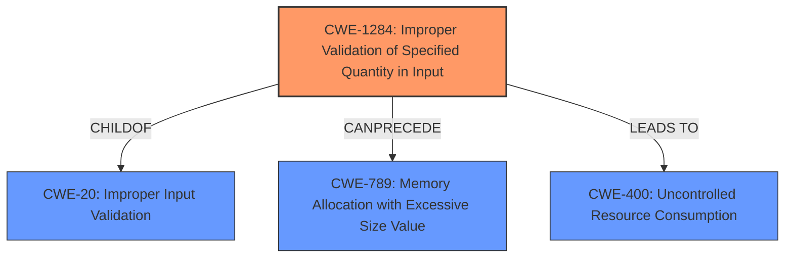

# Raw Analyzer Response for CVE-2021-1082

# Summary
| CWE ID   | CWE Name                                                                                                                                  | Confidence | CWE Abstraction Level | CWE Vulnerability Mapping Label | CWE-Vulnerability Mapping Notes |
| -------- | ----------------------------------------------------------------------------------------------------------------------------------------- | ---------- | ----------------------- | ------------------------------- | ------------------------------- |
| CWE-1284 | Improper Validation of Specified Quantity in Input                                                                                          | 0.9        | Base                    | Primary                         | Allowed                         |
| CWE-20   | Improper Input Validation                                                                                                                   | 0.7        | Class                   | Secondary                       | Discouraged                     |
| CWE-400  | Uncontrolled Resource Consumption                                                                                                         | 0.6        | Class                   | Secondary                       | Discouraged                     |

## Evidence and Confidence

*   **Confidence Score:** 0.8
*   **Evidence Strength:** HIGH

## Relationship Analysis
The primary CWE, CWE-1284, is a child of CWE-20, indicating a more specific type of input validation issue. While CWE-20 is a general class, CWE-1284 focuses on the validation of specified quantities, aligning directly with the vulnerability description, where the input length (a quantity) is not validated. CWE-1284 can precede CWE-789 (Memory Allocation with Excessive Size Value), suggesting a potential resource exhaustion scenario if the unvalidated length is used for memory allocation. CWE-400 (Uncontrolled Resource Consumption) is also considered as a potential impact if the unvalidated input leads to excessive resource usage. The relationships influenced the selection by showing a clear path from a specific input validation issue (CWE-1284) to potential consequences like excessive memory allocation or resource exhaustion.

## Vulnerability Chain
The vulnerability chain starts with the **lack of input validation** (CWE-1284). This can then lead to various impacts:
1.  **Information Disclosure:** The unvalidated input length could be used to read beyond the intended memory boundaries.
2.  **Tampering of Data:** The unvalidated input length may overwrite sensitive information.
3.  **Denial of Service:** The unvalidated input length, if used for resource allocation, can lead to excessive resource consumption and denial of service (CWE-400) or excessive memory allocation (CWE-789).

The chain highlights how a single **root cause** (missing input validation) can have multiple impacts depending on how the unvalidated input is used.

## Summary of Analysis
The initial analysis focused on the **root cause**, which is the **lack of input validation** for the input length. The vulnerability description clearly states that "**an input length is not validated**". This is the primary evidence for selecting CWE-1284. The CVE Reference Links Content Summary reinforces this, stating the **root cause** as "**where an input length is not validated**".

The graph relationships influenced the selection by providing context on potential consequences of the missing validation. While CWE-20 is a general case of improper input validation, CWE-1284 is more specific and accurately reflects the weakness. CWE-400 is a potential consequence, but the primary weakness is the missing input validation.

The selected CWEs are at the optimal level of specificity. CWE-1284 is a base-level CWE that describes the specific type of input that is not validated (quantity). CWE-20 is a more general class, and CWE-400 describes a potential impact. The choice of CWE-1284 over CWE-20 is justified by the vulnerability description's focus on the input length.

Relevant CWE Information:

# Enhanced Context (25 CWEs)

## CWE-664: Improper Control of a Resource Through its Lifetime
**Abstraction Level**: Pillar
**Similarity Score**: 0.77
**Source**: dense
- Considered but not chosen because it is too high-level.

## CWE-1220: Insufficient Granularity of Access Control
**Abstraction Level**: Base
**Similarity Score**: 0.76
**Source**: dense
- Considered but not chosen because access control is not directly related to the vulnerability.

## CWE-404: Improper Resource Shutdown or Release
**Abstraction Level**: Class
**Similarity Score**: 0.76
**Source**: dense
- Considered but not chosen because resource shutdown is not directly related to the vulnerability.

## CWE-653: Improper Isolation or Compartmentalization
**Abstraction Level**: Class
**Similarity Score**: 0.76
**Source**: dense
- Considered but not chosen because isolation or compartmentalization is not directly related to the vulnerability.

## CWE-274: Improper Handling of Insufficient Privileges
**Abstraction Level**: Base
**Similarity Score**: 0.75
**Source**: dense
- Considered but not chosen because privileges are not directly related to the vulnerability.

## CWE-226: Sensitive Information in Resource Not Removed Before Reuse
**Abstraction Level**: Base
**Similarity Score**: 0.75
**Source**: dense
- Considered but not chosen because resource reuse is not directly related to the vulnerability.

## CWE-1289: Improper Validation of Unsafe Equivalence in Input
**Abstraction Level**: Base
**Similarity Score**: 0.75
**Source**: dense
- Considered but not chosen because unsafe equivalence is not directly related to the vulnerability.

## CWE-691: Insufficient Control Flow Management
**Abstraction Level**: Pillar
**Similarity Score**: 0.75
**Source**: dense
- Considered but not chosen because it is too high-level.

## CWE-668: Exposure of Resource to Wrong Sphere
**Abstraction Level**: Class
**Similarity Score**: 0.75
**Source**: dense
- Considered but not chosen because the vulnerability is about input validation rather than exposure of resources.

## CWE-280: Improper Handling of Insufficient Permissions or Privileges
**Abstraction Level**: Base
**Similarity Score**: 0.75
**Source**: dense
- Considered but not chosen because permissions or privileges are not directly related to the vulnerability.

## CWE-1284: Improper Validation of Specified Quantity in Input
**Abstraction Level**: Base
**Similarity Score**: 8602.38
**Source**: sparse
- Chosen as the primary CWE because the vulnerability description mentions that the input length is not validated.

## CWE-789: Memory Allocation with Excessive Size Value
**Abstraction Level**: Variant
**Similarity Score**: 8457.79
**Source**: sparse
- Considered as a secondary CWE because the unvalidated input length could be used for memory allocation.

## CWE-190: Integer Overflow or Wraparound
**Abstraction Level**: Base
**Similarity Score**: 8234.61
**Source**: sparse
- Considered but not chosen because integer overflow is not directly mentioned in the vulnerability description.

## CWE-770: Allocation of Resources Without Limits or Throttling
**Abstraction Level**: Base
**Similarity Score**: 8208.74
**Source**: sparse
- Considered as a secondary CWE because the unvalidated input length could lead to resource exhaustion.

## CWE-125: Out-of-bounds Read
**Abstraction Level**: Base
**Similarity Score**: 8149.18
**Source**: sparse
- Considered as a potential impact, but the primary weakness is the missing input validation.

## CWE-170: Improper Null Termination
**Abstraction Level**: base
**Similarity Score**: 5.03
**Source**: graph
- Not chosen as it doesn't fit the context of the vulnerability, which focuses on missing length validation rather than null termination issues.

## CWE-1325: Improperly Controlled Sequential Memory Allocation
**Abstraction Level**: base
**Similarity Score**: 5.03
**Source**: graph
- Not chosen as it's more specific to memory allocation control, while the main issue is the lack of input validation of a quantity.

## CWE-789: Memory Allocation with Excessive Size Value
**Abstraction Level**: variant
**Similarity Score**: 4.53
**Source**: graph
- Considered, but the missing quantity validation is the more direct cause.

## CWE-22: Improper Limitation of a Pathname to a Restricted Directory ('Path Traversal')
**Abstraction Level**: base