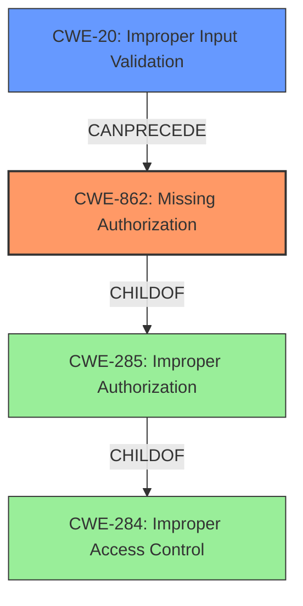

# Raw Analyzer Response for CVE-2021-1275

# Summary
| CWE ID | CWE Name | Confidence | CWE Abstraction Level | CWE Vulnerability Mapping Label | CWE-Vulnerability Mapping Notes |
|---|---|---|---|---|---|
| CWE-862 | Missing Authorization | 0.9 | Base | Primary | Allowed |
| CWE-20 | Improper Input Validation | 0.6 | Class | Secondary | Discouraged |

## Evidence and Confidence

*   **Confidence Score:** 0.8
*   **Evidence Strength:** MEDIUM

## Relationship Analysis
The primary CWE is CWE-862 (Missing Authorization), which is a base-level CWE. CWE-862 is a child of the class CWE-285 (Improper Authorization), which in turn is a child of the pillar CWE-284 (Improper Access Control). While CWE-285 and CWE-284 are related, they are less specific than CWE-862 and are discouraged for direct mapping.

The secondary CWE is CWE-20 (Improper Input Validation). It is a class-level CWE and is discouraged for direct mapping due to its generality. It can precede other CWEs like CWE-22 (Improper Limitation of a Pathname to a Restricted Directory) and CWE-119 (Improper Restriction of Operations within the Bounds of a Memory Buffer).

## Vulnerability Chain
The vulnerability chain starts with the **missing authorization** check (CWE-862). If input validation is also **improper** (CWE-20), this could lead to further vulnerabilities like path traversal or buffer overflows, but these are not explicitly mentioned in the provided description, so they are not included in the chain.

## Summary of Analysis
The initial analysis focused on identifying the root cause of the vulnerabilities described in the Cisco Security Advisory. The advisory detailed multiple vulnerabilities, some involving **missing authorization** checks and others involving **improper handling** of API requests. The most relevant CWE based on the provided evidence is CWE-862 (Missing Authorization).

The retriever results also suggested CWE-20 (Improper Input Validation), which can be a contributing factor in some of the vulnerabilities described. However, since the primary issue is the lack of authorization checks, CWE-862 is the more direct and appropriate mapping.

The relationship analysis confirms that CWE-862 is a base-level CWE, providing a good balance between specificity and generality. While higher-level CWEs like CWE-285 (Improper Authorization) and CWE-284 (Improper Access Control) are related, they are less specific and therefore less suitable for this analysis.

The decision to prioritize CWE-862 is based on the "CVE Reference Links Content Summary" which states: "Missing authorization checks on operations in the web UI". This directly supports the selection of CWE-862.

CWE-20 was considered as a secondary CWE because the initial "Vulnerability Description" mentions "Multiple vulnerabilities in Cisco SD-WAN vManage Software could allow an unauthenticated, remote attacker to execute arbitrary code or gain access to sensitive information, or allow an authenticated, local attacker to gain escalated privileges or gain unauthorized access to the application." This suggests that improper input validation might play a role in some of these vulnerabilities, but it is not the primary issue.

The selected CWEs are at the optimal level of specificity because they directly address the identified root causes of the vulnerabilities described in the Cisco Security Advisory.

Relevant CWE Information:

# Enhanced Context (25 CWEs)

## CWE-807: Reliance on Untrusted Inputs in a Security Decision
**Abstraction Level**: Base
**Similarity Score**: 0.79
**Source**: dense

**Description**:
The product uses a protection mechanism that relies on the existence or values of an input, but the input can be modified by an untrusted actor in a way that bypasses the protection mechanism.

**Mapping Guidance**:
- Usage: Allowed
- Rationale: This CWE entry is at the Base level of abstraction, which is a preferred level of abstraction for mapping to the root causes of vulnerabilities.

## CWE-1289: Improper Validation of Unsafe Equivalence in Input
**Abstraction Level**: Base
**Similarity Score**: 0.78
**Source**: dense

**Description**:
The product receives an input value that is used as a resource identifier or other type of reference, but it does not validate or incorrectly validates that the input is equivalent to a potentially-unsafe value.

**Mapping Guidance**:
- Usage: Allowed
- Rationale: This CWE entry is at the Base level of abstraction, which is a preferred level of abstraction for mapping to the root causes of vulnerabilities.

## CWE-303: Incorrect Implementation of Authentication Algorithm
**Abstraction Level**: Base
**Similarity Score**: 0.77
**Source**: dense

**Description**:
The requirements for the product dictate the use of an established authentication algorithm, but the implementation of the algorithm is incorrect.

**Mapping Guidance**:
- Usage: Allowed
- Rationale: This CWE entry is at the Base level of abstraction, which is a preferred level of abstraction for mapping to the root causes of vulnerabilities.

## CWE-668: Exposure of Resource to Wrong Sphere
**Abstraction Level**: Class
**Similarity Score**: 0.77
**Source**: dense

**Description**:
The product exposes a resource to the wrong control sphere, providing unintended actors with inappropriate access to the resource.

**Mapping Guidance**:
- Usage: Discouraged
- Rationale: CWE-668 is high-level and is often misused as a catch-all when lower-level CWE IDs might be applicable. It is sometimes used for low-information vulnerability reports [REF-1287]. It is a level-1 Class (i.e., a child of a Pillar). It is not useful for trend analysis.

## CWE-274: Improper Handling of Insufficient Privileges
**Abstraction Level**: Base
**Similarity Score**: 0.77
**Source**: dense

**Description**:
The product does not handle or incorrectly handles when it has insufficient privileges to perform an operation, leading to resultant weaknesses.

**Mapping Guidance**:
- Usage: Discouraged
- Rationale: This CWE entry could be deprecated in a future version of CWE.

## CWE-41: Improper Resolution of Path Equivalence
**Abstraction Level**: Base
**Similarity Score**: 0.76
**Source**: dense

**Description**:
The product is vulnerable to file system contents disclosure through path equivalence. Path equivalence involves the use of special characters in file and directory names. The associated manipulations are intended to generate multiple names for the same object.

**Mapping Guidance**:
- Usage: Allowed
- Rationale: This CWE entry is at the Base level of abstraction, which is a preferred level of abstraction for mapping to the root causes of vulnerabilities.

## CWE-653: Improper Isolation or Compartmentalization
**Abstraction Level**: Class
**Similarity Score**: 0.76
**Source**: dense

**Description**:
The product does not properly compartmentalize or isolate functionality, processes, or resources that require different privilege levels, rights, or permissions.

**Mapping Guidance**:
- Usage: Allowed
- Rationale: This CWE entry is at the Base level of abstraction, which is a preferred level of abstraction for mapping to the root causes of vulnerabilities.

## CWE-184: Incomplete List of Disallowed Inputs
**Abstraction Level**: Base
**Similarity Score**: 0.76
**Source**: dense

**Description**:
The product implements a protection mechanism that relies on a list of inputs (or properties of inputs) that are not allowed by policy or otherwise require other action to neutralize before additional processing takes place, but the list is incomplete.

**Mapping Guidance**:
- Usage: Allowed
- Rationale: This CWE entry is at the Base level of abstraction, which is a preferred level of abstraction for mapping to the root causes of vulnerabilities.

## CWE-639: Authorization Bypass Through User-Controlled Key
**Abstraction Level**: Base
**Similarity Score**: 0.76
**Source**: dense

**Description**:
The system's authorization functionality does not prevent one user from gaining access to another user's data or record by modifying the key value identifying the data.

**Mapping Guidance**:
- Usage: Allowed
- Rationale: This CWE entry is at the Base level of abstraction, which is a preferred level of abstraction for mapping to the root causes of vulnerabilities.

## CWE-345: Insufficient Verification of Data Authenticity
**Abstraction