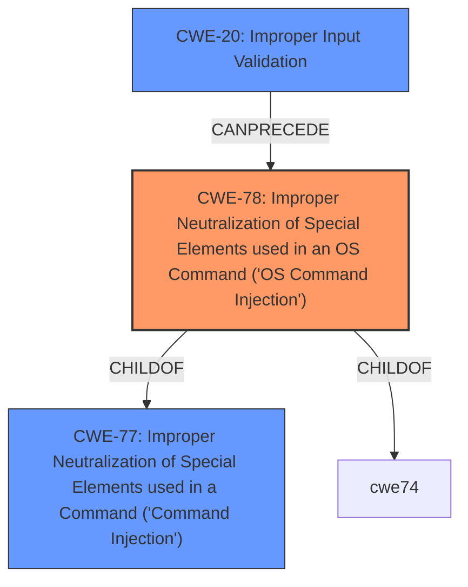

# Enhanced Analysis for CVE-2021-1498

# Summary
| CWE ID | CWE Name | Confidence | CWE Abstraction Level | CWE Vulnerability Mapping Label | CWE-Vulnerability Mapping Notes |
|---|---|---|---|---|---|
| CWE-78 | Improper Neutralization of Special Elements used in an OS Command ('OS Command Injection') | 1 | Base | Allowed | Primary CWE |
| CWE-20 | Improper Input Validation | 0.7 | Class | Discouraged | Secondary Candidate |

## Evidence and Confidence

*   **Confidence Score:** 0.9
*   **Evidence Strength:** HIGH

## Relationship Analysis
The primary relationship influencing my decision is that CWE-78 [Improper Neutralization of Special Elements used in an OS Command ('OS Command Injection')] is a child of CWE-77 [Improper Neutralization of Special Elements used in a Command ('Command Injection')], and the vulnerability description explicitly mentions "command injection attacks." However, since the description specifies OS commands, CWE-78 is more appropriate. CWE-20 [Improper Input Validation] can precede CWE-78 in a vulnerability chain, as **improper input validation** can lead to command injection.



## Vulnerability Chain
The vulnerability chain starts with **improper input validation** (CWE-20), which leads to **command injection** (CWE-78), allowing an unauthenticated remote attacker to execute arbitrary commands.

## Summary of Analysis
The initial analysis considered CWE-77 [Improper Neutralization of Special Elements used in a Command ('Command Injection')] and CWE-78 [Improper Neutralization of Special Elements used in an OS Command ('OS Command Injection')] since the vulnerability description explicitly mentions "**command injection** attacks". The CVE Reference Links Content Summary states that the "**root cause** of vulnerability is due to insufficient validation of user-supplied input within the web-based management interface" and that there is a "**command injection** vulnerability" because of "**lack of proper input validation**". Given that the attack involves OS commands, and the mapping guidance for CWE-77 [Improper Neutralization of Special Elements used in a Command ('Command Injection')] suggests considering CWE-78 [Improper Neutralization of Special Elements used in an OS Command ('OS Command Injection')] when OS command injection is intended, CWE-78 [Improper Neutralization of Special Elements used in an OS Command ('OS Command Injection')] is the more appropriate choice. The **improper input validation** is also a key factor, but the primary weakness is the **command injection**, making CWE-78 [Improper Neutralization of Special Elements used in an OS Command ('OS Command Injection')] the primary CWE. CWE-20 [Improper Input Validation] is also included as a secondary candidate because it can lead to the primary weakness.

The selected CWEs are at the optimal level of specificity because CWE-78 [Improper Neutralization of Special Elements used in an OS Command ('OS Command Injection')] is a Base CWE, and it accurately represents the specific type of command injection vulnerability.

# Enhanced Context (25 CWEs)
The following CWEs were identified as potentially relevant to this vulnerability:

## CWE-23: Relative Path Traversal
**Abstraction Level**: Base
**Similarity Score**: 0.76
**Source**: dense

**Description**:
The product uses external input to construct a pathname that should be within a restricted directory, but it does not properly neutralize sequences such as ".." that can resolve to a location that is outside of that directory.

**Mapping Guidance**:
- Usage: Allowed
- Rationale: This CWE entry is at the Base level of abstraction, which is a preferred level of abstraction for mapping to the root causes of vulnerabilities.

*Not selected because it doesn't match the vulnerability description, which focuses on command injection rather than path traversal.*

## CWE-41: Improper Resolution of Path Equivalence
**Abstraction Level**: Base
**Similarity Score**: 0.76
**Source**: dense

**Description**:
The product is vulnerable to file system contents disclosure through path equivalence. Path equivalence involves the use of special characters in file and directory names. The associated manipulations are intended to generate multiple names for the same object.

**Mapping Guidance**:
- Usage: Allowed
- Rationale: This CWE entry is at the Base level of abstraction, which is a preferred level of abstraction for mapping to the root causes of vulnerabilities.

*Not selected because it doesn't match the vulnerability description, which focuses on command injection rather than path equivalence.*

## CWE-1289: Improper Validation of Unsafe Equivalence in Input
**Abstraction Level**: Base
**Similarity Score**: 0.75
**Source**: dense

**Description**:
The product receives an input value that is used as a resource identifier or other type of reference, but it does not validate or incorrectly validates that the input is equivalent to a potentially-unsafe value.

**Mapping Guidance**:
- Usage: Allowed
- Rationale: This CWE entry is at the Base level of abstraction, which is a preferred level of abstraction for mapping to the root causes of vulnerabilities.

*Not selected because it doesn't match the vulnerability description, which focuses on command injection rather than unsafe equivalence in input.*

## CWE-807: Reliance on Untrusted Inputs in a Security Decision
**Abstraction Level**: Base
**Similarity Score**: 0.74
**Source**: dense

**Description**:
The product uses a protection mechanism that relies on the existence or values of an input, but the input can be modified by an untrusted actor in a way that bypasses the protection mechanism.

**Mapping Guidance**:
- Usage: Allowed
- Rationale: This CWE entry is at the Base level of abstraction, which is a preferred level of abstraction for mapping to the root causes of vulnerabilities.

*Not selected because the vulnerability isn't specifically about relying on untrusted inputs for security decisions, but more about the lack of input validation leading to command injection.*

## CWE-73: External Control of File Name or Path
**Abstraction Level**: Base
**Similarity Score**: 0.74
**Source**: dense

**Description**:
The product allows user input to control or influence paths or file names that are used in filesystem operations.

**Mapping Guidance**:
- Usage: Allowed
- Rationale: This CWE entry is at the Base level of abstraction, which is a preferred level of abstraction for mapping to the root causes of vulnerabilities.

*Not selected because the vulnerability focuses on command injection rather than external control of file names or paths.*

## CWE-74: Improper Neutralization of Special Elements in Output Used by a Downstream Component ('Injection')
**Abstraction Level**: Class
**Similarity Score**: 0.74
**Source**: dense

**Description**:
The product constructs all or part of a command, data structure, or record using externally-influenced input from an upstream component, but it does not neutralize or incorrectly neutralizes special elements that could modify how it is parsed or interpreted when it is sent to a downstream component.

**Mapping Guidance**:
- Usage: Discouraged
- Rationale: CWE-74 is high-level and often misused when lower-level weaknesses are more appropriate.

*Not selected because CWE-78 [Improper Neutralization of Special Elements used in an OS Command ('OS Command Injection')] is a more specific, lower-level CWE that better describes the vulnerability.*

## CWE-59: Improper Link Resolution Before File Access ('Link Following')
**Abstraction Level**: Base
**Similarity Score**: 0.74
**Source**: dense

**Description**:
The product attempts to access a file based on the filename, but it does not properly prevent that filename from identifying a link or shortcut that resolves to an unintended resource.

**Mapping Guidance**:
- Usage: Allowed
- Rationale: This CWE entry is at the Base level of abstraction, which is a preferred level of abstraction for mapping to the root causes of vulnerabilities.

*Not selected because it doesn't match the vulnerability description, which focuses on command injection rather than improper link resolution.*

## CWE-668: Exposure of Resource to Wrong Sphere
**Abstraction Level**: Class
**Similarity Score**: 0.74
**Source**: dense

**Description**:
The product exposes a resource to the wrong control sphere, providing unintended actors with inappropriate access to the resource.

**Mapping Guidance**:
- Usage: Discouraged
- Rationale: CWE-668 is high-level and is often misused as a catch-all when lower-level CWE IDs might be applicable. It is sometimes used for low-information vulnerability reports [REF-1287]. It is a level-1 Class (i.e., a child of a


## CWE Relationship Analysis

Current CWEs represent these abstraction levels: .


### Vulnerability Chain Analysis

**Chain starting from CWE-41:**
- 41 (Improper Resolution of Path Equivalence) - ROOT


**Chain starting from CWE-73:**
- 73 (External Control of File Name or Path) - ROOT


### CWE Relationship Diagram

```mermaid
graph TD
    classDef primary fill:#f96,stroke:#333,stroke-width:2px
    classDef secondary fill:#69f,stroke:#333
    classDef tertiary fill:#9e9,stroke:#333
```