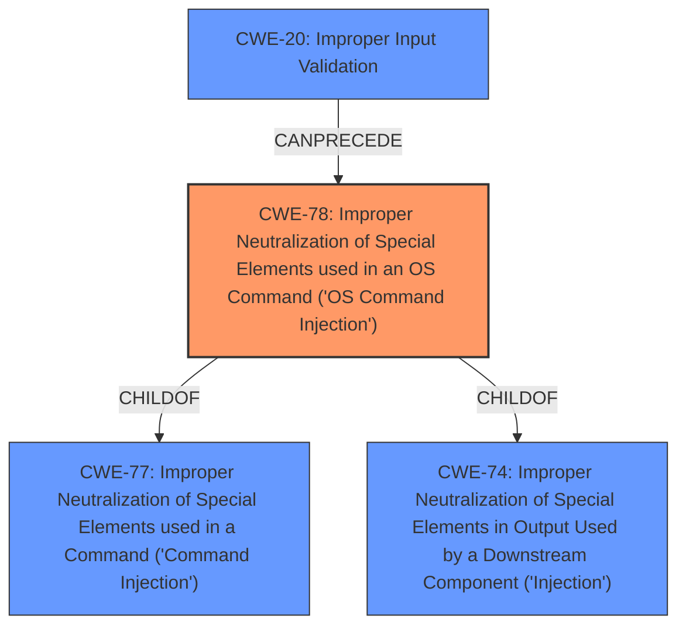

# Enhanced Analysis for CVE-2021-1498

# Summary
| CWE ID | CWE Name | Confidence | CWE Abstraction Level | CWE Vulnerability Mapping Label | CWE-Vulnerability Mapping Notes |
|---|---|---|---|---|---|
| CWE-78 | Improper Neutralization of Special Elements used in an OS Command ('OS Command Injection') | 1.0 | Base | Allowed | Primary CWE |
| CWE-20 | Improper Input Validation | 0.7 | Class | Discouraged | Secondary Candidate |

## Evidence and Confidence

*   **Confidence Score:** 0.9
*   **Evidence Strength:** HIGH

## Relationship Analysis
The primary CWE is CWE-78, a Base level CWE, which is a child of the Class level CWE-77 (Improper Neutralization of Special Elements used in a Command) and CWE-74 (Improper Neutralization of Special Elements in Output Used by a Downstream Component ('Injection')). CWE-78 focuses specifically on OS command injection. CWE-20 (Improper Input Validation) is a Class level CWE and a parent of many Base level CWEs that involve validating data. CWE-20 can precede CWE-78 as the **improper input validation** can cause the **command injection**.



## Vulnerability Chain
The vulnerability chain starts with **improper input validation** (CWE-20), which leads to the **command injection** vulnerability (CWE-78), allowing an attacker to execute arbitrary commands.

## Summary of Analysis
The primary weakness is CWE-78 (Improper Neutralization of Special Elements used in an OS Command ('OS Command Injection')). The vulnerability description explicitly mentions "**command injection** attacks" and the CVE Reference Links Content Summary indicates that the root cause is "**insufficient validation of user-supplied input**" which allows an attacker to "**inject and execute arbitrary commands**." The "CWE for similar CVE Descriptions" section lists CWE-78 as the Primary CWE Match.

CWE-20 (Improper Input Validation) was considered as a secondary weakness. The "CVE Reference Links Content Summary" mentions "**insufficient validation of user-supplied input**", which aligns with CWE-20. While CWE-20 is a relevant contributing factor, it is a high-level Class CWE, and the vulnerability description provides sufficient detail to identify the more specific Base CWE-78. Therefore, CWE-20 is a secondary candidate.

CWE-77 (Improper Neutralization of Special Elements used in a Command ('Command Injection')) was considered, as CWE-78 is a child of CWE-77. However, CWE-77 is a Class level CWE and according to the mapping guidance, is often misused when OS command injection (CWE-78) was intended instead. Since the vulnerability description specifically mentions OS commands, CWE-78 is more appropriate.

CWE-22 (Improper Limitation of a Pathname to a Restricted Directory ('Path Traversal')) was considered as it appeared in the Retriever Results. However, the vulnerability description does not mention path traversal, so it was not selected.

CWE-190 (Integer Overflow or Wraparound) and CWE-125 (Out-of-bounds Read) were also considered as they appeared in the Retriever Results. However, there is no evidence in the vulnerability description to support these, so they were not selected.

The final selection of CWE-78 is based on the explicit mention of "**command injection**" in the vulnerability description, and the supporting evidence from the CVE Reference Links Content Summary, which indicates that the root cause is "**insufficient validation of user-supplied input**" that allows an attacker to "**inject and execute arbitrary commands**." This is at the optimal level of specificity.


## CWE Relationship Analysis

Current CWEs represent these abstraction levels: .


### Vulnerability Chain Analysis

**Chain starting from CWE-190:**
- 190 (Integer Overflow or Wraparound) - ROOT


**Chain starting from CWE-20:**
- 20 (Improper Input Validation) - ROOT


### CWE Relationship Diagram

```mermaid
graph TD
    classDef primary fill:#f96,stroke:#333,stroke-width:2px
    classDef secondary fill:#69f,stroke:#333
    classDef tertiary fill:#9e9,stroke:#333
```