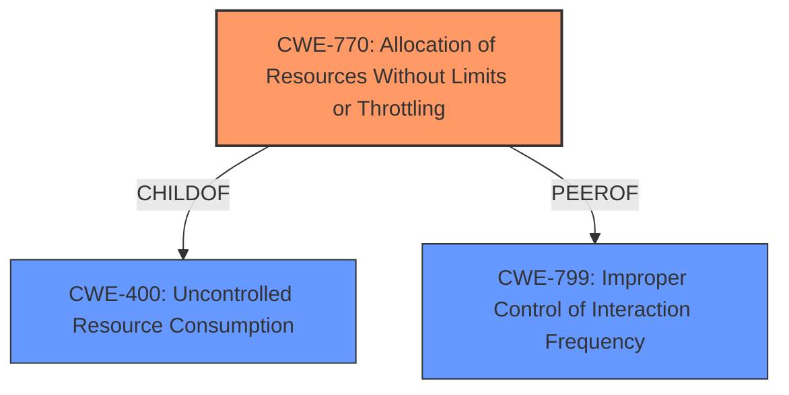

# Analysis Report for CVE-2021-1624

# Vulnerability Analysis Report: CVE-2021-1624

## Description


## Analysis (with Relationship Data)

# Summary
| CWE ID | CWE Name | Confidence | CWE Abstraction Level | CWE Vulnerability Mapping Label | CWE-Vulnerability Mapping Notes |
|---|---|---|---|---|---|
| CWE-770 | Allocation of Resources Without Limits or Throttling | 0.9 | Base | Allowed | Primary CWE |
| CWE-400 | Uncontrolled Resource Consumption | 0.7 | Class | Discouraged | Secondary Candidate |
| CWE-799 | Improper Control of Interaction Frequency | 0.6 | Class | Allowed-with-Review | Secondary Candidate |

## Evidence and Confidence

*   **Confidence Score:** 0.9
*   **Evidence Strength:** HIGH

## Relationship Analysis
The primary CWE, CWE-770 Allocation of Resources Without Limits or Throttling (Base), is a child of CWE-400 Uncontrolled Resource Consumption (Class). CWE-770 is the more specific base level weakness. CWE-770 is related to CWE-799 Improper Control of Interaction Frequency because not controlling the frequency of interactions can lead to uncontrolled resource allocation.



## Vulnerability Chain
The vulnerability chain begins with the **mishandling of the rate limiting feature** in the QuantumFlow Processor. This **mishandling** allows an attacker to send large amounts of traffic that bypass the intended rate limits, leading to excessive resource allocation and ultimately a denial-of-service condition due to high CPU utilization.

## Summary of Analysis
The initial analysis identified several potential CWEs, including CWE-799, CWE-400, and CWE-770. Based on the vulnerability description and the provided CVE reference, the root cause is the **mishandling of the rate limiting feature**, which allows excessive traffic to be processed without proper limits, leading to resource exhaustion.

The most specific and accurate CWE to represent this root cause is CWE-770, Allocation of Resources Without Limits or Throttling. This CWE directly addresses the **allocation of resources without imposing any restrictions** on the size or number of resources that can be allocated, which aligns with the vulnerability's description of mishandling the rate limiting feature. Evidence for this is found in the "Vulnerability Description Key Phrases" which states "**rootcause:** **mishandling of the rate limiting feature**" and the "CVE Reference Links Content Summary" which states "The vulnerability is due to **mishandling of the rate limiting feature** within the QuantumFlow Processor." The "CVE Reference Links Content Summary" also states "An attacker could exploit this vulnerability by sending large amounts of traffic that would be subject to NAT and rate limiting through an affected device. A successful exploit could allow the attacker to cause the QuantumFlow Processor utilization to reach 100 percent on the affected device, resulting in a DoS condition."

CWE-400, Uncontrolled Resource Consumption, is a broader class that encompasses various resource exhaustion scenarios. While the vulnerability leads to resource consumption, the root cause is specifically the **lack of limits on resource allocation**, making CWE-770 a more precise match.

CWE-799, Improper Control of Interaction Frequency, is also relevant as the attacker sends large amounts of traffic which could be interpreted as interaction frequency, but the core issue is the **lack of limits on the resources allocated** to handle this traffic, not the frequency of interaction itself.

Therefore, CWE-770 is the most appropriate and specific CWE for this vulnerability. The final selection of CWE-770 is based on direct evidence from the vulnerability description and CVE reference, combined with an understanding of the relationships between potential CWEs.

Relevant CWE Information:
*   CWE-404: Improper Resource Shutdown or Release - Not selected because the vulnerability is not about improper release of resources, but about **improper allocation without limits.**
*   CWE-799: Improper Control of Interaction Frequency - Considered, but the **root cause is not directly about the frequency of interactions**, but about the lack of limits on resource allocation.
*   CWE-664: Improper Control of a Resource Through its Lifetime - Too high-level. The vulnerability is about allocation, not the entire resource lifetime.
*   CWE-754: Improper Check for Unusual or Exceptional Conditions - Not relevant because the vulnerability is not about checking for unusual conditions.
*   CWE-703: Improper Check or Handling of Exceptional Conditions - Too high-level.
*   CWE-668: Exposure of Resource to Wrong Sphere - Not relevant.
*   CWE-405: Asymmetric Resource Consumption (Amplification) - Not selected as the vulnerability is not directly about amplification.
*   CWE-1289: Improper Validation of Unsafe Equivalence in Input - Not relevant.
*   CWE-755: Improper Handling of Exceptional Conditions - Not relevant.
*   CWE-226: Sensitive Information in Resource Not Removed Before Reuse - Not relevant.
*   CWE-789: Memory Allocation with Excessive Size Value - This is a variant of CWE-770, but the description doesn't specify memory allocation.
*   CWE-1284: Improper Validation of Specified Quantity in Input - Not selected as the vulnerability isn't specifically about quantity validation.
*   CWE-190: Integer Overflow or Wraparound - Not relevant.
*   CWE-73: External Control of File Name or Path - Not relevant.
*   CWE-22: Improper Limitation of a Pathname to a Restricted Directory ('Path Traversal') - Not relevant.
*   CWE-125: Out-of-bounds Read - Not relevant.
*   CWE-787: Out-of-bounds Write - Not relevant.
*   CWE-843: Access of Resource Using Incompatible Type ('Type Confusion') - Not relevant.
*   CWE-41: Improper Resolution of Path Equivalence - Not relevant.


## CWE Relationship Analysis

Current CWEs represent these abstraction levels: .


### Vulnerability Chain Analysis

**Chain starting from CWE-41:**
- 41 (Improper Resolution of Path Equivalence) - ROOT


**Chain starting from CWE-668:**
- 668 (Exposure of Resource to Wrong Sphere) - ROOT


### CWE Relationship Diagram

```mermaid
graph TD
    classDef primary fill:#f96,stroke:#333,stroke-width:2px
    classDef secondary fill:#69f,stroke:#333
    classDef tertiary fill:#9e9,stroke:#333
```


*Report generated on 2025-03-31 12:11:52*
