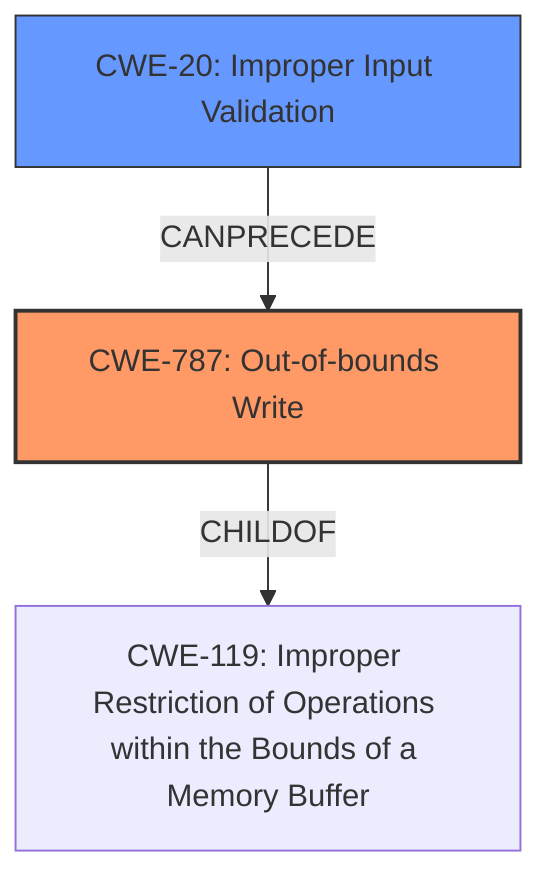

# Analysis for CVE-2021-1675

# Summary
| CWE ID | CWE Name | Confidence | CWE Abstraction Level | CWE Vulnerability Mapping Label | CWE-Vulnerability Mapping Notes |
|---|---|---|---|---|---|
| CWE-787 | Out-of-bounds Write | 0.7 | Base | Allowed | Primary CWE |
| CWE-20 | Improper Input Validation | 0.5 | Class | Discouraged | Secondary Candidate |

## Evidence and Confidence

*   **Confidence Score:** 0.7
*   **Evidence Strength:** MEDIUM

## Relationship Analysis
The primary relationship impacting the CWE selection is the parent-child relationship between CWE-787 (Out-of-bounds Write) and CWE-119 (Improper Restriction of Operations within the Bounds of a Memory Buffer). CWE-787 is a more specific Base-level CWE and thus preferred over its parent. CWE-20 (Improper Input Validation) can precede CWE-787, suggesting a potential chain where **improper input validation** leads to an out-of-bounds write.

## Vulnerability Chain
The vulnerability chain starts with **improper validation of user-supplied data** (**ROOTCAUSE**), potentially leading to **insufficient input sanitization and boundary checks** (**WEAKNESS**), culminating in an out-of-bounds write (CWE-787) and remote code execution.

## Summary of Analysis
The analysis indicates that the primary weakness is an out-of-bounds write (CWE-787) stemming from **improper validation of user-supplied data** and **insufficient input sanitization and boundary checks.**

The selection is based on the following evidence:

*   **Vulnerability Description Key Phrases:** "**Improper validation of user-supplied data within the print spooler service.**" and "**Insufficient input sanitization and boundary checks.**"
*   **CVE Reference Links Content Summary:** Mentions "Inadequate access control" and "Unrestricted use of RpcAddPrinterDriverEx() and RpcAsyncAddPrinterDriver functions", as well as "Ability to specify remote driver file locations" which can lead to the Print Spooler service executing arbitrary code.

CWE-787 is at the Base level of abstraction and directly relates to the **weakness** of writing data beyond buffer boundaries. This aligns well with the provided information about the **rootcause** being **improper validation** leading to the ability to write arbitrary code. While CWE-20 (Improper Input Validation) is a plausible contributing factor, the immediate cause is the out-of-bounds write.

Other CWEs Considered but Not Used:

*   CWE-20: While **improper input validation** is mentioned, it is a broad class. The more specific CWE-787 is preferred because the vulnerability manifests as an out-of-bounds write.
*   CWE-427: The vulnerability involves the print spooler service executing code from a remote server, but it doesn't explicitly involve an uncontrolled search path.
*   CWE-367: A race condition isn't explicitly mentioned.
*   CWE-59: While remote files are involved, the core issue isn't about symlink resolution, but writing beyond buffer boundaries.
*   CWE-250: Execution with Unnecessary Privileges: The Print Spooler service runs with SYSTEM privileges, but the immediate cause of the vulnerability isn't about excessive privileges but rather the out-of-bounds write.