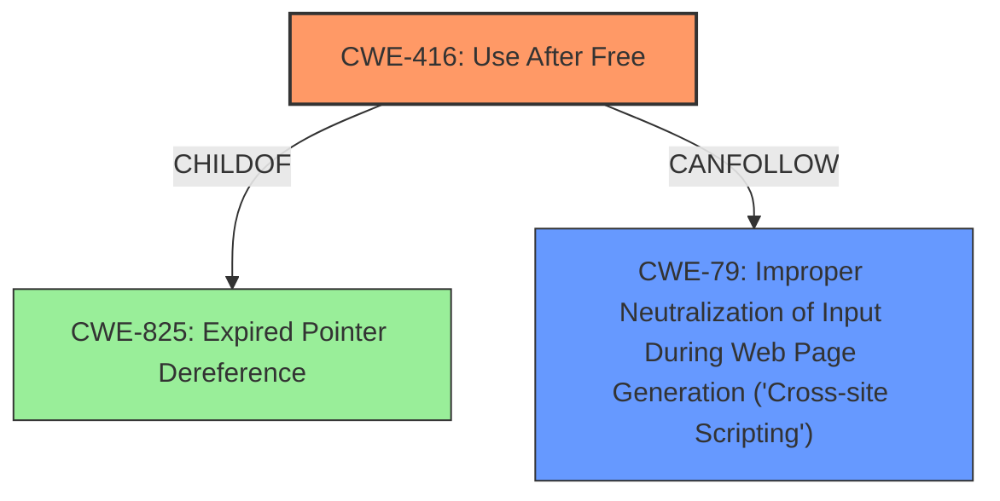

# Enhanced Analysis for CVE-2021-1879

# Summary
| CWE ID | CWE Name | Confidence | CWE Abstraction Level | CWE Vulnerability Mapping Label | CWE-Vulnerability Mapping Notes |
|---|---|---|---|---|---|
| CWE-416 | Use After Free | 0.9 | Variant | Primary | Allowed |
| CWE-79 | Improper Neutralization of Input During Web Page Generation ('Cross-site Scripting') | 0.7 | Base | Secondary | Allowed |

## Evidence and Confidence

*   **Confidence Score:** 0.8
*   **Evidence Strength:** HIGH

## Relationship Analysis
The primary weakness is CWE-416, Use After Free, which is a variant of CWE-825 (Expired Pointer Dereference). The vulnerability stems from improper management of object lifetimes, which leads to the use of a pointer after the memory it points to has been freed. This can result in writing to unexpected memory locations, potentially causing a crash or exploitable condition. The secondary weakness, CWE-79, Improper Neutralization of Input During Web Page Generation ('Cross-site Scripting'), arises because the Use-After-Free allows for arbitrary code execution in the context of a web page, effectively creating a cross-site scripting vulnerability.



## Vulnerability Chain
The vulnerability chain begins with **improper management of object lifetimes**, leading to CWE-416 (Use After Free). This allows for the execution of arbitrary JavaScript code, resulting in CWE-79 (Cross-site Scripting).
  - Improper object lifetime management -> CWE-416 -> CWE-79

## Summary of Analysis
The initial assessment identified the core issue as improper management of object lifetimes, leading to a use-after-free condition (CWE-416). The cross-site scripting (CWE-79) aspect is a consequence of the arbitrary code execution made possible by the use-after-free. The graph relationships emphasize that CWE-416 can lead to CWE-79. The final selection of CWEs accurately reflects the root cause and its direct impact, with CWE-416 at the variant level providing the most specific representation of the vulnerability.

The evidence from the "Vulnerability Description Key Phrases" and "CVE Reference Links Content Summary" sections clearly supports this conclusion. Specifically, the phrases "**improper management of object lifetimes**" and "**cross-site scripting**" directly align with the descriptions of CWE-416 and CWE-79, respectively. The description also mentions that the issue was addressed by improved management of object lifetimes, further supporting the choice of CWE-416 as the primary weakness.

The retriever results also support this analysis, with CWE-787 (Out-of-bounds Write), CWE-843 (Type Confusion), and CWE-79 (Cross-site Scripting) being the top matches. However, CWE-416 (Use After Free) is a more precise fit for the **improper management of object lifetimes** root cause.

Relevant CWE Information:

# Enhanced Context (25 CWEs)

## CWE-667: Improper Locking
**Abstraction Level**: Class
**Similarity Score**: 0.77
**Source**: dense

**Description**:
The product does not properly acquire or release a lock on a resource, leading to unexpected resource state changes and behaviors.

**Mapping Guidance**:
- Usage: Allowed-with-Review
- Rationale: This CWE entry is a Class and might have Base-level children that would be more appropriate

*Rationale for not selecting:* While concurrency issues can sometimes lead to memory corruption, the specific vulnerability description points to object lifetime management rather than locking.

## CWE-131: Incorrect Calculation of Buffer Size
**Abstraction Level**: Base
**Similarity Score**: 0.76
**Source**: dense

**Description**:
The product does not correctly calculate the size to be used when allocating a buffer, which could lead to a buffer overflow.

**Mapping Guidance**:
- Usage: Allowed
- Rationale: This CWE entry is at the Base level of abstraction, which is a preferred level of abstraction for mapping to the root causes of vulnerabilities.

*Rationale for not selecting:* The vulnerability isn't related to buffer size calculation but rather object lifetime.

## CWE-404: Improper Resource Shutdown or Release
**Abstraction Level**: Class
**Similarity Score**: 0.76
**Source**: dense

**Description**:
The product does not release or incorrectly releases a resource before it is made available for re-use.

**Mapping Guidance**:
- Usage: Allowed-with-Review
- Rationale: This CWE entry is a Class and might have Base-level children that would be more appropriate

*Rationale for not selecting:* CWE-404 is too general. CWE-416, Use After Free, is more specific.

## CWE-226: Sensitive Information in Resource Not Removed Before Reuse
**Abstraction Level**: Base
**Similarity Score**: 0.76
**Source**: dense

**Description**:
The product releases a resource such as memory or a file so that it can be made available for reuse, but it does not clear or "zeroize" the information contained in the resource before the product performs a critical state transition or makes the resource available for reuse by other entities.

**Mapping Guidance**:
- Usage: Allowed
- Rationale: This CWE entry is at the Base level of abstraction, which is a preferred level of abstraction for mapping to the root causes of vulnerabilities.

*Rationale for not selecting:* This is not about sensitive information, but about object lifetime.

## CWE-1289: Improper Validation of Unsafe Equivalence in Input
**Abstraction Level**: Base
**Similarity Score**: 0.76
**Source**: dense

**Description**:
The product receives an input value that is used as a resource identifier or other type of reference, but it does not validate or incorrectly validates that the input is equivalent to a potentially-unsafe value.

**Mapping Guidance**:
- Usage: Allowed
- Rationale: This CWE entry is at the Base level of abstraction, which is a preferred level of abstraction for mapping to the root causes of vulnerabilities.

*Rationale for not selecting:* This CWE is not related to this vulnerability.

## CWE-125: Out-of-bounds Read
**Abstraction Level**: Base
**Similarity Score**: 0.76
**Source**: dense

**Description**:
The product reads data past the end, or before the beginning, of the intended buffer.

**Mapping Guidance**:
- Usage: Allowed
- Rationale: This CWE entry is at the Base level of abstraction, which is a preferred level of abstraction for mapping to the root causes of vulnerabilities.

*Rationale for not selecting:* The vulnerability is due to writing to freed memory, not reading out of bounds.

## CWE-191: Integer Underflow (Wrap or Wraparound)
**Abstraction Level**: Base
**Similarity Score**: 0.75
**Source**: dense

**Description**:
The product subtracts one value from another, such that the result is less than the minimum allowable integer value, which produces a value that is not equal to the correct result.

**Mapping Guidance**:
- Usage: Allowed
- Rationale: This CWE entry is at the Base level of abstraction, which is a preferred level of abstraction for mapping to the root causes of vulnerabilities.

*Rationale for not selecting:* Integer underflow is not relevant to this vulnerability.

## CWE-119: Improper Restriction of Operations within the Bounds of a Memory Buffer
**Abstraction Level**: Class
**Similarity Score**: 0.75
**Source**: dense

**Description**:
The product performs operations on a memory buffer, but it reads from or writes to a memory location outside the buffer's intended boundary. This may result in read or write operations on unexpected memory locations that could be linked to other variables, data structures, or internal program data.

**Mapping Guidance**:
- Usage: Discouraged
- Rationale: CWE-119 is commonly misused in low-information vulnerability reports when lower-level CWEs could be used instead, or when more details about the vulnerability are available.

*Rationale for not selecting:* This is too general. CWE-416 is more specific.

## CWE-126: Buffer Over-read
**Abstraction Level**: Variant
**Similarity Score**: 0.75
**Source**: dense

**Description**:
The product reads from a buffer using buffer access mechanisms such as indexes or pointers that reference memory locations after the targeted buffer.

**Mapping Guidance**:
- Usage: Allowed
- Rationale: This CWE entry is at the Variant level of abstraction, which is a preferred level of abstraction for mapping to the root


## CWE Relationship Analysis

Current CWEs represent these abstraction levels: .


### Vulnerability Chain Analysis

**Chain starting from CWE-131:**
- 131 (Incorrect Calculation of Buffer Size) - ROOT


**Chain starting from CWE-226:**
- 226 (Sensitive Information in Resource Not Removed Before Reuse) - ROOT


### CWE Relationship Diagram

```mermaid
graph TD
    classDef primary fill:#f96,stroke:#333,stroke-width:2px
    classDef secondary fill:#69f,stroke:#333
    classDef tertiary fill:#9e9,stroke:#333
```