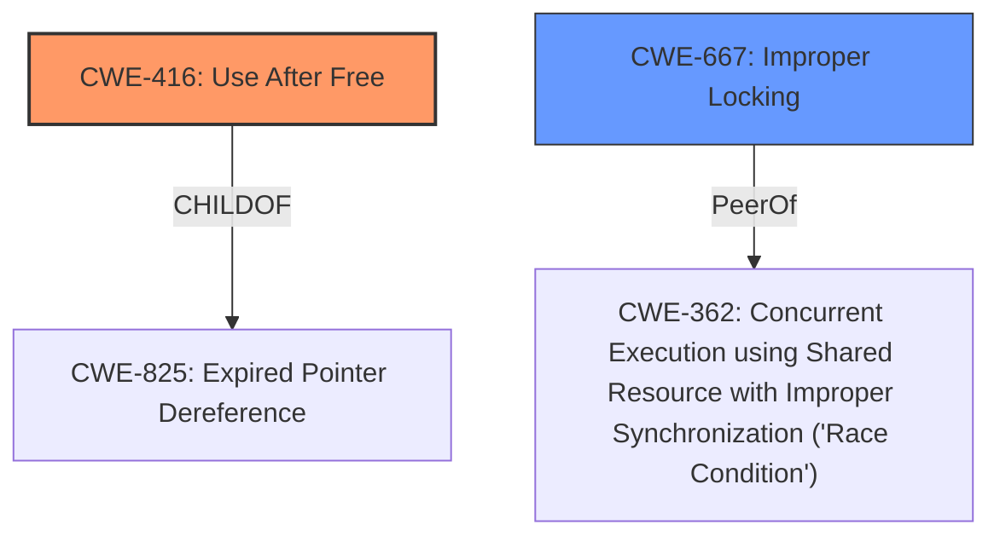

# Enhanced Analysis for CVE-2021-1905

# Summary
| CWE ID | CWE Name | Confidence | CWE Abstraction Level | CWE Vulnerability Mapping Label | CWE-Vulnerability Mapping Notes |
|---|---|---|---|---|---|
| CWE-416 | Use After Free | 0.75 | Variant | Allowed | Primary CWE |
| CWE-667 | Improper Locking | 0.5 | Class | Allowed-with-Review | Secondary Candidate |

## Evidence and Confidence

*   **Confidence Score:** 0.7
*   **Evidence Strength:** MEDIUM

## Relationship Analysis
The primary relationship that influenced the decision was the direct match of the vulnerability description's impact to the definition of CWE-416. The description explicitly mentions "use after free," aligning perfectly with CWE-416's core concept. Additionally, the potential involvement of concurrency issues suggested a possible connection to CWE-667 related to improper locking.



## Vulnerability Chain
The vulnerability chain starts with **improper handling of memory mapping of multiple processes simultaneously**, potentially leading to a race condition or memory corruption. This results in the **impact** of a use-after-free condition.

## Summary of Analysis
The primary decision driver was the direct statement in the vulnerability description of the impact being a "use after free." The retriever results included CWE-415 (Double Free) and other memory corruption issues, however, the explicit mention of "use after free" makes CWE-416 the most appropriate primary mapping. The **rootcause** of the vulnerability is **improper handling of memory mapping of multiple processes simultaneously** which could suggest CWE-367 (Time-of-check Time-of-use (TOCTOU) Race Condition) or CWE-667 (Improper Locking), but without more information it is hard to say which is most relevant.

Relevant CWE Information:

# Enhanced Context (25 CWEs)
The following CWEs were identified as potentially relevant to this vulnerability:

## CWE-124: Buffer Underwrite ('Buffer Underflow')
**Abstraction Level**: Base

## CWE-131: Incorrect Calculation of Buffer Size
**Abstraction Level**: Base

## CWE-191: Integer Underflow (Wrap or Wraparound)
**Abstraction Level**: Base

## CWE-805: Buffer Access with Incorrect Length Value
**Abstraction Level**: Base

## CWE-127: Buffer Under-read
**Abstraction Level**: Variant

## CWE-822: Untrusted Pointer Dereference
**Abstraction Level**: Base

## CWE-126: Buffer Over-read
**Abstraction Level**: Variant

## CWE-823: Use of Out-of-range Pointer Offset
**Abstraction Level**: Base

## CWE-667: Improper Locking
**Abstraction Level**: Class

## CWE-252: Unchecked Return Value
**Abstraction Level**: Base

## CWE-823: Use of Out-of-range Pointer Offset
**Abstraction Level**: Base

## CWE-252: Unchecked Return Value
**Abstraction Level**: Base

## CWE-822: Untrusted Pointer Dereference
**Abstraction Level**: Base

## CWE-367: Time-of-check Time-of-use (TOCTOU) Race Condition
**Abstraction Level**: Base

## CWE-415: Double Free
**Abstraction Level**: Variant

## CWE-123: Write-what-where Condition
**Abstraction Level**: base

## CWE-416: Use After Free
**Abstraction Level**: variant

## CWE-476: NULL Pointer Dereference
**Abstraction Level**: base

## CWE-825: Expired Pointer Dereference
**Abstraction Level**: base

## CWE-787: Out-of-bounds Write
**Abstraction Level**: base

## CWE-1341: Multiple Releases of Same Resource or Handle
**Abstraction Level**: base

## CWE-1284: Improper Validation of Specified Quantity in Input
**Abstraction Level**: base

## CWE-190: Integer Overflow or Wraparound
**Abstraction Level**: base

## CWE-130: Improper Handling of Length Parameter Inconsistency
**Abstraction Level**: base

## CWE-390: Detection of Error Condition Without Action
**Abstraction Level**: base

## CWE-416: Use After Free
CWE-416 - Use After Free

*   **CWE ID:** CWE-416
*   **CWE Name:** Use After Free
*   **Explanation:** The vulnerability description states "Possible use after free due to **improper handling of memory mapping of multiple processes simultaneously**". This directly aligns with the core concept of CWE-416, which occurs when a program attempts to access memory that has already been freed. The security implication is significant, as it can lead to arbitrary code execution, denial of service, or information disclosure.
*   **Relationships:** CWE-416 is a variant of CWE-825 (Expired Pointer Dereference), indicating that the vulnerability involves using a pointer that is no longer valid. It is also a peer of CWE-415 (Double Free), representing another memory management error.
*   **Mapping Guidance:** The MITRE mapping guidance allows the use of CWE-416.
*   **Confidence:** 0.75

## CWE-667: Improper Locking
CWE-667 - Improper Locking

*   **CWE ID:** CWE-667
*   **CWE Name:** Improper Locking
*   **Explanation:** The **rootcause** is due to **improper handling of memory mapping of multiple processes simultaneously**. This hints at potential concurrency issues, which can manifest as **improper locking**. The security implication is that race conditions can occur.
*   **Relationships:** CWE-667 is a class-level CWE, meaning there might be more specific base or variant level CWEs. One possible relationship is to CWE-362 (Concurrent Execution using Shared Resource with Improper Synchronization ('Race Condition')).
*   **Mapping Guidance:** The MITRE mapping guidance allows the use of CWE-667, but recommends reviewing if a more specific CWE is available.
*   **Confidence:** 0.5

### CWEs Considered But Not Used

*   CWE-367: Time-of-check Time-of-use (TOCTOU) Race Condition - While the description mentions multiple processes, there's no explicit TOCTOU condition described.
*   CWE-415: Double Free - The vulnerability description explicitly indicates a use-after-free, not a double free.
*   CWE-123: Write-what-where Condition - While UAF can lead to write-what-where, the primary issue is the UAF itself.
*   CWE-822: Untrusted Pointer Dereference - This is possible, but less direct than UAF.
*   CWE-126: Buffer Over-read, CWE-124: Buffer Underwrite, CWE-787: Out-of-bounds Write - These are buffer-related issues, and the description doesn't primarily focus on buffers.


## CWE Relationship Analysis

Current CWEs represent these abstraction levels: .


### Vulnerability Chain Analysis

**Chain starting from CWE-823:**
- 823 (Use of Out-of-range Pointer Offset) - ROOT


**Chain starting from CWE-123:**
- 123 (Write-what-where Condition) - ROOT


### CWE Relationship Diagram

```mermaid
graph TD
    classDef primary fill:#f96,stroke:#333,stroke-width:2px
    classDef secondary fill:#69f,stroke:#333
    classDef tertiary fill:#9e9,stroke:#333
```