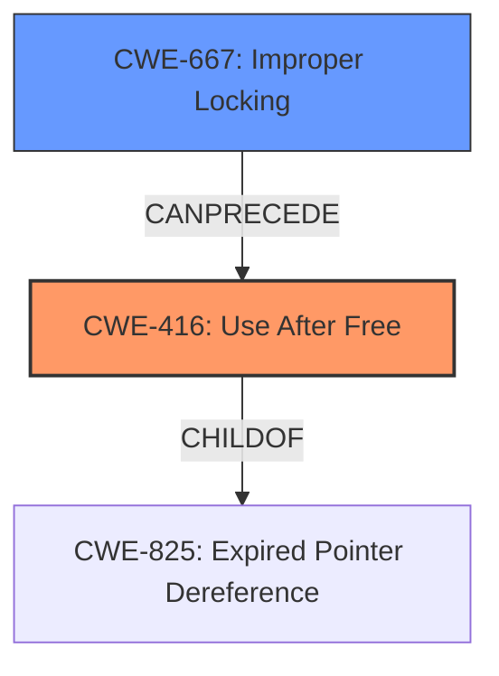

# Raw Analyzer Response for CVE-2021-1905

# Summary
| CWE ID | CWE Name | Confidence | CWE Abstraction Level | CWE Vulnerability Mapping Label | CWE-Vulnerability Mapping Notes |
|---|---|---|---|---|---|
| CWE-416 | Use After Free | 0.8 | Variant | Allowed | Primary CWE |
| CWE-667 | Improper Locking | 0.6 | Class | Allowed-with-Review | Secondary Candidate |

## Evidence and Confidence

*   **Confidence Score:** 0.8
*   **Evidence Strength:** MEDIUM

## Relationship Analysis
The primary relationship influencing the selection is the potential for a race condition leading to a use-after-free scenario. CWE-416 (Use After Free) is a variant-level CWE that accurately describes the impact, while CWE-667 (Improper Locking) could represent the root cause related to concurrency issues. The description points towards **improper handling of memory mapping of multiple processes simultaneously**, which suggests a concurrency problem, potentially involving improper locking mechanisms.

## Vulnerability Chain
The vulnerability chain starts with **improper handling of memory mapping of multiple processes simultaneously**, potentially due to **improper locking**, leading to a **use-after-free** condition.

## Summary of Analysis
The analysis is primarily based on the provided vulnerability description key phrases and the retriever results. The description explicitly mentions **improper handling of memory mapping of multiple processes simultaneously** as a root cause and **use after free** as the impact. This suggests a concurrency issue where memory is freed while still being accessed by another process.

The retriever results point to several CWEs, including CWE-367 (Time-of-check Time-of-use (TOCTOU) Race Condition), CWE-415 (Double Free), and CWE-416 (Use After Free). Given the description's emphasis on memory mapping and simultaneous access by multiple processes, CWE-416 (Use After Free) seems most appropriate as the primary CWE. The potential concurrency issue suggests that CWE-667 (Improper Locking) is also a relevant secondary candidate, as the **improper handling of memory mapping of multiple processes simultaneously** could involve a failure to properly synchronize access to the shared memory region.

CWE-416 is selected because the description explicitly states "use after free". CWE-667 is included because the root cause indicates a concurrency problem related to handling memory mapping across multiple processes, which could be due to a locking issue. The selected CWEs are at the appropriate level of specificity, with CWE-416 being a Variant and CWE-667 being a Class.

Relevant CWE Information:

# Enhanced Context (25 CWEs)

## CWE-416: Use After Free
**Abstraction:** variant
**Similarity Score:** 4.53
**Source:** graph

**Description**:
CWE-416: Use After Free

**Mapping Guidance**:
- Usage: Allowed
- Rationale: This CWE entry is at the Variant level of abstraction, which is a preferred level of abstraction for mapping to the root causes of vulnerabilities.

**Relationships**:
- CANFOLLOW -> CWE-754
- CANFOLLOW -> CWE-364
- CANFOLLOW -> CWE-362
- CANFOLLOW -> CWE-1265
- CANPRECEDE -> CWE-123

## CWE-667: Improper Locking
**Abstraction:** Class
**Similarity Score:** 0.77
**Source:** dense

**Description**:
The product does not properly acquire or release a lock on a resource, leading to unexpected resource state changes and behaviors.

**Mapping Guidance**:
- Usage: Allowed-with-Review
- Rationale: This CWE entry is a Class and might have Base-level children that would be more appropriate

# Rationale for Not Selecting Other CWEs:

*   CWE-367 (Time-of-check Time-of-use (TOCTOU) Race Condition): While a race condition might be involved, the primary issue is the use of freed memory, making CWE-416 a better fit for the impact.
*   CWE-415 (Double Free): The description doesn't explicitly mention a double free, so CWE-416 is more appropriate.
*   CWE-123 (Write-what-where Condition): This is a potential consequence of a use-after-free, but CWE-416 is the more direct issue.
*   CWE-822 (Untrusted Pointer Dereference): This CWE is not applicable because there is no mention of untrusted pointers being dereferenced.
*   CWE-390 (Detection of Error Condition Without Action): This CWE is not applicable because there is no mention of error detection without action.
*   CWE-126 (Buffer Over-read): This CWE is not applicable because there is no mention of buffer over-read.
*   CWE-823 (Use of Out-of-range Pointer Offset): This CWE is not applicable because there is no mention of pointer offsets.
*   CWE-1314 (Missing Write Protection for Parametric Data Values): This CWE is not applicable because it relates to parametric data values and sensors, which are not mentioned in the vulnerability description.
*   CWE-252 (Unchecked Return Value): This CWE is not applicable because there is no mention of unchecked return values.
*   CWE-124 (Buffer Underwrite ('Buffer Underflow')): This CWE is not applicable because there is no mention of buffer underwrite.