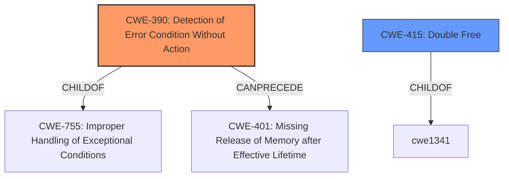

# Enhanced Analysis for CVE-2021-1906

# Summary
| CWE ID | CWE Name | Confidence | CWE Abstraction Level | CWE Vulnerability Mapping Label | CWE-Vulnerability Mapping Notes |
|---|---|---|---|---|---|
| CWE-390 | Detection of Error Condition Without Action | 0.8 | Base | Allowed | Primary CWE |
| CWE-415 | Double Free | 0.6 | Variant | Allowed | Secondary Candidate |

## Evidence and Confidence

*   **Confidence Score:** 0.7
*   **Evidence Strength:** MEDIUM

## Relationship Analysis
The primary CWE selected is CWE-390 (Detection of Error Condition Without Action), a Base level CWE. It has a parent CWE of CWE-755 (Improper Handling of Exceptional Conditions) and can precede CWE-401 (Missing Release of Memory after Effective Lifetime). CWE-415 (Double Free) is considered as a possible secondary CWE. The abstraction levels influenced the decision to focus on the base class for root cause.



## Vulnerability Chain
The vulnerability chain starts with **Improper handling of address deregistration on failure**, leading to the **Detection of Error Condition Without Action** (CWE-390), and potentially resulting in a new GPU address allocation failure. A possible secondary effect is CWE-415 Double Free.

## Summary of Analysis
The initial assessment focused on the provided vulnerability description: "**Improper handling of address deregistration on failure** can lead to new GPU address allocation failure". The key phrase being "**Improper handling of address deregistration on failure**".

Based on the retriever results and the CWE specifications, the most fitting CWE is CWE-390 (Detection of Error Condition Without Action). The description of CWE-390, "The product detects a specific error, but takes no actions to handle the error", aligns well with the **improper handling of address deregistration on failure**, which implies an error is detected, but no corrective action is taken. This inaction leads to further problems.

CWE-415 (Double Free) was considered as a secondary CWE, given the potential consequences of memory management issues and the mention of address deregistration. However, the description doesn't explicitly state a double free occurs, so it's a less direct fit.

The choice of CWE-390 is further supported by the "Mapping Guidance" which states: "This CWE entry is at the Base level of abstraction, which is a preferred level of abstraction for mapping to the root causes of vulnerabilities." This aligns with the goal of identifying the root cause.

Other CWEs considered but not used:
*   CWE-126 (Buffer Over-read), CWE-1314 (Missing Write Protection for Parametric Data Values), CWE-823 (Use of Out-of-range Pointer Offset), CWE-367 (Time-of-check Time-of-use (TOCTOU) Race Condition), CWE-1285 (Improper Validation of Specified Index, Position, or Offset in Input), CWE-781 (Improper Address Validation in IOCTL with METHOD_NEITHER I/O Control Code), CWE-822 (Untrusted Pointer Dereference), CWE-697 (Incorrect Comparison): These were considered based on retriever results. However, they do not directly address the **improper handling of address deregistration on failure** as the root cause. They represent potential consequences or related issues, rather than the root cause itself.

Relevant CWE Information:
*   CWE-390: Detection of Error Condition Without Action
*   CWE-415: Double Free


## CWE Relationship Analysis

Current CWEs represent these abstraction levels: .


### Vulnerability Chain Analysis

**Chain starting from CWE-755:**
- 755 (Improper Handling of Exceptional Conditions) - ROOT


**Chain starting from CWE-823:**
- 823 (Use of Out-of-range Pointer Offset) - ROOT


### CWE Relationship Diagram

```mermaid
graph TD
    classDef primary fill:#f96,stroke:#333,stroke-width:2px
    classDef secondary fill:#69f,stroke:#333
    classDef tertiary fill:#9e9,stroke:#333
```