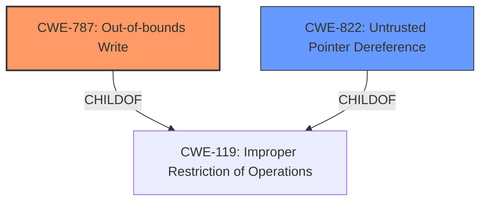

# Enhanced Analysis for CVE-2021-1942

# Summary
| CWE ID | CWE Name | Confidence | CWE Abstraction Level | CWE Vulnerability Mapping Label | CWE-Vulnerability Mapping Notes |
|---|---|---|---|---|---|
| CWE-787 | Out-of-bounds Write | 0.75 | Base | Allowed | Primary CWE |
| CWE-822 | Untrusted Pointer Dereference | 0.60 | Base | Allowed | Secondary Candidate |

## Evidence and Confidence

*   **Confidence Score:** 0.70
*   **Evidence Strength:** MEDIUM

## Relationship Analysis
The primary CWE is CWE-787, which represents the out-of-bounds write leading to memory corruption. CWE-822 is considered as a secondary candidate, which could occur if the improper permission handling leads to the dereferencing of an untrusted pointer.



## Vulnerability Chain
The vulnerability chain starts with the **improper handling of permissions** which leads to memory corruption.

## Summary of Analysis
The initial analysis focused on the **improper handling of permissions** leading to memory corruption. The core issue appears to be a failure to properly restrict access to a shared memory region, which could lead to out-of-bounds writes (CWE-787). The retriever results also suggested CWE-822 (Untrusted Pointer Dereference) as a possible candidate, which could occur if the memory region contains pointers that are then dereferenced.

The evidence for the root cause is: "**Improper handling of permissions** of a shared memory region can lead to memory corruption".

CWE-787 is at the Base level of abstraction and directly reflects the **out-of-bounds write** condition, making it the most appropriate primary CWE.

CWE-822 is included as a secondary candidate.

Relevant CWE Information:

# Enhanced Context (25 CWEs)
The following CWEs were identified as potentially relevant to this vulnerability:

## CWE-787: Out-of-bounds Write
**Abstraction:** Base
**Similarity Score**: 4.33
**Source**: graph

**Description**:
CWE-787: Out-of-bounds Write

**Mapping Guidance**:
- Usage: Allowed
- Rationale: This CWE entry is at the Base level of abstraction, which is a preferred level of abstraction for mapping to the root causes of vulnerabilities.

**Relationships**:
- CANFOLLOW -> CWE-825
- CANFOLLOW -> CWE-824
- CANFOLLOW -> CWE-823
- CANFOLLOW -> CWE-822
- PARENTOF -> CWE-124

CWE-787 Out-of-bounds Write: This CWE is selected as the primary CWE because the vulnerability description explicitly mentions that the **improper handling of permissions** can lead to memory corruption, which is a direct consequence of writing data outside the intended memory boundaries.

## CWE-822: Untrusted Pointer Dereference
**Abstraction:** Base
**Similarity Score**: 0.77
**Source**: dense

**Description**:
The product obtains a value from an untrusted source, converts this value to a pointer, and dereferences the resulting pointer.

**Mapping Guidance**:
- Usage: Allowed
- Rationale: This CWE entry is at the Base level of abstraction, which is a preferred level of abstraction for mapping to the root causes of vulnerabilities.

CWE-822 Untrusted Pointer Dereference: This CWE is considered as a secondary CWE because **improper handling of permissions** could lead to a scenario where an untrusted pointer is dereferenced, potentially causing memory corruption. However, the description does not explicitly state this.

The remaining CWEs were not selected because they did not directly map to the root cause and impact described in the vulnerability description.


## CWE Relationship Analysis

Current CWEs represent these abstraction levels: .


### Vulnerability Chain Analysis

**Chain starting from CWE-825:**
- 825 (Expired Pointer Dereference) - ROOT


**Chain starting from CWE-823:**
- 823 (Use of Out-of-range Pointer Offset) - ROOT


### CWE Relationship Diagram

```mermaid
graph TD
    classDef primary fill:#f96,stroke:#333,stroke-width:2px
    classDef secondary fill:#69f,stroke:#333
    classDef tertiary fill:#9e9,stroke:#333
```