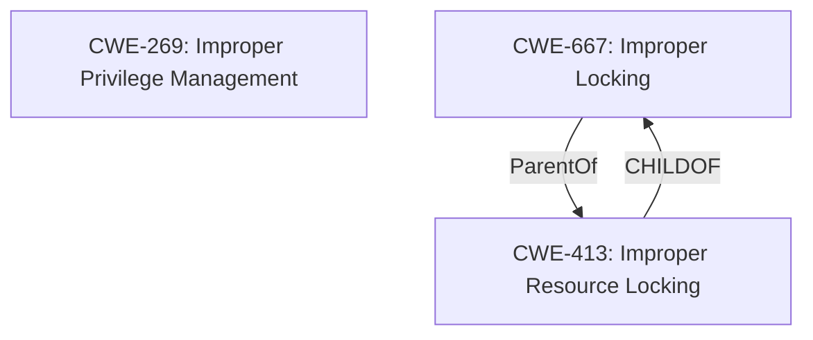

# Analysis Report for CVE-2021-1957

# Vulnerability Analysis Report: CVE-2021-1957

## Description


## Analysis (with Relationship Data)

# Summary
| CWE ID | CWE Name | Confidence | CWE Abstraction Level | CWE Vulnerability Mapping Label | CWE-Vulnerability Mapping Notes |
|---|---|---|---|---|---|
| CWE-269 | Improper Privilege Management | 0.9 | Class | Allowed-with-Review | Primary CWE |
| CWE-413 | Improper Resource Locking | 0.6 | Base | Allowed | Secondary CWE |

## Evidence and Confidence

*   **Confidence Score:** 0.75
*   **Evidence Strength:** MEDIUM

## Relationship Analysis
The primary CWE is CWE-269 which is a Class level vulnerability. CWE-413 is a Base level vulnerability and child of CWE-667.



## Vulnerability Chain
The vulnerability chain involves an **improper access control** issue due to a failure in ACL link encryption and the link not being disconnected during reconnection. This leads to **improper privilege management**, where a device might gain unauthorized access because of the failed encryption and lack of disconnection. **Improper Resource Locking** during the reconnection attempt might further exacerbate the issue.

## Summary of Analysis
The initial assessment identified **Improper Access Control** due to failure in ACL link encryption and the failure to disconnect during reconnection with a paired device.

The vulnerability description states: "**Improper Access Control when ACL link encryption is failed and ACL link is not disconnected during reconnection with paired device**". This indicates that the system **fails to properly manage access rights** when the ACL link encryption fails and does not disconnect, leading to potential unauthorized access.

Given the **improper access control** and the context of managing privileges during reconnection, CWE-269 (Improper Privilege Management) is deemed the most suitable primary CWE.

CWE-413 (Improper Resource Locking) might also be relevant if the reconnection process involves locking resources, but the provided description focuses more on access control issues.

The selected CWEs are at the optimal level of specificity, with CWE-269 providing a broad categorization of the privilege management issue and CWE-413 highlighting a potential resource locking problem.

# Relevant CWE Information:

## CWE-269: Improper Privilege Management

**Abstraction Level**: Class

**Description**: The software does not properly manage privileges or permissions for sensitive resources.

**Rationale**: This CWE entry is a Class and might have Base-level children that would be more appropriate

**Mapping Guidance**: Usage: Allowed-with-Review

## CWE-413: Improper Resource Locking

**Abstraction Level**: Base

**Description**: The product does not lock or does not correctly lock a resource when the product must have exclusive access to the resource.

**Rationale**: This CWE entry is at the Base level of abstraction, which is a preferred level of abstraction for mapping to the root causes of vulnerabilities.

**Mapping Guidance**: Usage: Allowed


## CWE Relationship Analysis

Current CWEs represent these abstraction levels: .


### Vulnerability Chain Analysis

**Chain starting from CWE-269:**
- 269 (Improper Privilege Management) - ROOT


**Chain starting from CWE-667:**
- 667 (Improper Locking) - ROOT


### CWE Relationship Diagram

```mermaid
graph TD
    classDef primary fill:#f96,stroke:#333,stroke-width:2px
    classDef secondary fill:#69f,stroke:#333
    classDef tertiary fill:#9e9,stroke:#333
```


*Report generated on 2025-03-31 04:44:03*
