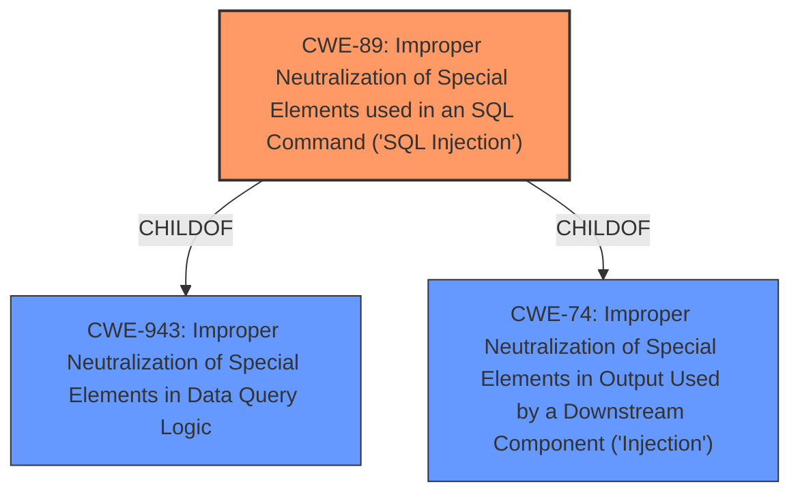

# Raw Analyzer Response for CVE-2021-20016

# Summary
| CWE ID | CWE Name | Confidence | CWE Abstraction Level | CWE Vulnerability Mapping Label | CWE-Vulnerability Mapping Notes |
|---|---|---|---|---|---|
| CWE-89 | Improper Neutralization of Special Elements used in an SQL Command ('SQL Injection') | 1.0 | Base | Allowed | Primary CWE: The vulnerability description explicitly states "SQL-Injection vulnerability," making this the most direct and appropriate mapping. |

## Evidence and Confidence

*   **Confidence Score:** 1.0
*   **Evidence Strength:** HIGH

## Relationship Analysis
The primary CWE, CWE-89, is a base-level CWE that is child of CWE-943 (Improper Neutralization of Special Elements in Data Query Logic) and CWE-74 (Improper Neutralization of Special Elements in Output Used by a Downstream Component ('Injection')). The relationship analysis confirms that CWE-89 is the most specific and appropriate choice given the information provided.

## Vulnerability Chain
The vulnerability chain starts with **improper neutralization** of special elements in an SQL command (CWE-89), leading to the ability to perform SQL queries and access sensitive information like usernames and passwords.
  - **Root Cause:** CWE-89: Improper Neutralization of Special Elements used in an SQL Command ('SQL Injection')
  - **Impact:** Access to username password and other session related information

## Summary of Analysis
The initial analysis strongly points to CWE-89 due to the explicit mention of "SQL Injection" in the vulnerability description. The retriever results also list CWE-89 as the top combined result with a score of 1.0, further supporting this selection. The vulnerability allows a remote unauthenticated attacker to perform SQL queries to access sensitive information.

The evidence is strong and directly supports the selection of CWE-89. The relationship analysis reinforces that CWE-89 is the most specific and relevant CWE.

Relevant CWE Information:

# Enhanced Context (25 CWEs)
The following CWEs were identified as potentially relevant to this vulnerability:

## CWE-89: Improper Neutralization of Special Elements used in an SQL Command ('SQL Injection')
**Abstraction:** Base
**Status:** Stable

### Description
The product constructs all or part of an SQL command using externally-influenced input from an upstream component, but it does not neutralize or incorrectly neutralizes special elements that could modify the intended SQL command when it is sent to a downstream component. Without sufficient removal or quoting of SQL syntax in user-controllable inputs, the generated SQL query can cause those inputs to be interpreted as SQL instead of ordinary user data.

### Extended Description
Not provided

### Alternative Terms
SQL injection: a common attack-oriented phrase
SQLi: a common abbreviation for "SQL injection"

### Relationships
ChildOf -> CWE-943
ChildOf -> CWE-74

### Mapping Guidance
**Usage:** Allowed
**Rationale:** This CWE entry is at the Base level of abstraction, which is a preferred level of abstraction for mapping to the root causes of vulnerabilities.
**Comments:** Carefully read both the name and description to ensure that this mapping is an appropriate fit. Do not try to 'force' a mapping to a lower-level Base/Variant simply to comply with this preferred level of abstraction.
**Reasons:**
- Acceptable-Use

### Additional Notes
**[Relationship]** SQL injection can be resultant from special character mismanagement, MAID, or denylist/allowlist problems. It can be primary to authentication errors.

### Observed Examples
- **CVE-2023-32530:** SQL injection in security product dashboard using crafted certificate fields
- **CVE-2021-42258:** SQL injection in time and billing software, as exploited in the wild per CISA KEV.
- **CVE-2021-27101:** SQL injection in file-transfer system via a crafted Host header, as exploited in the wild per CISA KEV.

CWE-204, CWE-312, CWE-943, CWE-916, CWE-294, CWE-1272, CWE-90, CWE-116, CWE-209 were considered but not used because the vulnerability description explicitly states "SQL-Injection vulnerability," making CWE-89 the most direct and appropriate mapping. These other CWEs do not directly address the root cause of SQL injection.