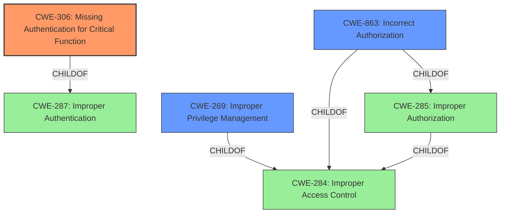

# Enhanced Analysis for CVE-2021-20021

# Summary
| CWE ID | CWE Name | Confidence | CWE Abstraction Level | CWE Vulnerability Mapping Label | CWE-Vulnerability Mapping Notes |
|---|---|---|---|---|---|
| CWE-306 | Missing Authentication for Critical Function | 0.9 | Base | Primary | Allowed |
| CWE-269 | Improper Privilege Management | 0.5 | Class | Secondary | Discouraged |
| CWE-863 | Incorrect Authorization | 0.5 | Class | Secondary | Allowed-with-Review |

## Evidence and Confidence

*   **Confidence Score:** 0.9
*   **Evidence Strength:** HIGH

## Relationship Analysis
The primary CWE selected is CWE-306, which is a Base level CWE and a child of CWE-287 (Improper Authentication). The secondary CWEs are higher-level Classes, representing related but less specific issues. CWE-269 is a child of CWE-284, and CWE-863 is a child of CWE-285 and CWE-284. The choice of CWE-306 is based on the explicit lack of authentication for a critical function, which directly matches the CWE description.



## Vulnerability Chain
The vulnerability chain starts with an **insecure configuration**, leading to **missing authentication** for a critical function. This allows an attacker to send a **crafted HTTP request** to create an administrative account, resulting in **improper privilege management** and **incorrect authorization**.

## Summary of Analysis
The initial assessment focused on the **insecure configuration** that leads to the ability to create an administrative account. The Retriever Results pointed to CWE-306, CWE-269, CWE-74 and CWE-863 as potential matches.

The final conclusion is that CWE-306 (Missing Authentication for Critical Function) is the most appropriate primary CWE. This is because the vulnerability description states that an attacker can create an administrative account, a critical function, by sending a crafted HTTP request, implying that there is **missing authentication**. This directly aligns with the CWE-306 description: "The product does not perform any authentication for functionality that requires a provable user identity or consumes a significant amount of resources."

The relationship graph shows that CWE-306 is a child of CWE-287 (Improper Authentication), indicating a hierarchical connection. The abstraction level of CWE-306 is Base, which is preferred for vulnerability mapping.

CWE-269 (Improper Privilege Management) and CWE-863 (Incorrect Authorization) were considered as secondary CWEs, since creating an admin account inherently involves privilege management and authorization. However, they are higher-level classes and less specific than the root cause, which is the **missing authentication**.

The selection of CWE-306 is based on the provided evidence, relationship analysis, and mapping guidance. The confidence level is high (0.9) due to the direct alignment between the vulnerability description and the CWE description.

CWE-74 (Improper Neutralization of Special Elements in Output Used by a Downstream Component ('Injection')) and CWE-78 (Improper Neutralization of Special Elements used in an OS Command ('OS Command Injection')) were not selected because the vulnerability is not directly related to injection, but rather to the **missing authentication**. CWE-200 (Exposure of Sensitive Information to an Unauthorized Actor) and CWE-1272 (Sensitive Information Uncleared Before Debug/Power State Transition) are also not relevant as the vulnerability doesn't primarily involve sensitive information exposure or state transitions.


## CWE Relationship Analysis

Current CWEs represent these abstraction levels: .


### Vulnerability Chain Analysis

**Chain starting from CWE-306:**
- 306 (Missing Authentication for Critical Function) - ROOT


**Chain starting from CWE-284:**
- 284 (Improper Access Control) - ROOT


### CWE Relationship Diagram

```mermaid
graph TD
    classDef primary fill:#f96,stroke:#333,stroke-width:2px
    classDef secondary fill:#69f,stroke:#333
    classDef tertiary fill:#9e9,stroke:#333
```