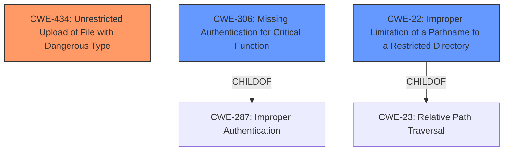

# Enhanced Analysis for CVE-2021-20022

# Summary 
| CWE ID    | CWE Name                                                                        | Confidence | CWE Abstraction Level | CWE Vulnerability Mapping Label | CWE-Vulnerability Mapping Notes |
| --------- | ------------------------------------------------------------------------------- | ---------- | --------------------- | --------------------------------- | ------------------------------- |
| CWE-434   | Unrestricted Upload of File with Dangerous Type                                 | 0.9        | Base                  | Primary CWE                       | Allowed                       |
| CWE-306   | Missing Authentication for Critical Function                                    | 0.6        | Base                  | Secondary Candidate               | Allowed                       |
| CWE-22    | Improper Limitation of a Pathname to a Restricted Directory ('Path Traversal') | 0.5        | Base                  | Secondary Candidate               | Allowed                       |

## Evidence and Confidence

*   **Confidence Score:** 0.8
*   **Evidence Strength:** MEDIUM

## Relationship Analysis
The primary CWE is CWE-434, which describes the **unrestricted upload** of files with dangerous types. The secondary CWEs considered are CWE-306 (Missing Authentication) and CWE-22 (Path Traversal). CWE-434 is at the Base level, which is the preferred level of abstraction. CWE-434 has peer relationships with CWE-430 (Deployment of Wrong Handler) and CWE-436 (Unvalidated Subdomain in Redirect). CWE-22 has a child relationship with CWE-23 (Relative Path Traversal). CWE-306 has a child relationship with CWE-287 (Improper Authentication).mermaid



## Vulnerability Chain
The vulnerability chain starts with a post-authenticated attacker **uploading an arbitrary file**. This leads to the **unrestricted upload** of a dangerous file type (CWE-434), potentially followed by execution of the file if the server processes it, or path traversal (CWE-22) if the filename is not properly validated. If authentication is missing entirely (CWE-306), the attacker does not even need to be authenticated to upload the file.

## Summary of Analysis
The initial analysis focused on the provided information about the vulnerability, specifically the ability to upload arbitrary files after authentication. The retriever results pointed to CWE-434 (Unrestricted Upload of File with Dangerous Type), CWE-78 (OS Command Injection) and CWE-22 (Path Traversal) as potential candidates.

The analysis concluded that CWE-434 is the most appropriate primary CWE because the vulnerability description explicitly mentions the ability to upload an arbitrary file. "SonicWall Email Security version 10.0.9.x contains a vulnerability that allows a post-authenticated attacker to **upload an arbitrary file** to the remote host." This aligns directly with the description of CWE-434: "The product allows the **upload** or transfer of dangerous file types that are automatically processed within its environment."

CWE-22 was considered, but it's more of a potential secondary weakness if the file is uploaded to a location where path traversal is possible.

CWE-306 was also considered, as the attacker is post-authenticated. However, the vulnerability lies in the unrestricted file upload after authentication, making CWE-434 more fitting as the primary weakness. It is possible authentication is not required at all, so it is added as a secondary candidate.

The final selected CWE, CWE-434, is at the optimal level of specificity as it directly addresses the root cause of the vulnerability which is the **unrestricted upload**.

Relevant CWE Information:

# Enhanced Context (25 CWEs)
The following CWEs were identified as potentially relevant to this vulnerability:

## CWE-538: Insertion of Sensitive Information into Externally-Accessible File or Directory
**Abstraction Level**: Base
**Similarity Score**: 0.79
**Source**: dense

**Description**:
The product places sensitive information into files or directories that are accessible to actors who are allowed to have access to the files, but not to the sensitive information.

**Mapping Guidance**:
- Usage: Allowed
- Rationale: This CWE entry is at the Base level of abstraction, which is a preferred level of abstraction for mapping to the root causes of vulnerabilities.


## CWE-209: Generation of Error Message Containing Sensitive Information
**Abstraction Level**: Base
**Similarity Score**: 0.77
**Source**: dense

**Description**:
The product generates an error message that includes sensitive information about its environment, users, or associated data.

**Mapping Guidance**:
- Usage: Allowed
- Rationale: This CWE entry is at the Base level of abstraction, which is a preferred level of abstraction for mapping to the root causes of vulnerabilities.


## CWE-212: Improper Removal of Sensitive Information Before Storage or Transfer
**Abstraction Level**: Base
**Similarity Score**: 0.77
**Source**: dense

**Description**:
The product stores, transfers, or shares a resource that contains sensitive information, but it does not properly remove that information before the product makes the resource available to unauthorized actors.

**Mapping Guidance**:
- Usage: Allowed
- Rationale: This CWE entry is at the Base level of abstraction, which is a preferred level of abstraction for mapping to the root causes of vulnerabilities.


## CWE-74: Improper Neutralization of Special Elements in Output Used by a Downstream Component ('Injection')
**Abstraction Level**: Class
**Similarity Score**: 0.77
**Source**: dense

**Description**:
The product constructs all or part of a command, data structure, or record using externally-influenced input from an upstream component, but it does not neutralize or incorrectly neutralizes special elements that could modify how it is parsed or interpreted when it is sent to a downstream component.

**Mapping Guidance**:
- Usage: Discouraged
- Rationale: CWE-74 is high-level and often misused when lower-level weaknesses are more appropriate.


## CWE-668: Exposure of Resource to Wrong Sphere
**Abstraction Level**: Class
**Similarity Score**: 0.77
**Source**: dense

**Description**:
The product exposes a resource to the wrong control sphere, providing unintended actors with inappropriate access to the resource.

**Mapping Guidance**:
- Usage: Discouraged
- Rationale: CWE-668 is high-level and is often misused as a catch-all when lower-level CWE IDs might be applicable. It is sometimes used for low-information vulnerability reports [REF-1287]. It is a level-1 Class (i.e., a child of a Pillar). It is not useful for trend analysis.


## CWE-497: Exposure of Sensitive System Information to an Unauthorized Control Sphere
**Abstraction Level**: Base
**Similarity Score**: 0.77
**Source**: dense

**Description**:
The product does not properly prevent sensitive system-level information from being accessed by unauthorized actors who do not have the same level of access to the underlying system as the product does.

**Mapping Guidance**:
- Usage: Allowed
- Rationale: This CWE entry is at the Base level of abstraction, which is a preferred level of abstraction for mapping to the root causes of vulnerabilities.


## CWE-807: Reliance on Untrusted Inputs in a Security Decision
**Abstraction Level**: Base
**Similarity Score**: 0.77
**Source**: dense

**Description**:
The product uses a protection mechanism that relies on the existence or values of an input, but the input can be modified by an untrusted actor in a way that bypasses the protection mechanism.

**Mapping Guidance**:
- Usage: Allowed
- Rationale: This CWE entry is at the Base level of abstraction, which is a preferred level of abstraction for mapping to the root causes of vulnerabilities.


## CWE-184: Incomplete List of Disallowed Inputs
**Abstraction Level**: Base
**Similarity Score**: 0.77
**Source**: dense

**Description**:
The product implements a protection mechanism that relies on a list of inputs (or properties of inputs) that are not allowed by policy or otherwise require other action to neutralize before additional processing takes place, but the list is incomplete.

**Mapping Guidance**:
- Usage: Allowed
- Rationale: This CWE entry is at the Base level of abstraction, which is a preferred level of abstraction for mapping to the root causes of vulnerabilities.


## CWE-23: Relative Path Traversal
**Abstraction Level**: Base
**Similarity Score**: 0.76
**Source**: dense

**Description**:


## CWE Relationship Analysis

Current CWEs represent these abstraction levels: .


### Vulnerability Chain Analysis

**Chain starting from CWE-306:**
- 306 (Missing Authentication for Critical Function) - ROOT


**Chain starting from CWE-497:**
- 497 (Exposure of Sensitive System Information to an Unauthorized Control Sphere) - ROOT


### CWE Relationship Diagram

```mermaid
graph TD
    classDef primary fill:#f96,stroke:#333,stroke-width:2px
    classDef secondary fill:#69f,stroke:#333
    classDef tertiary fill:#9e9,stroke:#333
```