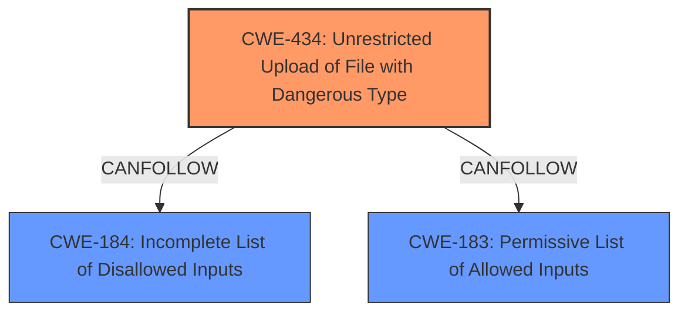

# Analysis Report for CVE-2021-20022

# Vulnerability Analysis Report: CVE-2021-20022

## Description


## Analysis (with Relationship Data)

# Summary
| CWE ID | CWE Name | Confidence | CWE Abstraction Level | CWE Vulnerability Mapping Label | CWE-Vulnerability Mapping Notes |
|---|---|---|---|---|---|
| CWE-434 | Unrestricted Upload of File with Dangerous Type | 1 | Base | Allowed | Primary CWE |

## Evidence and Confidence

*   **Confidence Score:** 1
*   **Evidence Strength:** HIGH

## Relationship Analysis
The primary relationship that influenced the selection of CWE-434 is its base-level abstraction, which aligns with the vulnerability's root cause. The absence of more specific details prevents the selection of child CWEs. However, the relationships with CWE-183 and CWE-184 (Incomplete List of Disallowed Inputs), suggest potential chaining if input validation is attempted but fails.



## Vulnerability Chain
The vulnerability chain involves the **unrestricted upload** (ROOT CAUSE) leading to the potential execution of a dangerous file type (IMPACT).
  - The chain starts with the server failing to restrict file uploads
  - This leads to arbitrary file uploads which can lead to code execution on the server

## Summary of Analysis
The vulnerability description clearly states, "SonicWall Email Security version 10.0.9.x contains a vulnerability that allows a post-authenticated attacker to upload an arbitrary file to the remote host." This statement directly points to a file upload vulnerability.

The primary match from similar CVE descriptions is CWE-22 (Improper Limitation of a Pathname to a Restricted Directory ('Path Traversal')). However, the description doesn't mention path traversal but focuses on the ability to upload arbitrary files.

The retriever results list CWE-434 (Unrestricted Upload of File with Dangerous Type) as the top candidate. This aligns directly with the description and the provided information. CWE-434's description states: "The product allows the upload or transfer of dangerous file types that are automatically processed within its environment." This is a precise match for the vulnerability.

CWE-78 (Improper Neutralization of Special Elements used in an OS Command ('OS Command Injection')) and CWE-22 (Improper Limitation of a Pathname to a Restricted Directory ('Path Traversal')) were considered but are less relevant because the vulnerability centers on the **unrestricted file upload** itself rather than command injection or path manipulation.

CWE-306 (Missing Authentication for Critical Function) was considered but the attacker is post-authenticated meaning that the function is not missing authentication.

CWE-200 (Exposure of Sensitive Information to an Unauthorized Actor) was considered, but the main issue is not information exposure but the ability to upload arbitrary files.

CWE-434 is at the base level of abstraction, which is the preferred level. The evidence strongly supports the selection of CWE-434 as the primary CWE.

Relevant CWE Information:
### CWE-434: Unrestricted Upload of File with Dangerous Type
**CWE-434 (Unrestricted Upload of File with Dangerous Type)** is the most appropriate because the vulnerability allows a post-authenticated attacker to upload an arbitrary file to the remote host. This aligns directly with the description of CWE-434: "The product allows the upload or transfer of dangerous file types that are automatically processed within its environment." The security implication is that an attacker could upload and execute malicious files, leading to code execution or other compromises. The fact that the attacker is authenticated suggests that this is not a missing authentication issue (CWE-306), but rather a failure to properly validate the file type being uploaded. The CWE is at the base level of abstraction, which is preferred.


## CWE Relationship Analysis

Current CWEs represent these abstraction levels: .


### Vulnerability Chain Analysis

**Chain starting from CWE-200:**
- 200 (Exposure of Sensitive Information to an Unauthorized Actor) - ROOT


**Chain starting from CWE-434:**
- 434 (Unrestricted Upload of File with Dangerous Type) - ROOT


### CWE Relationship Diagram

```mermaid
graph TD
    classDef primary fill:#f96,stroke:#333,stroke-width:2px
    classDef secondary fill:#69f,stroke:#333
    classDef tertiary fill:#9e9,stroke:#333
```


*Report generated on 2025-03-30 19:46:30*
