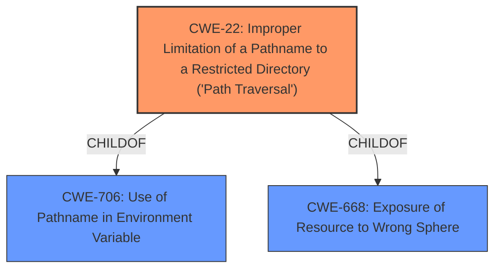

# Raw Analyzer Response for CVE-2021-20023

# Summary
| CWE ID | CWE Name | Confidence | CWE Abstraction Level | CWE Vulnerability Mapping Label | CWE-Vulnerability Mapping Notes |
|---|---|---|---|---|---|
| CWE-22 | Improper Limitation of a Pathname to a Restricted Directory ('Path Traversal') | 0.9 | Base | Allowed | Primary CWE. The vulnerability allows reading arbitrary files due to a path traversal issue. |

## Evidence and Confidence

*   **Confidence Score:** 0.9
*   **Evidence Strength:** MEDIUM

## Relationship Analysis
The primary relationship that influenced my decision was the hierarchical structure with CWE-22 as a Base level weakness. This allowed me to map the vulnerability to a specific type of path traversal. The other relationships such as chain relationships did not seem relevant in this case.

## Vulnerability Chain
The vulnerability chain is relatively simple:
1.  **Improper input validation** (inferred): The application **fails to properly validate** the input file path provided by the attacker.
2.  **Path Traversal (CWE-22)**: Due to the **lack of proper validation**, the attacker can manipulate the file path to access arbitrary files outside the intended directory.
3.  **Arbitrary File Read (Impact)**: The attacker successfully reads sensitive files on the system.

## Summary of Analysis
Initially, CWE-434 (Unrestricted Upload of File with Dangerous Type) was considered due to its presence in the "CWE for similar CVE Descriptions". However, the vulnerability description mentions reading an arbitrary file which is more aligned with CWE-22 (Improper Limitation of a Pathname to a Restricted Directory ('Path Traversal')). The vulnerability description clearly states that a post-authenticated attacker can "read an arbitrary file on the remote host," indicating a path traversal issue.

The selection of CWE-22 is based on the following evidence:

*   **Vulnerability Description Key Phrases:** The "impact: read arbitrary file" phrase directly supports the classification as CWE-22, as path traversal vulnerabilities often lead to arbitrary file access.

The retriever also returns a high score for CWE-22 and the usage is "Allowed".

Therefore, based on the evidence and relationship analysis, CWE-22 is the most appropriate and specific CWE for this vulnerability.

# Relevant CWE Information:

# Enhanced Context (25 CWEs)

## CWE-538: Insertion of Sensitive Information into Externally-Accessible File or Directory
**Abstraction Level**: Base
**Similarity Score**: 0.76
**Source**: dense

**Description**:
The product places sensitive information into files or directories that are accessible to actors who are allowed to have access to the files, but not to the sensitive information.

**Mapping Guidance**:
- Usage: Allowed
- Rationale: This CWE entry is at the Base level of abstraction, which is a preferred level of abstraction for mapping to the root causes of vulnerabilities.

*Reason for not using this CWE*: This vulnerability is about reading an arbitrary file and not about writing sensitive information to a file.

## CWE-312: Cleartext Storage of Sensitive Information
**Abstraction Level**: Base
**Similarity Score**: 0.76
**Source**: dense

**Description**:
The product stores sensitive information in cleartext within a resource that might be accessible to another control sphere.

**Mapping Guidance**:
- Usage: Allowed
- Rationale: This CWE entry is at the Base level of abstraction, which is a preferred level of abstraction for mapping to the root causes of vulnerabilities.

*Reason for not using this CWE*: This vulnerability is about reading an arbitrary file and not about storing information.

## CWE-668: Exposure of Resource to Wrong Sphere
**Abstraction Level**: Class
**Similarity Score**: 0.75
**Source**: dense

**Description**:
The product exposes a resource to the wrong control sphere, providing unintended actors with inappropriate access to the resource.

**Mapping Guidance**:
- Usage: Discouraged
- Rationale: CWE-668 is high-level and is often misused as a catch-all when lower-level CWE IDs might be applicable. It is sometimes used for low-information vulnerability reports [REF-1287]. It is a level-1 Class (i.e., a child of a Pillar). It is not useful for trend analysis.

*Reason for not using this CWE*: This is a high level class and CWE-22 is more descriptive.

## CWE-212: Improper Removal of Sensitive Information Before Storage or Transfer
**Abstraction Level**: Base
**Similarity Score**: 0.75
**Source**: dense

**Description**:
The product stores, transfers, or shares a resource that contains sensitive information, but it does not properly remove that information before the product makes the resource available to unauthorized actors.

**Mapping Guidance**:
- Usage: Allowed
- Rationale: This CWE entry is at the Base level of abstraction, which is a preferred level of abstraction for mapping to the root causes of vulnerabilities.

*Reason for not using this CWE*: This vulnerability is about reading an arbitrary file and not about removing sensitive information.

## CWE-226: Sensitive Information in Resource Not Removed Before Reuse
**Abstraction Level**: Base
**Similarity Score**: 0.75
**Source**: dense

**Description**:
The product releases a resource such as memory or a file so that it can be made available for reuse, but it does not clear or "zeroize" the information contained in the resource before the product performs a critical state transition or makes the resource available for reuse by other entities.

**Mapping Guidance**:
- Usage: Allowed
- Rationale: This CWE entry is at the Base level of abstraction, which is a preferred level of abstraction for mapping to the root causes of vulnerabilities.

*Reason for not using this CWE*: This vulnerability is about reading an arbitrary file and not about sensitive information in resources being reused.

## CWE-274: Improper Handling of Insufficient Privileges
**Abstraction Level**: Base
**Similarity Score**: 0.75
**Source**: dense

**Description**:
The product does not handle or incorrectly handles when it has insufficient privileges to perform an operation, leading to resultant weaknesses.

**Mapping Guidance**:
- Usage: Discouraged
- Rationale: This CWE entry could be deprecated in a future version of CWE.

*Reason for not using this CWE*: This vulnerability is about reading an arbitrary file using path traversal and not about handling privileges.

## CWE-552: Files or Directories Accessible to External Parties
**Abstraction Level**: Base
**Similarity Score**: 0.74
**Source**: dense

**Description**:
The product makes files or directories accessible to unauthorized actors, even though they should not be.

**Mapping Guidance**:
- Usage: Allowed
- Rationale: This CWE entry is at the Base level of abstraction, which is a preferred level of abstraction for mapping to the root causes of vulnerabilities.

*Reason for not using this CWE*: This vulnerability is about reading an arbitrary file using path traversal and not just about making files accessible.

## CWE-653: Improper Isolation or Compartmentalization
**Abstraction Level**: Class
**Similarity Score**: 0.74
**Source**: dense

**Description**:
The product does not properly compartmentalize or isolate functionality, processes, or resources that require different privilege levels, rights, or permissions.

**Mapping Guidance**:
- Usage: Allowed
- Rationale: This CWE entry is at the Base level of abstraction, which is a preferred level of abstraction for mapping to the root causes of vulnerabilities.

*Reason for not using this CWE*: This vulnerability is about reading an arbitrary file using path traversal and not about isolating resources.

## CWE-807: Reliance on Untrusted Inputs in a Security Decision
**Abstraction Level**: Base
**Similarity Score**: 0.74
**Source**: dense

**Description**:
The product uses a protection mechanism that relies on the existence or values of an input, but the input can be modified by an untrusted actor in a way that bypasses the protection mechanism.

**Mapping Guidance**:
- Usage: Allowed
- Rationale: This CWE entry is at the Base level of abstraction, which is a preferred level of abstraction for mapping to the root causes of vulnerabilities.

*Reason for not using this CWE*: This vulnerability is about reading an arbitrary file using path traversal and not about making a security decision.

## CWE-23: Relative Path Traversal
**Abstraction Level**: Base
**Similarity Score**: 0.74
**Source**: dense

**Description**:
The product uses external input to construct a pathname that should be within a restricted directory, but it does not properly neutralize sequences such as ".." that can