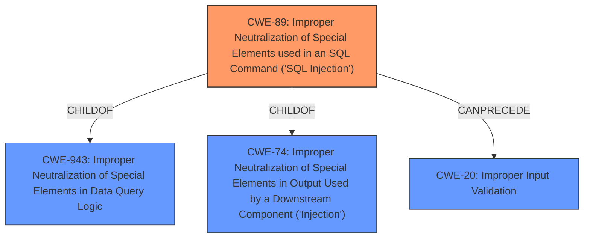

# Analysis for CVE-2021-20028

# Summary
| CWE ID | CWE Name | Confidence | CWE Abstraction Level | CWE Vulnerability Mapping Label | CWE-Vulnerability Mapping Notes |
|---|---|---|---|---|---|
| CWE-89 | Improper Neutralization of Special Elements used in an SQL Command ('SQL Injection') | 1.0 | Base | Allowed | Primary CWE |
| CWE-20 | Improper Input Validation | 0.5 | Class | Discouraged | Secondary Candidate |

## Evidence and Confidence

*   **Confidence Score:** 0.8
*   **Evidence Strength:** HIGH

## Relationship Analysis
The primary CWE is CWE-89, a base level CWE that is a child of CWE-943 and CWE-74. CWE-20 is a class-level CWE, and is too general for this case and is a parent of many base level CWEs.

## Vulnerability Chain
The vulnerability chain starts with **improper input sanitization**, which leads to **SQL injection**.

## Summary of Analysis
The vulnerability description clearly indicates an **SQL injection** vulnerability due to **improper input sanitization**.

The primary CWE selection is based on the following:
*   The vulnerability description explicitly mentions "SQL Injection vulnerability".
*   The retriever results list CWE-89 as the top match with a score of 1.0.
*   CWE-89's description aligns perfectly with the vulnerability: "The product constructs all or part of an SQL command using externally-influenced input from an upstream component, but it does not neutralize or incorrectly neutralizes special elements that could modify the intended SQL command when it is sent to a downstream component."
*   CWE-89 is at the Base level of abstraction, which is preferred.
*   The mapping guidance for CWE-89 states "This CWE entry is at the Base level of abstraction, which is a preferred level of abstraction for mapping to the root causes of vulnerabilities."
*   The retriever results list CWE-20, Improper Input Validation. While **improper input sanitization** is indicated in the description, CWE-20 is too general and is discouraged.

Based on the evidence, CWE-89 is the most appropriate and specific CWE for this vulnerability.

Relevant CWE Information:
- Vulnerability Description Key Phrases:
  - **rootcause:** **Improper input sanitization**
  - **weakness:** **SQL injection**

The analysis is based on the provided evidence. The evidence explicitly states "SQL Injection vulnerability" and "**Improper input sanitization**", which strongly supports the selection of CWE-89. The graph relationships confirm that CWE-89 is a specific type of injection, making it more appropriate than a general input validation weakness (CWE-20). The selected CWE is at the optimal level of specificity because it directly describes the SQL injection vulnerability, unlike the more general CWE-20.