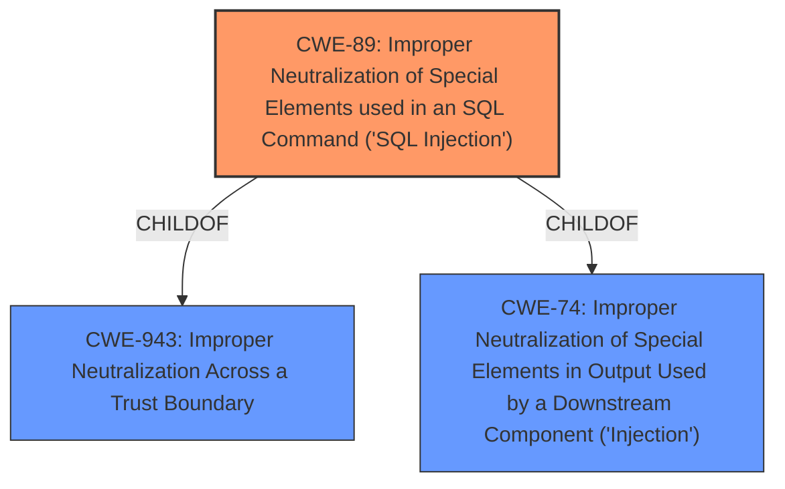

# Raw Analyzer Response for CVE-2021-20028

# Summary
| CWE ID | CWE Name | Confidence | CWE Abstraction Level | CWE Vulnerability Mapping Label | CWE-Vulnerability Mapping Notes |
|---|---|---|---|---|---|
| CWE-89 | Improper Neutralization of Special Elements used in an SQL Command ('SQL Injection') | 1.0 | Base | Allowed | Primary CWE |

## Evidence and Confidence

*   **Confidence Score:** 1.0
*   **Evidence Strength:** HIGH

## Relationship Analysis
The primary CWE, CWE-89, is a base level CWE, which is preferred. It is a child of CWE-943 (Improper Neutralization Across a Trust Boundary) and CWE-74 (Improper Neutralization of Special Elements in Output Used by a Downstream Component ('Injection')). CWE-89 directly addresses the **SQL injection** **weakness** described in the vulnerability.

## Vulnerability Chain
The chain of events starts with **improper input sanitization**, leading to a **SQL injection** vulnerability.
  - Root Cause: **Improper input sanitization**
  - Weakness: **SQL injection**

## Summary of Analysis
The vulnerability description clearly states that the root cause is **improper input sanitization**, leading to a **SQL injection** vulnerability. The description explicitly mentions **SQL injection**, which aligns perfectly with CWE-89.

The provided vulnerability description states: "Improper neutralization of a SQL Command leading to SQL Injection vulnerability impacting end-of-life Secure Remote Access (SRA) products, specifically the SRA appliances running all 8.x firmware and 9.0.0.9-26sv or earlier". The key phrases also point to "improper input sanitization" as the root cause and "SQL injection" as the **weakness**.

CWE-89 (Improper Neutralization of Special Elements used in an SQL Command ('SQL Injection')) is the most appropriate CWE. The description of CWE-89 states: "The product constructs all or part of an SQL command using externally-influenced input from an upstream component, but it does not neutralize or incorrectly neutralizes special elements that could modify the intended SQL command when it is sent to a downstream component." This directly matches the vulnerability description.

Other CWEs such as CWE-78 (Improper Neutralization of Special Elements used in an OS Command ('OS Command Injection')), CWE-23 (Relative Path Traversal), and CWE-434 (Unrestricted Upload of File with Dangerous Type) do not accurately reflect the nature of the vulnerability, which is specifically related to **SQL injection** caused by **improper input sanitization**. Although CWE-20 (Improper Input Validation) could be considered, it is a class-level CWE and less specific than CWE-89. The retriever results also list CWE-89 as the top match.

The selection of CWE-89 is at the optimal level of specificity because it directly addresses the **SQL injection** vulnerability described in the vulnerability and is a base level CWE.