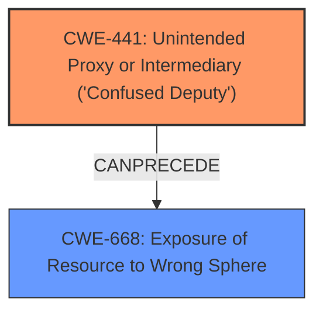

# Analysis Report for CVE-2021-20042

# Vulnerability Analysis Report: CVE-2021-20042

## Description


## Analysis (with Relationship Data)

# Summary
| CWE ID | CWE Name | Confidence | CWE Abstraction Level | CWE Vulnerability Mapping Label | CWE-Vulnerability Mapping Notes |
|---|---|---|---|---|---|
| CWE-441 | Unintended Proxy or Intermediary ('Confused Deputy') | 0.9 | Class | Allowed-with-Review | Primary CWE |
| CWE-668 | Exposure of Resource to Wrong Sphere | 0.6 | Class | Discouraged | Secondary Candidate |

## Evidence and Confidence

*   **Confidence Score:** 0.9
*   **Evidence Strength:** HIGH

## Relationship Analysis
The primary CWE selected is CWE-441 (Unintended Proxy or Intermediary ('Confused Deputy')). This CWE is a Class-level weakness. While it's generally preferable to select a Base or Variant level CWE, in this case, the provided information aligns well with the description of CWE-441. CWE-441 has a chaining relationship with CWE-668 (Exposure of Resource to Wrong Sphere), since the proxy effectively provides the attacker with access to the target's resources that the attacker cannot directly obtain.



## Vulnerability Chain
The vulnerability chain starts with the SonicWall SMA 100 device acting as an **Unintended Proxy or Intermediary** (CWE-441), which then leads to **Exposure of Resource to Wrong Sphere** (CWE-668), where firewall rules are bypassed, and an attacker gains unauthorized access.

## Summary of Analysis
The initial assessment identified CWE-441 as the primary weakness, with a secondary consideration for CWE-668 due to the resulting exposure of resources. The decision is strongly supported by the vulnerability description, which explicitly states that the SMA 100 device is used as an "unintended proxy or intermediary" to "bypass firewall rules." This aligns directly with the definition of CWE-441, where a product acts as an intermediary without sufficiently preserving the original source of the request.

The relationship graph clarifies the connection between CWE-441 and CWE-668, showing how the unintended proxy leads to the exposure of resources to the wrong sphere. This relationship reinforces the selection of CWE-441 as the root cause and CWE-668 as a subsequent impact.

The selected CWEs are at the appropriate level of specificity because CWE-441 directly captures the **root cause** of the vulnerability: the **unintended proxy** behavior. While more specific CWEs might exist, they would likely focus on the implementation details of the proxy mechanism, which are not provided in the vulnerability description. CWE-668 is a class level that is more general than CWE-441.

Relevant CWE Information:

# Enhanced Context (25 CWEs)

## CWE-441: Unintended Proxy or Intermediary ('Confused Deputy')
**Abstraction:** Class
**Status:** Draft

### Description
The product receives a request, message, or directive from an upstream component, but the product does not sufficiently preserve the original source of the request before forwarding the request to an external actor that is outside of the product's control sphere. This causes the product to appear to be the source of the request, leading it to act as a proxy or other intermediary between the upstream component and the external actor.

### Extended Description
If an attacker cannot directly contact a target, but the product has access to the target, then the attacker can send a request to the product and have it be forwarded to the target. The request would appear to be coming from the product's system, not the attacker's system. As a result, the attacker can bypass access controls (such as firewalls) or hide the source of malicious requests, since the requests would not be coming directly from the attacker.

Since proxy functionality and message-forwarding often serve a legitimate purpose, this issue only becomes a vulnerability when:

*   The product runs with different privileges or on a different system, or otherwise has different levels of access than the upstream component;

*   The attacker is prevented from making the request directly to the target; and

*   The attacker can create a request that the proxy does not explicitly intend to be forwarded on the behalf of the requester. Such a request might point to an unexpected hostname, port number, hardware IP, or service. Or, the request might be sent to an allowed service, but the request could contain disallowed directives, commands, or resources.

### Observed Examples
- **CVE-1999-0017:** FTP bounce attack. The design of the protocol allows an attacker to modify the PORT command to cause the FTP server to connect to other machines besides the attacker's.

The vulnerability description directly states "use SMA 100 as an **unintended proxy or intermediary** undetectable proxy to **bypass firewall rules**". This aligns perfectly with the description and extended description of CWE-441.

## CWE-668: Exposure of Resource to Wrong Sphere
**Abstraction:** Class
**Status:** Draft

### Description
The product exposes a resource to the wrong control sphere, providing unintended actors with inappropriate access to the resource.

### Observed Examples
- **CVE-2019-15849:** A Spring Cloud Config Server exposes sensitive data to the wrong control sphere when the spring.cloud.config.server.git.uri property is set using the [username:password@] syntax.

The impact of the **unintended proxy** is that firewall rules are bypassed. The firewall is meant to protect resources, but because of the proxy, those resources are exposed to the wrong control sphere.


## CWE Relationship Analysis

Current CWEs represent these abstraction levels: .


### Vulnerability Chain Analysis

**Chain starting from CWE-441:**
- 441 (Unintended Proxy or Intermediary ('Confused Deputy')) - ROOT


**Chain starting from CWE-668:**
- 668 (Exposure of Resource to Wrong Sphere) - ROOT


### CWE Relationship Diagram

```mermaid
graph TD
    classDef primary fill:#f96,stroke:#333,stroke-width:2px
    classDef secondary fill:#69f,stroke:#333
    classDef tertiary fill:#9e9,stroke:#333
```


*Report generated on 2025-03-31 05:59:55*
